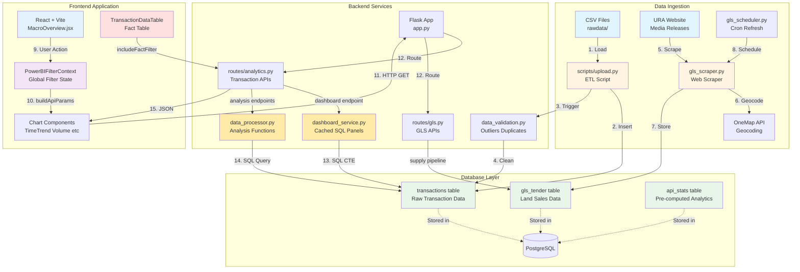
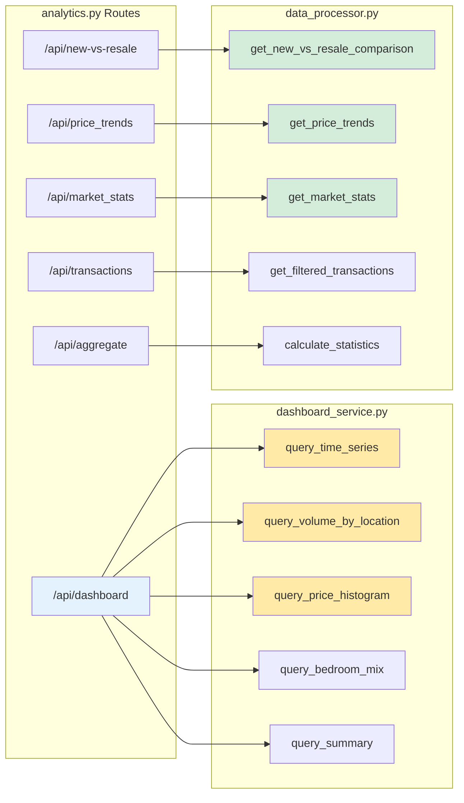
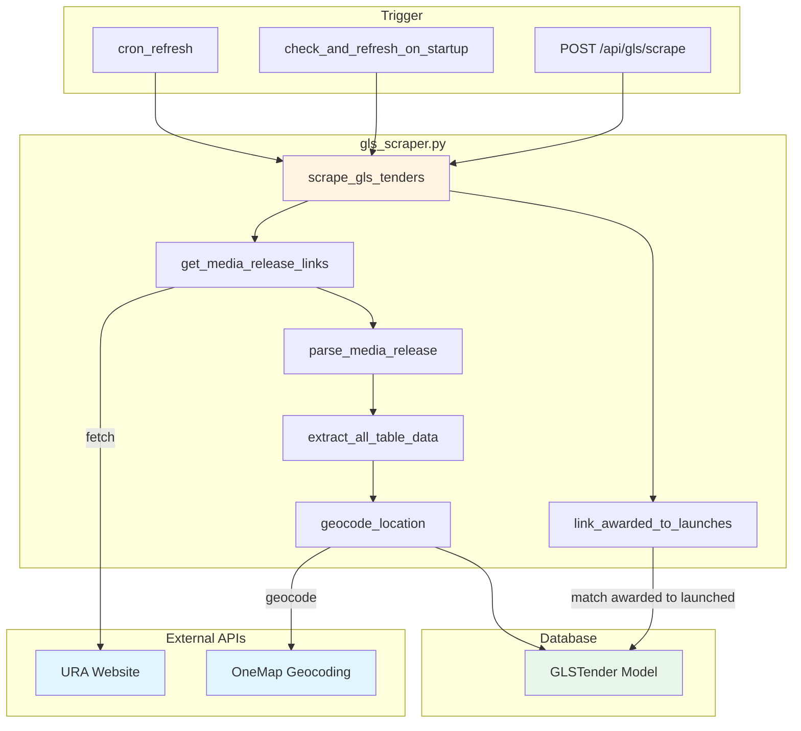

# Architecture Documentation

## Project Overview

This project is a **Power BI-style Analytics Dashboard** for analyzing Singapore private condominium transactions. The system follows a "Split Deployment" pattern with clear separation between data ingestion, computation, and consumption.

### Technology Stack

- **Frontend**: React + Vite + Tailwind CSS + Chart.js
- **Backend**: Flask (Python) with SQLAlchemy ORM
- **Database**: PostgreSQL (all environments - SQLite not supported)
- **Hosting**: Render (512MB memory constraint)
- **Architecture Pattern**: Pre-computed analytics + SQL-level aggregation

### Key Architectural Principles

1. **Separation of Concerns**: Clear boundaries between ingestion, computation, and API layers
2. **Pre-Computation**: Heavy analytics computed once, stored in database
3. **SQL Aggregation**: Live queries use SQL GROUP BY (no DataFrames in memory)
4. **Power BI Filter Patterns**: Global slicers, cross-filtering, fact/dimension separation
5. **Memory Efficiency**: Designed for 512MB RAM constraint

---

## System Design Diagram



### Service Layer Detail



### GLS Scraping Pipeline



### Request Flow (Step by Step)

```
┌──────────────────────────────────────────────────────────────────────────────┐
│  1. USER ACTION                                                               │
│     User selects D09 in sidebar filter                                       │
└──────────────────────────────────────────────────────────────────────────────┘
                                    │
                                    ▼
┌──────────────────────────────────────────────────────────────────────────────┐
│  2. FILTER CONTEXT UPDATE                                                     │
│     PowerBIFilterContext.jsx                                                  │
│     ├── filters.districts = ['D09']                                          │
│     └── Triggers re-render of all chart components                           │
└──────────────────────────────────────────────────────────────────────────────┘
                                    │
                                    ▼
┌──────────────────────────────────────────────────────────────────────────────┐
│  3. API CALL CONSTRUCTION                                                     │
│     Each chart calls: buildApiParams({ panels: 'time_series' })              │
│     Returns: { district: 'D09', panels: 'time_series', ... }                 │
└──────────────────────────────────────────────────────────────────────────────┘
                                    │
                                    ▼
┌──────────────────────────────────────────────────────────────────────────────┐
│  4. HTTP REQUEST                                                              │
│     GET /api/dashboard?district=D09&panels=time_series                       │
│     axios.get() from api/client.js                                           │
└──────────────────────────────────────────────────────────────────────────────┘
                                    │
                                    ▼
┌──────────────────────────────────────────────────────────────────────────────┐
│  5. FLASK ROUTING                                                             │
│     routes/analytics.py                                                       │
│     ├── Parse query params (district, bedroom, segment, date_from, date_to)  │
│     └── Call dashboard_service.get_dashboard_data(filters, panels)           │
└──────────────────────────────────────────────────────────────────────────────┘
                                    │
                                    ▼
┌──────────────────────────────────────────────────────────────────────────────┐
│  6. SQL AGGREGATION                                                           │
│     dashboard_service.py                                                      │
│     ├── Build WHERE clause from filters                                      │
│     ├── Execute: SELECT district, COUNT(*), AVG(psf) ... GROUP BY ...        │
│     └── Return JSON response (no DataFrame in memory)                        │
└──────────────────────────────────────────────────────────────────────────────┘
                                    │
                                    ▼
┌──────────────────────────────────────────────────────────────────────────────┐
│  7. CHART UPDATE                                                              │
│     TimeTrendChart.jsx receives data                                         │
│     ├── Updates Chart.js visualization                                       │
│     └── Shows only D09 transactions                                          │
└──────────────────────────────────────────────────────────────────────────────┘
```

---

## Power BI Data Modeling Rules

### Golden Rule

> **Slicers belong to dimensions. Facts should almost never be slicers.**

### Filter Direction: Dimension → Fact (One-Way)

```
┌─────────────────┐         ┌─────────────────┐
│   DIMENSION     │────────▶│      FACT       │
│   (Slicers)     │         │   (Data Sink)   │
└─────────────────┘         └─────────────────┘
     Filters                  Gets Filtered
     Others                   Never Filters
```

### Component Architecture

| Component | Type | Filters Others? | Notes |
|-----------|------|-----------------|-------|
| **Sidebar Filters** | Dimension Slicers | Yes → All charts | Region, District, Bedroom, Sale Type |
| **Time Trend Chart** | Dimension Visual | Highlight only | Click applies visual highlight, not filter |
| **Volume by Location** | Dimension Visual | Yes (categorical) | Click filters by region/district |
| **Price Distribution** | Dimension Visual | Only → Fact table | Uses `factFilter` state |
| **New vs Resale Chart** | Dimension Visual | No | Respects global filters, local drill only |
| **Transaction Data Table** | **Fact Table** | Never | Pure data sink |

---

## Filtering Standard (Power BI Pattern)

### Global Slicers (Page Scope) — MUST Apply to Everything

All slicers in the **Global Slicer Bar** (sidebar) are **page-scoped** and **always apply to every visual** on the main page.

**Global slicers include:**
- Location (Districts, Market Segment: CCR/RCR/OCR)
- Date Range (From/To)
- Bedroom Types
- Sale Type (New Sale / Resale)
- PSF Range
- Size Range

**Rules:**
1. Every main-page API query **MUST** accept these global filters
2. Every main-page visual **MUST** use the filtered dataset returned from global filters
3. **No visual is allowed to "opt out"** of global slicers
4. Global slicers must be visible at all times and must not be duplicated inside individual chart cards

**Implementation:**
```jsx
// Global slicer state lives in PowerBIFilterContext (single source of truth)
const { buildApiParams, filters } = usePowerBIFilters();

// CORRECT: Use buildApiParams to include global filters
const params = buildApiParams({
  group_by: 'quarter',
  metrics: 'count,median_psf'
});

// WRONG: Ignoring global filters completely
const params = { region: localRegion, bedroom: localBedroom }; // DON'T DO THIS
```

### Local Filters (Visual Scope) — Narrow, Don't Replace

Visual components may add **local filters**, but local filters can only **further narrow** the already globally-filtered data. They cannot replace or override global filters.

**Example - Correct pattern:**
```jsx
// Start with global filters
const params = buildApiParams({});

// Local filter ADDS to global (narrows further)
params.timeGrain = localDrillLevel; // visual-local drill level
```

---

## Drill Up/Down Rules

### Core Principle

> **Drill ≠ Filter. Drill is visual-local by default.**

| Action | Scope | Effect |
|--------|-------|--------|
| **Drill** | Single visual only | Changes level of detail inside one chart |
| **Filter** | Cross-visual (dashboard) | Changes data scope across all visuals |

### Implementation Pattern

```jsx
// Drill state is LOCAL to each chart component
const [drillLevel, setDrillLevel] = useState('quarter'); // year → quarter → month

// Drill does NOT use global context - it's component state only
// This ensures other charts are never affected
```

### MANDATORY: Standardized DrillButtons Component

**Every chart with drill functionality MUST use the `DrillButtons` component** for visual consistency.

```jsx
import { DrillButtons } from './DrillButtons';

// LOCAL MODE: Uses local state (visual-local, does NOT affect other charts)
<DrillButtons
  localLevel={localDrillLevel}
  localLevels={['year', 'quarter', 'month']}
  localLevelLabels={{ year: 'Year', quarter: 'Quarter', month: 'Month' }}
  onLocalDrillUp={handleDrillUp}
  onLocalDrillDown={handleDrillDown}
/>
```

---

## Directory Structure

```
sg-property-analyzer/
├── backend/                    # Flask API backend
│   ├── app.py                 # Flask application factory & entry point
│   ├── config.py              # Configuration (DATABASE_URL, secrets)
│   ├── requirements.txt       # Python dependencies
│   ├── models/                # SQLAlchemy models
│   │   ├── database.py        # SQLAlchemy db instance
│   │   ├── transaction.py     # Transaction model (raw data)
│   │   ├── gls_tender.py      # GLSTender model (land sales)
│   │   └── user.py            # User model (authentication)
│   ├── routes/                # API route blueprints
│   │   ├── analytics.py       # Transaction & analysis endpoints
│   │   ├── gls.py             # GLS tender endpoints
│   │   └── auth.py            # JWT authentication
│   └── services/              # Business logic services
│       ├── dashboard_service.py   # Cached SQL panel queries (high-perf)
│       ├── data_processor.py      # Analysis functions (price trends, stats)
│       ├── data_validation.py     # Data cleaning (outliers, duplicates)
│       ├── gls_scraper.py         # URA website scraper + geocoding
│       ├── gls_scheduler.py       # Cron refresh & freshness checks
│       ├── data_computation.py    # Pre-compute stats
│       └── analytics_reader.py    # Read pre-computed stats
│
├── frontend/                   # React frontend (Vite)
│   ├── src/
│   │   ├── api/
│   │   │   └── client.js      # Axios API client
│   │   ├── context/
│   │   │   ├── DataContext.jsx           # Global data/metadata
│   │   │   └── PowerBIFilterContext.jsx  # Filter state management
│   │   ├── components/powerbi/
│   │   │   ├── PowerBIFilterSidebar.jsx  # Dimension slicers
│   │   │   ├── TimeTrendChart.jsx        # Time dimension
│   │   │   ├── VolumeByLocationChart.jsx # Location dimension
│   │   │   ├── PriceDistributionChart.jsx # Price dimension
│   │   │   ├── NewVsResaleChart.jsx      # New vs Resale comparison
│   │   │   ├── TransactionDataTable.jsx  # Fact table
│   │   │   ├── DrillButtons.jsx          # Standardized drill controls
│   │   │   └── DrillBreadcrumb.jsx       # Navigation breadcrumbs
│   │   └── pages/
│   │       └── MacroOverview.jsx         # Main dashboard page
│   └── index.html
│
├── scripts/                    # ETL & maintenance scripts
│   ├── upload.py              # CSV → Database ingestion
│   └── recompute_stats.py     # Re-run aggregation service
│
├── rawdata/                    # Source CSV files
├── .env                        # Environment variables
├── claude.md                   # Project guide & patterns
├── README.md                   # Project documentation
└── ARCHITECTURE.md             # This file
```

---

## Data Flow Architecture

### Backend Data Flow

```
┌─────────────────────────────────────────────────────────────────┐
│                        DATA INGESTION                           │
├─────────────────────────────────────────────────────────────────┤
│  URA API Data ──▶ scripts/upload.py ──▶ PostgreSQL Database    │
│                         │                                       │
│                         ▼                                       │
│              services/data_validation.py                        │
│              (auto-runs on app startup)                         │
│                         │                                       │
│                         ├── remove_invalid_records()            │
│                         ├── remove_duplicates_sql()             │
│                         └── filter_outliers_sql() (IQR method)  │
└─────────────────────────────────────────────────────────────────┘
                              │
                              ▼
┌─────────────────────────────────────────────────────────────────┐
│                        API LAYER                                │
├─────────────────────────────────────────────────────────────────┤
│  routes/analytics.py                                            │
│       │                                                         │
│       ├── /api/dashboard   ──▶ dashboard_service.py            │
│       │       • Panels: summary, time_series, location_volume   │
│       │       • SQL aggregation (no DataFrame in memory)        │
│       │                                                         │
│       ├── /api/aggregate   ──▶ SQL GROUP BY queries            │
│       │                                                         │
│       ├── /api/new-vs-resale ──▶ data_processor.py             │
│       │       • Respects global filters (district, bedroom)     │
│       │       • Visual-local drill (timeGrain only)             │
│       │                                                         │
│       ├── /api/transactions/list ──▶ Paginated transaction list│
│       │                                                         │
│       └── /api/filter-options ──▶ Available filter values      │
└─────────────────────────────────────────────────────────────────┘
```

### Frontend Data Flow

```
┌─────────────────────────────────────────────────────────────────┐
│                      FILTER CONTEXT                             │
├─────────────────────────────────────────────────────────────────┤
│  context/PowerBIFilterContext.jsx                               │
│       │                                                         │
│       ├── filters (sidebar slicers - GLOBAL)                    │
│       │       • dateRange, districts, bedroomTypes              │
│       │       • segment, saleType, psfRange, sizeRange          │
│       │                                                         │
│       ├── crossFilter (categorical dimension clicks)            │
│       │       • district, region, bedroom, sale_type            │
│       │                                                         │
│       ├── factFilter (dimension → fact only)                    │
│       │       • priceRange (from Price Distribution chart)      │
│       │                                                         │
│       ├── highlight (time visual emphasis, non-filtering)       │
│       │       • year, quarter, month                            │
│       │                                                         │
│       └── buildApiParams(additionalParams, options)             │
│               • Combines all active filters for API calls       │
│               • options.includeFactFilter (for Fact table)      │
│               • options.excludeHighlight (for Time charts)      │
└─────────────────────────────────────────────────────────────────┘
```

---

## Key API Endpoints

### `/api/dashboard`
Unified dashboard endpoint - returns all chart datasets in one response.

**Parameters:**
- `district`: comma-separated districts (D01,D02,...)
- `bedroom`: comma-separated bedroom counts (2,3,4)
- `segment`: CCR, RCR, OCR
- `date_from`, `date_to`: YYYY-MM-DD
- `panels`: time_series, volume_by_location, price_histogram, summary
- `time_grain`: year, quarter, month

### `/api/new-vs-resale`
New Launch vs Resale comparison chart.

**Global filters (from sidebar):**
- `district`: comma-separated districts
- `bedroom`: comma-separated bedroom counts
- `segment`: CCR, RCR, OCR
- `date_from`, `date_to`: date range

**Visual-local parameter:**
- `timeGrain`: year, quarter, month (for drill up/down)

### `/api/aggregate`
Flexible aggregation endpoint for dynamic filtering.

**Parameters:**
- `group_by`: month, quarter, year, district, bedroom, sale_type, region
- `metrics`: count, median_psf, avg_psf, total_value

### GLS Endpoints (`/api/gls/*`)

| Endpoint | Method | Description |
|----------|--------|-------------|
| `/api/gls/upcoming` | GET | Launched tenders (forward-looking signal) |
| `/api/gls/awarded` | GET | Awarded tenders (historical fact) |
| `/api/gls/all` | GET | Combined with status labels |
| `/api/gls/supply-pipeline` | GET | Aggregate units by region |
| `/api/gls/price-floor` | GET | Aggregate PSF/sqm by region |
| `/api/gls/tender/<id>` | GET | Single tender detail |
| `/api/gls/scrape` | POST | Manual scrape trigger |
| `/api/gls/cron-refresh` | POST | Cron job refresh |

**GLS Data Flow:**
1. `gls_scheduler.py` triggers scrape on startup or cron
2. `gls_scraper.py` fetches URA media releases
3. Parses HTML tables for tender data (location, price, units, GFA)
4. Geocodes locations via OneMap API (cached)
5. Links awarded tenders to original launches (6-pass matching algorithm)
6. Stores in `GLSTender` model

---

## Memory Constraints

Render free tier: **512MB RAM**

### Design Decisions for Memory Efficiency

1. **No in-memory DataFrames** - All analytics use SQL aggregation
2. **Server-side histogram** - Computes bins in SQL, not Python
3. **Paginated transactions** - Never load all 100K+ records at once
4. **Pre-computed stats** - Heavy aggregations stored in `api_stats` table
5. **IQR outlier removal** - Reduces dataset size

---

## Database Schema

### Transaction Table

Stores raw transaction data from CSV files.

**Key Columns:**
- `id` (Primary Key)
- `project_name` (Indexed)
- `transaction_date` (Indexed, Date)
- `price`, `area_sqft`, `psf` (Numeric)
- `district` (Indexed, String)
- `bedroom_count` (Indexed, Integer)
- `sale_type` (String: 'New Sale' or 'Resale')
- `tenure` (Text: Original Tenure string)
- `lease_start_year`, `remaining_lease` (Computed from Tenure)

---

## Color Palette Theme

**Source**: https://colorhunt.co/palette/21344854779294b4c1eae0cf

| Color | Hex | Usage |
|-------|-----|-------|
| **Deep Navy** | `#213448` | Headings, primary text, CCR region |
| **Ocean Blue** | `#547792` | Secondary text, labels, RCR region |
| **Sky Blue** | `#94B4C1` | Borders, icons, OCR region |
| **Sand/Cream** | `#EAE0CF` | Backgrounds, hover states |

---

## District to Region Mapping

```javascript
const DISTRICT_REGION_MAP = {
  // CCR - Core Central Region
  '01': 'CCR', '02': 'CCR', '06': 'CCR', '07': 'CCR',
  '09': 'CCR', '10': 'CCR', '11': 'CCR',

  // RCR - Rest of Central Region
  '03': 'RCR', '04': 'RCR', '05': 'RCR', '08': 'RCR',
  '12': 'RCR', '13': 'RCR', '14': 'RCR', '15': 'RCR',
  '20': 'RCR', '21': 'RCR',

  // OCR - Outside Central Region
  '16': 'OCR', '17': 'OCR', '18': 'OCR', '19': 'OCR',
  '22': 'OCR', '23': 'OCR', '24': 'OCR', '25': 'OCR',
  '26': 'OCR', '27': 'OCR', '28': 'OCR',
};
```

---

## Summary

This architecture provides:

- **Power BI Patterns**: Global slicers, cross-filtering, dimension/fact separation
- **Performance**: SQL-level aggregation, no DataFrames in memory
- **Scalability**: Pre-computed stats, paginated queries
- **Consistency**: Standardized DrillButtons, unified filter context
- **Memory Efficiency**: Designed for 512MB RAM constraint

The system follows Power BI best practices where global slicers apply to all visuals, drill is visual-local, and facts never filter dimensions.
