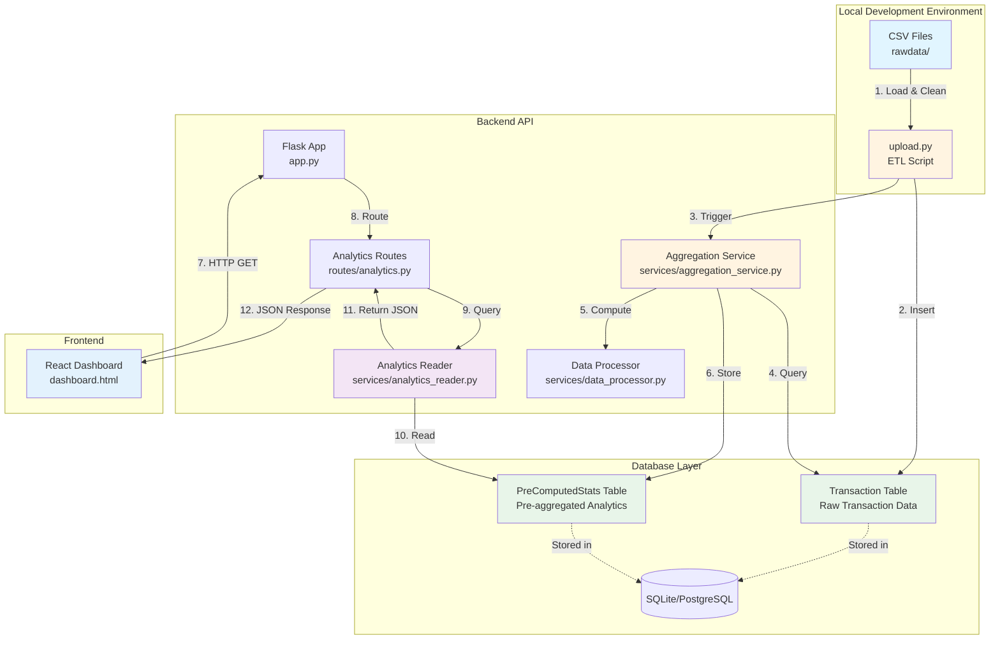

# Architecture Documentation

## Project Overview

This project is a **Pre-Computed Analytics Architecture** for analyzing Singapore private condominium resale transactions. The system follows a "Split Deployment" pattern with clear separation between data ingestion, computation, and consumption.

### Technology Stack

- **Backend**: Flask (Python) with SQLAlchemy ORM
- **Database**: SQLite (development) / PostgreSQL (production-ready)
- **Frontend**: React (via single-page HTML with React CDN)
- **Data Processing**: Pandas for analytics computation
- **Architecture Pattern**: Pre-computed analytics (compute once, serve many)

### Key Architectural Principles

1. **Separation of Concerns**: Clear boundaries between ingestion, computation, and API layers
2. **Pre-Computation**: Analytics computed once during data upload, stored in database
3. **Lightweight API**: API routes are read-only, querying pre-computed stats (no on-demand calculations)
4. **Business Logic Preservation**: All existing analytics logic preserved exactly as-is
5. **Scalability**: Can handle high concurrent load since API is just database reads

---

## Directory Structure

```
sgpropertytrend/
├── backend/                    # Flask API backend
│   ├── app.py                 # Flask application factory & entry point
│   ├── config.py              # Configuration (database, secrets)
│   ├── requirements.txt       # Python dependencies
│   ├── condo_master.db        # SQLite database (development)
│   ├── models/                # SQLAlchemy models
│   │   ├── database.py        # SQLAlchemy db instance
│   │   ├── transaction.py    # Transaction model (raw data)
│   │   ├── precomputed_stats.py  # PreComputedStats model (analytics)
│   │   └── user.py            # User model (authentication)
│   ├── routes/                # API route blueprints
│   │   └── analytics.py      # Analytics endpoints (read-only)
│   └── services/              # Business logic services
│       ├── aggregation_service.py  # Pre-computes analytics
│       ├── analytics_reader.py    # Read-only stats reader
│       ├── data_loader.py         # CSV loading & cleaning
│       ├── data_processor.py      # Analytics computation logic
│       ├── classifier.py          # Bedroom classification
│       └── json_serializer.py     # JSON serialization helper
│
├── frontend/                   # React frontend
│   └── dashboard.html         # Single-page React application
│
├── scripts/                    # ETL & maintenance scripts
│   ├── upload.py              # CSV → Database ingestion
│   ├── recompute_stats.py     # Re-run aggregation service
│   └── README.md              # Scripts documentation
│
├── rawdata/                    # Source CSV files
│   ├── New Sale/              # New sale transaction CSVs
│   └── Resale/                 # Resale transaction CSVs
│
├── .env                        # Environment variables (secrets)
├── env.example                 # Environment template
├── .gitignore                  # Git ignore rules
├── README.md                   # Project documentation
└── ARCHITECTURE.md             # This file
```

---

## System Design Diagram



---

## Data Flow

### Phase 1: Ingestion (Upload Script)

**Script**: `scripts/upload.py`

1. **CSV Loading**
   - Reads all CSV files from `rawdata/New Sale/` and `rawdata/Resale/`
   - Handles multiple encodings (UTF-8, Latin-1, ISO-8859-1) for compatibility
   - Uses existing `data_loader.py` logic for cleaning

2. **Data Processing**
   - Applies three-tier bedroom classification (New Sale Post/Pre Harmonization, Resale)
   - Parses flexible date formats (Dec-20, Mar-21, Oct 2023, etc.)
   - Filters property types (Condo/Apartment only, excludes EC/HDB)
   - Calculates lease information from Tenure text
   - Maps districts to market segments (CCR, RCR, OCR)

3. **Database Insertion**
   - Saves cleaned transactions to `Transaction` SQLAlchemy table
   - Handles duplicates (same project, date, price, area)
   - Bulk inserts in batches of 1000 for performance

4. **Aggregation Trigger**
   - Automatically calls `aggregation_service.recompute_all_stats()`

### Phase 2: Aggregation (Pre-Computation)

**Service**: `backend/services/aggregation_service.py`

1. **Data Loading**
   - Loads all transactions from `Transaction` table into Pandas DataFrame
   - Temporarily sets global DataFrame for backward compatibility with existing logic

2. **Analytics Computation**
   - Calls existing functions from `data_processor.py`:
     - `get_resale_stats()` - Resale statistics by bedroom type
     - `get_price_trends()` - Price trends over time by quarter
     - `get_market_stats()` - Short-term vs long-term market analysis
     - `get_price_trends_by_region()` - Regional trends (CCR/RCR/OCR)
     - `get_psf_trends_by_region()` - PSF trends by region
     - And 7+ other analytics functions
   - **CRITICAL**: All business logic preserved exactly as-is

3. **JSON Serialization**
   - Converts pandas Timestamps, datetime objects to ISO strings
   - Handles numpy types and nested structures
   - Ensures JSON compatibility

4. **Storage**
   - Saves each computed stat to `PreComputedStats` table
   - Key-value store: `stat_key` (e.g., 'price_trends_all') → `stat_value` (JSON)
   - Stores metadata: `computed_at`, `row_count`

### Phase 3: Consumption (API & Frontend)

**API**: `backend/routes/analytics.py`  
**Reader**: `backend/services/analytics_reader.py`

1. **API Request**
   - Frontend makes HTTP GET request to `/api/{endpoint}`
   - Example: `GET /api/resale_stats`

2. **Route Handling**
   - Flask route receives request
   - Calls `AnalyticsReader.get_resale_stats()`

3. **Stats Retrieval**
   - Reader queries `PreComputedStats` table by key
   - Example: `PreComputedStats.get_stat('resale_stats_all')`
   - Returns pre-computed JSON (no calculations)

4. **Response**
   - JSON response sent to frontend
   - Fast response time (typically <10ms, just database read)

5. **Frontend Rendering**
   - React dashboard receives JSON
   - Renders charts using Chart.js
   - Updates UI with real-time data

---

## Key Modules

### `backend/app.py`

**Purpose**: Flask application factory and entry point

**Responsibilities**:
- Initialize Flask app with configuration
- Initialize SQLAlchemy database connection
- Register route blueprints
- Configure CORS headers
- Serve dashboard.html at root route
- Create database tables on startup

**Key Functions**:
- `create_app()` - Application factory pattern
- `run_app()` - Entry point for `python app.py`

---

### `backend/services/aggregation_service.py`

**Purpose**: Pre-computes all analytics and stores in database

**Responsibilities**:
- Load transactions from database into DataFrame
- Call existing analytics functions from `data_processor.py`
- Serialize results to JSON-compatible format
- Store in `PreComputedStats` table

**Key Functions**:
- `load_transactions_to_dataframe()` - Load from DB to DataFrame
- `recompute_all_stats()` - Main aggregation function
  - Computes 12+ different analytics
  - Stores each as key-value pair in `PreComputedStats`
- `recompute_stat_for_filters()` - Future: filtered pre-computation

**Business Logic Preservation**:
- Does NOT modify existing `data_processor.py` functions
- Uses them exactly as-is
- Only adds serialization and storage layer

---

### `scripts/upload.py`

**Purpose**: ETL script to load CSV data and trigger aggregation

**Responsibilities**:
- Load CSV files from `rawdata/` folder
- Clean data using existing `data_loader.py` logic
- Save to `Transaction` SQLAlchemy table
- Trigger aggregation service

**Key Functions**:
- `load_csv_to_transactions()` - Load single CSV file
- `save_dataframe_to_db()` - Bulk insert to database
- `main()` - Orchestrates entire upload process

**Data Processing**:
- Uses `clean_csv_data()` from `data_loader.py`
- Applies bedroom classification from `classifier.py`
- Parses dates, calculates lease info
- Removes duplicates before insertion

---

### `backend/services/analytics_reader.py`

**Purpose**: Lightweight read-only service for pre-computed stats

**Responsibilities**:
- Query `PreComputedStats` table by key
- Return JSON data (no calculations)
- Handle missing stats gracefully

**Key Functions**:
- `get_resale_stats()` - Returns pre-computed resale stats
- `get_price_trends()` - Returns pre-computed price trends
- `get_market_stats()` - Returns pre-computed market stats
- And 10+ other getter methods

**Performance**:
- No Pandas operations
- No calculations
- Just database queries
- Fast response times

---

### `backend/routes/analytics.py`

**Purpose**: API endpoints for analytics data

**Responsibilities**:
- Define REST API routes
- Call `AnalyticsReader` methods
- Return JSON responses
- Handle errors gracefully

**Key Endpoints**:
- `GET /api/health` - System health check
- `GET /api/resale_stats` - Resale statistics
- `GET /api/price_trends` - Price trends over time
- `GET /api/price_trends_by_region` - Regional price trends
- `GET /api/market_stats` - Market statistics
- And 15+ other endpoints

**Architecture**:
- Uses Flask Blueprint pattern
- All routes are read-only (GET only)
- No on-demand calculations
- Fast responses from pre-computed data

---

## Database Schema

### Transaction Table

Stores raw transaction data from CSV files.

**Key Columns**:
- `id` (Primary Key)
- `project_name` (Indexed)
- `transaction_date` (Indexed, Date)
- `price`, `area_sqft`, `psf` (Numeric)
- `district` (Indexed, String)
- `bedroom_count` (Indexed, Integer)
- `sale_type` (String: 'New Sale' or 'Resale')
- `tenure` (Text: Original Tenure string)
- `lease_start_year`, `remaining_lease` (Computed from Tenure)

**Indexes**: Optimized for queries by district, bedroom_count, transaction_date

---

### PreComputedStats Table

Stores pre-aggregated analytics as JSON.

**Key Columns**:
- `id` (Primary Key)
- `stat_key` (Unique, Indexed, String)
  - Examples: 'resale_stats_all', 'price_trends_all', 'market_stats_all'
- `stat_value` (Text: JSON string)
- `computed_at` (DateTime: When stats were computed)
- `row_count` (Integer: Number of transactions used)

**Usage**: Key-value store for fast lookups

---

## Business Logic Preservation

All existing analytics logic is preserved in `backend/services/data_processor.py`:

1. **Three-Tier Bedroom Classification**
   - Tier 1: New Sale (Post-Harmonization, >= June 1, 2023) - Ultra Compact
   - Tier 2: New Sale (Pre-Harmonization, < June 1, 2023) - Modern Compact
   - Tier 3: Resale (Any Date) - Legacy Sizes

2. **Lease Calculations**
   - Parses Tenure text to extract lease start year
   - Calculates remaining lease years
   - Handles Freehold as 999-year pseudo-lease

3. **Market Segmentation**
   - Maps districts to CCR (Core Central Region)
   - Maps districts to RCR (Rest of Central Region)
   - Maps districts to OCR (Outside Central Region)

4. **Date Parsing**
   - Handles multiple formats: "Dec-20", "Mar-21", "Oct 2023", ISO dates
   - Flexible parsing with fallbacks

---

## Performance Characteristics

### Upload Phase
- **Time**: ~2-5 minutes for 100K+ transactions
- **Bottleneck**: CSV parsing and database inserts
- **Optimization**: Bulk inserts in batches

### Aggregation Phase
- **Time**: ~30-60 seconds for all analytics
- **Bottleneck**: Pandas calculations
- **Frequency**: Once per upload (or scheduled)

### API Phase
- **Response Time**: <10ms (database read only)
- **Throughput**: High (no calculations, just DB queries)
- **Scalability**: Can handle 1000+ concurrent requests

---

## Deployment Considerations

### Development
- SQLite database (`condo_master.db`)
- Single Flask process
- Local file system for CSVs

### Production (Recommended)
- PostgreSQL database
- Gunicorn/uWSGI for Flask
- Redis for caching (optional)
- Nginx as reverse proxy
- Scheduled aggregation via cron
- Object storage for CSV files (S3, etc.)

---

## Maintenance Scripts

### `scripts/upload.py`
- **When**: Initial data load or adding new CSV files
- **What**: Loads CSVs → Transaction table → Triggers aggregation

### `scripts/recompute_stats.py`
- **When**: After business logic changes or scheduled updates
- **What**: Re-runs aggregation without reloading data
- **Cron**: Can be scheduled for daily/weekly updates

---

## Future Enhancements

1. **Filtered Pre-Computation**
   - Pre-compute stats for common filter combinations
   - Store as separate keys (e.g., 'resale_stats_d09', 'price_trends_ccr')

2. **Incremental Updates**
   - Only recompute stats for new data
   - Faster updates for large datasets

3. **API Admin Endpoints**
   - `/api/admin/recompute` - Trigger recomputation via API
   - `/api/admin/stats_status` - Check computation status

4. **Caching Layer**
   - Redis/memcached for even faster responses
   - Cache frequently accessed stats

5. **Monitoring**
   - Track computation time
   - Alert if stats are stale
   - Monitor API response times

---

## Summary

This architecture provides:

✅ **Separation of Concerns**: Clear boundaries between ingestion, computation, and API  
✅ **Performance**: Fast API responses (pre-computed stats)  
✅ **Scalability**: Can handle high concurrent load  
✅ **Maintainability**: Modular structure, easy to extend  
✅ **Business Logic Preservation**: All existing analytics logic intact  
✅ **Production-Ready**: Can scale to PostgreSQL, add caching, etc.

The system follows the "Compute Once, Serve Many" pattern, making it ideal for analytics dashboards with high read traffic.

