# Technical Architecture

> Singapore Property Analyzer - System Design & Technical Documentation

## Table of Contents

1. [System Overview](#1-system-overview)
2. [Data Pipeline](#2-data-pipeline)
3. [Backend Architecture](#3-backend-architecture)
4. [Frontend Architecture](#4-frontend-architecture)
5. [Component Interactions](#5-component-interactions)
6. [Database Schema](#6-database-schema)
7. [API Reference](#7-api-reference)
8. [Deployment & Constraints](#8-deployment--constraints)

---

# 1. System Overview

## High-Level Architecture

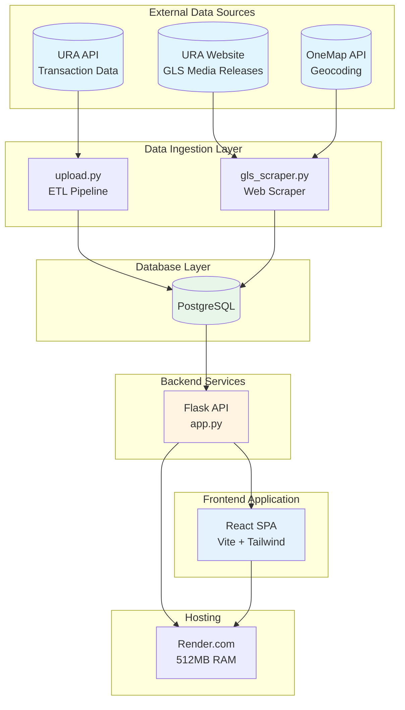
```mermaid
graph TB
    subgraph "External Data Sources"
        URA[("URA API<br/>Transaction Data")]
        URAWeb[("URA Website<br/>GLS Media Releases")]
        OneMap[("OneMap API<br/>Geocoding")]
    end

    subgraph "Data Ingestion Layer"
        Upload["upload.py<br/>ETL Pipeline"]
        GLSScraper["gls_scraper.py<br/>Web Scraper"]
    end

    subgraph "Database Layer"
        DB[("PostgreSQL")]
    end

    subgraph "Backend Services"
        Flask["Flask API<br/>app.py"]
    end

    subgraph "Frontend Application"
        React["React SPA<br/>Vite + Tailwind"]
    end

    subgraph "Hosting"
        Render["Render.com<br/>512MB RAM"]
    end

    URA --> Upload
    URAWeb --> GLSScraper
    OneMap --> GLSScraper
    Upload --> DB
    GLSScraper --> DB
    DB --> Flask
    Flask --> React
    Flask --> Render
    React --> Render

    style URA fill:#e1f5ff
    style URAWeb fill:#e1f5ff
    style OneMap fill:#e1f5ff
    style DB fill:#e8f5e9
    style Flask fill:#fff4e1
    style React fill:#e3f2fd
```

## Technology Stack

| Layer | Technology | Purpose |
|-------|------------|---------|
| **Frontend** | React 18 + Vite | SPA framework |
| **Styling** | Tailwind CSS | Utility-first CSS |
| **Charts** | Chart.js + react-chartjs-2 | Data visualization |
| **Backend** | Flask + SQLAlchemy | REST API |
| **Database** | PostgreSQL | Primary datastore |
| **Hosting** | Render | Cloud deployment |

## Architectural Principles

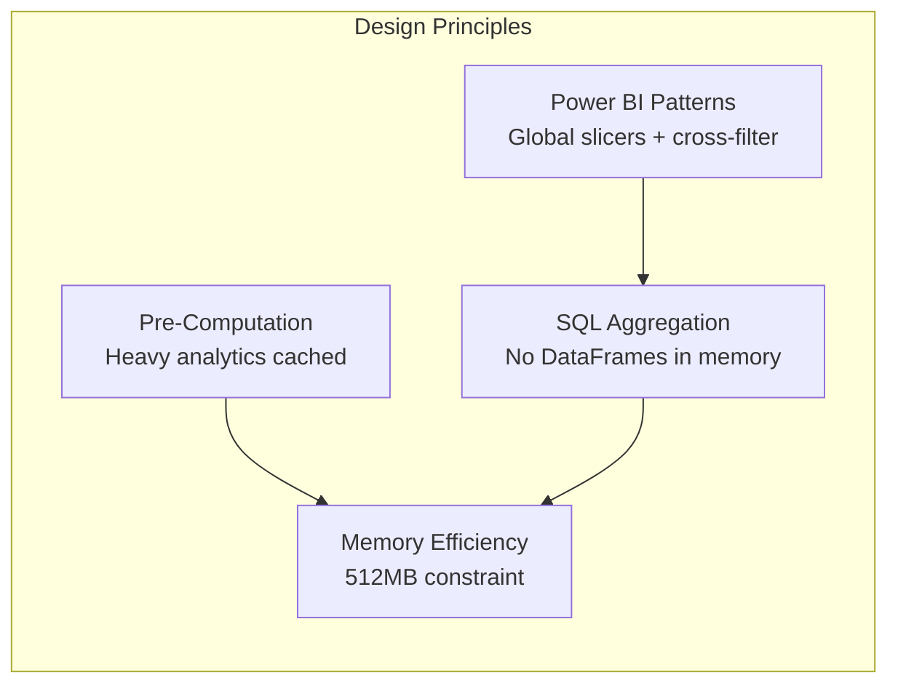
```mermaid
graph LR
    subgraph "Design Principles"
        P1["Pre-Computation<br/>Heavy analytics cached"]
        P2["SQL Aggregation<br/>No DataFrames in memory"]
        P3["Memory Efficiency<br/>512MB constraint"]
        P4["Power BI Patterns<br/>Global slicers + cross-filter"]
    end

    P1 --> P3
    P2 --> P3
    P4 --> P2
```

---

# 2. Data Pipeline

## Transaction Data Ingestion

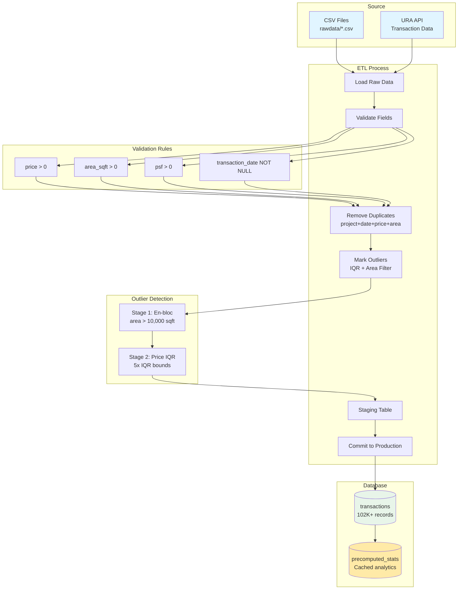
```mermaid
flowchart TD
    subgraph "Source"
        CSV["CSV Files<br/>rawdata/*.csv"]
        API["URA API<br/>Transaction Data"]
    end

    subgraph "ETL Process"
        Load["Load Raw Data"]
        Validate["Validate Fields"]
        Dedupe["Remove Duplicates<br/>project+date+price+area"]
        Outlier["Mark Outliers<br/>IQR + Area Filter"]
        Stage["Staging Table"]
        Commit["Commit to Production"]
    end

    subgraph "Validation Rules"
        V1["price > 0"]
        V2["area_sqft > 0"]
        V3["psf > 0"]
        V4["transaction_date NOT NULL"]
    end

    subgraph "Outlier Detection"
        O1["Stage 1: En-bloc<br/>area > 10,000 sqft"]
        O2["Stage 2: Price IQR<br/>5x IQR bounds"]
    end

    CSV --> Load
    API --> Load
    Load --> Validate
    Validate --> V1 & V2 & V3 & V4
    V1 & V2 & V3 & V4 --> Dedupe
    Dedupe --> Outlier
    Outlier --> O1 --> O2
    O2 --> Stage
    Stage --> Commit

    subgraph "Database"
        TxnTable[("transactions<br/>102K+ records")]
        Stats[("precomputed_stats<br/>Cached analytics")]
    end

    Commit --> TxnTable
    TxnTable --> Stats

    style CSV fill:#e1f5ff
    style API fill:#e1f5ff
    style TxnTable fill:#e8f5e9
    style Stats fill:#ffeaa7
```

## GLS Data Scraping Pipeline

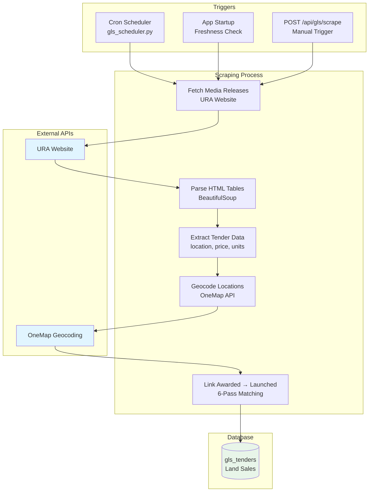
```mermaid
flowchart TD
    subgraph "Triggers"
        Cron["Cron Scheduler<br/>gls_scheduler.py"]
        Startup["App Startup<br/>Freshness Check"]
        Manual["POST /api/gls/scrape<br/>Manual Trigger"]
    end

    subgraph "Scraping Process"
        Fetch["Fetch Media Releases<br/>URA Website"]
        Parse["Parse HTML Tables<br/>BeautifulSoup"]
        Extract["Extract Tender Data<br/>location, price, units"]
        Geo["Geocode Locations<br/>OneMap API"]
        Link["Link Awarded → Launched<br/>6-Pass Matching"]
    end

    subgraph "External APIs"
        URA["URA Website"]
        OneMap["OneMap Geocoding"]
    end

    subgraph "Database"
        GLS[("gls_tenders<br/>Land Sales")]
    end

    Cron --> Fetch
    Startup --> Fetch
    Manual --> Fetch
    Fetch --> URA
    URA --> Parse
    Parse --> Extract
    Extract --> Geo
    Geo --> OneMap
    OneMap --> Link
    Link --> GLS

    style URA fill:#e1f5ff
    style OneMap fill:#e1f5ff
    style GLS fill:#e8f5e9
```

## Data Validation Sequence

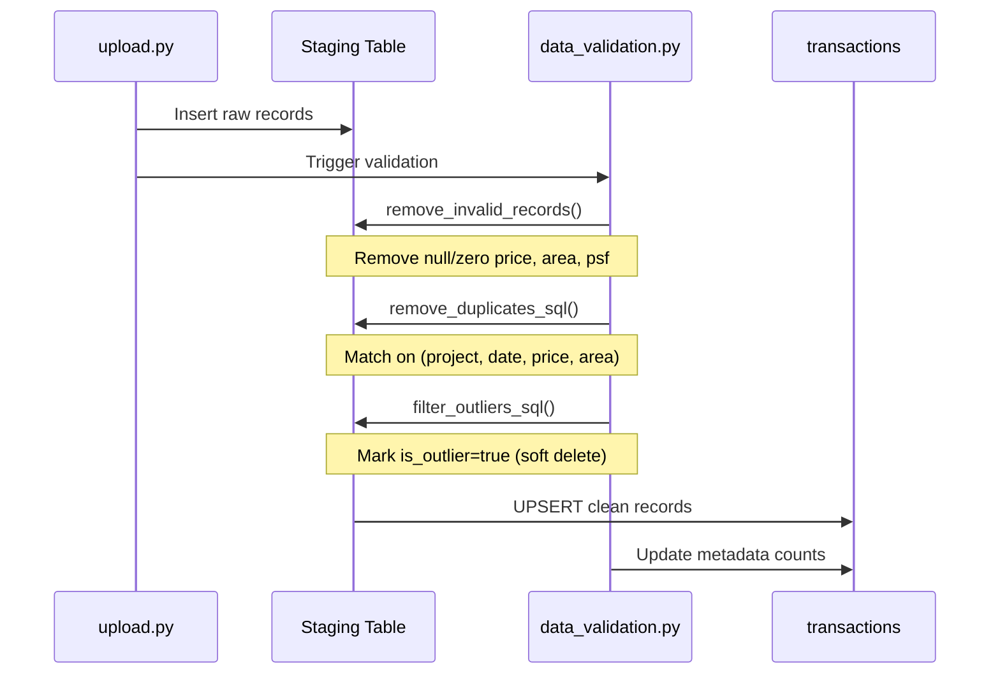
```mermaid
sequenceDiagram
    participant Upload as upload.py
    participant Staging as Staging Table
    participant Validation as data_validation.py
    participant Production as transactions

    Upload->>Staging: Insert raw records
    Upload->>Validation: Trigger validation

    Validation->>Staging: remove_invalid_records()
    Note over Validation,Staging: Remove null/zero price, area, psf

    Validation->>Staging: remove_duplicates_sql()
    Note over Validation,Staging: Match on (project, date, price, area)

    Validation->>Staging: filter_outliers_sql()
    Note over Validation,Staging: Mark is_outlier=true (soft delete)

    Staging->>Production: UPSERT clean records
    Validation->>Production: Update metadata counts
```

---

# 3. Backend Architecture

## Service Layer Architecture

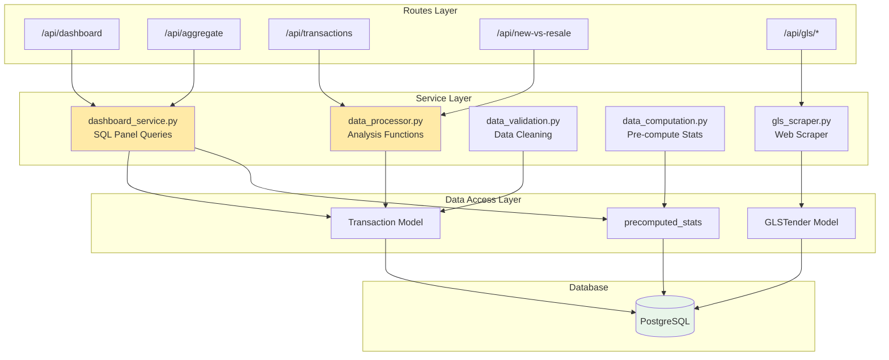
```mermaid
graph TB
    subgraph "Routes Layer"
        R1["/api/dashboard"]
        R2["/api/aggregate"]
        R3["/api/transactions"]
        R4["/api/new-vs-resale"]
        R5["/api/gls/*"]
    end

    subgraph "Service Layer"
        DS["dashboard_service.py<br/>SQL Panel Queries"]
        DP["data_processor.py<br/>Analysis Functions"]
        DV["data_validation.py<br/>Data Cleaning"]
        DC["data_computation.py<br/>Pre-compute Stats"]
        GS["gls_scraper.py<br/>Web Scraper"]
    end

    subgraph "Data Access Layer"
        TxnModel["Transaction Model"]
        GLSModel["GLSTender Model"]
        StatsTable["precomputed_stats"]
    end

    subgraph "Database"
        DB[("PostgreSQL")]
    end

    R1 --> DS
    R2 --> DS
    R3 --> DP
    R4 --> DP
    R5 --> GS

    DS --> TxnModel
    DS --> StatsTable
    DP --> TxnModel
    DV --> TxnModel
    DC --> StatsTable
    GS --> GLSModel

    TxnModel --> DB
    GLSModel --> DB
    StatsTable --> DB

    style DS fill:#ffeaa7
    style DP fill:#ffeaa7
    style DB fill:#e8f5e9
```

## Dashboard Service Query Flow

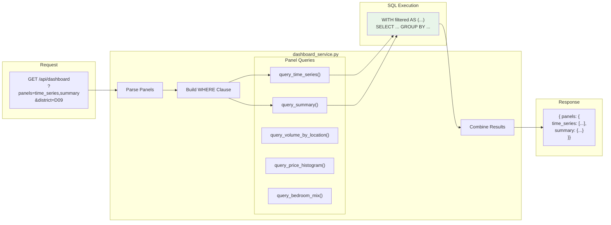
```mermaid
flowchart LR
    subgraph "Request"
        Req["GET /api/dashboard<br/>?panels=time_series,summary<br/>&district=D09"]
    end

    subgraph "dashboard_service.py"
        Parse["Parse Panels"]
        Build["Build WHERE Clause"]

        subgraph "Panel Queries"
            Q1["query_time_series()"]
            Q2["query_summary()"]
            Q3["query_volume_by_location()"]
            Q4["query_price_histogram()"]
            Q5["query_bedroom_mix()"]
        end

        Combine["Combine Results"]
    end

    subgraph "SQL Execution"
        CTE["WITH filtered AS (...)<br/>SELECT ... GROUP BY ..."]
    end

    subgraph "Response"
        JSON["{ panels: {<br/>  time_series: [...],<br/>  summary: {...}<br/>}}"]
    end

    Req --> Parse --> Build
    Build --> Q1 & Q2
    Q1 & Q2 --> CTE
    CTE --> Combine --> JSON

    style CTE fill:#e8f5e9
```

## File Structure

```
backend/
├── app.py                      # Flask factory + startup hooks
├── config.py                   # Environment configuration
├── requirements.txt
│
├── models/
│   ├── database.py             # SQLAlchemy db instance
│   ├── transaction.py          # Transaction model
│   ├── gls_tender.py           # GLSTender model
│   └── user.py                 # User authentication
│
├── routes/
│   ├── analytics.py            # Transaction endpoints
│   ├── gls.py                  # GLS tender endpoints
│   └── auth.py                 # JWT authentication
│
└── services/
    ├── dashboard_service.py    # High-perf SQL panels
    ├── data_processor.py       # Analysis functions
    ├── data_validation.py      # Outlier/duplicate removal
    ├── data_computation.py     # Pre-compute aggregations
    ├── analytics_reader.py     # Read cached stats
    ├── gls_scraper.py          # URA web scraper
    └── gls_scheduler.py        # Cron refresh logic
```

---

# 4. Frontend Architecture

## Component Hierarchy

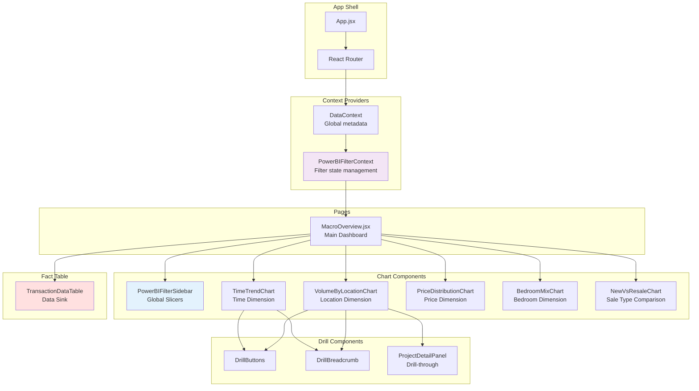
```mermaid
graph TB
    subgraph "App Shell"
        App["App.jsx"]
        Router["React Router"]
    end

    subgraph "Context Providers"
        DataCtx["DataContext<br/>Global metadata"]
        FilterCtx["PowerBIFilterContext<br/>Filter state management"]
    end

    subgraph "Pages"
        Macro["MacroOverview.jsx<br/>Main Dashboard"]
    end

    subgraph "Chart Components"
        Sidebar["PowerBIFilterSidebar<br/>Global Slicers"]
        Time["TimeTrendChart<br/>Time Dimension"]
        Volume["VolumeByLocationChart<br/>Location Dimension"]
        Price["PriceDistributionChart<br/>Price Dimension"]
        Bedroom["BedroomMixChart<br/>Bedroom Dimension"]
        NewResale["NewVsResaleChart<br/>Sale Type Comparison"]
    end

    subgraph "Fact Table"
        TxnTable["TransactionDataTable<br/>Data Sink"]
    end

    subgraph "Drill Components"
        DrillBtn["DrillButtons"]
        DrillBread["DrillBreadcrumb"]
        ProjectPanel["ProjectDetailPanel<br/>Drill-through"]
    end

    App --> Router --> DataCtx --> FilterCtx --> Macro
    Macro --> Sidebar
    Macro --> Time & Volume & Price & Bedroom & NewResale
    Macro --> TxnTable
    Time & Volume --> DrillBtn & DrillBread
    Volume --> ProjectPanel

    style FilterCtx fill:#f3e5f5
    style TxnTable fill:#ffe0e0
    style Sidebar fill:#e3f2fd
```

## State Management Flow

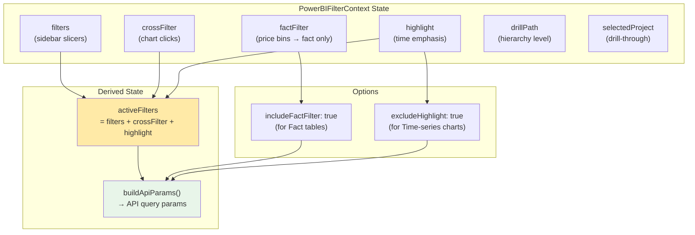
```mermaid
flowchart TD
    subgraph "PowerBIFilterContext State"
        filters["filters<br/>(sidebar slicers)"]
        crossFilter["crossFilter<br/>(chart clicks)"]
        factFilter["factFilter<br/>(price bins → fact only)"]
        highlight["highlight<br/>(time emphasis)"]
        drillPath["drillPath<br/>(hierarchy level)"]
        selectedProject["selectedProject<br/>(drill-through)"]
    end

    subgraph "Derived State"
        activeFilters["activeFilters<br/>= filters + crossFilter + highlight"]
        buildApiParams["buildApiParams()<br/>→ API query params"]
    end

    subgraph "Options"
        opt1["includeFactFilter: true<br/>(for Fact tables)"]
        opt2["excludeHighlight: true<br/>(for Time-series charts)"]
    end

    filters --> activeFilters
    crossFilter --> activeFilters
    highlight --> activeFilters
    activeFilters --> buildApiParams
    factFilter --> opt1 --> buildApiParams
    highlight --> opt2 --> buildApiParams

    style activeFilters fill:#ffeaa7
    style buildApiParams fill:#e8f5e9
```

## Filter Propagation Sequence

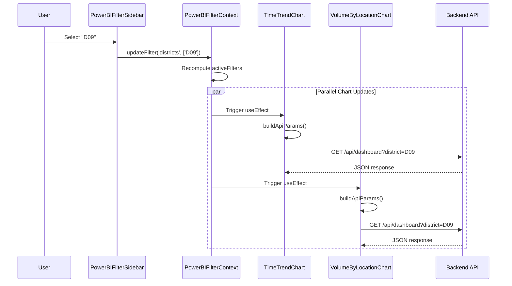
```mermaid
sequenceDiagram
    participant User
    participant Sidebar as PowerBIFilterSidebar
    participant Context as PowerBIFilterContext
    participant Chart1 as TimeTrendChart
    participant Chart2 as VolumeByLocationChart
    participant API as Backend API

    User->>Sidebar: Select "D09"
    Sidebar->>Context: updateFilter('districts', ['D09'])
    Context->>Context: Recompute activeFilters

    par Parallel Chart Updates
        Context->>Chart1: Trigger useEffect
        Chart1->>Chart1: buildApiParams()
        Chart1->>API: GET /api/dashboard?district=D09
        API-->>Chart1: JSON response

        Context->>Chart2: Trigger useEffect
        Chart2->>Chart2: buildApiParams()
        Chart2->>API: GET /api/dashboard?district=D09
        API-->>Chart2: JSON response
    end
```

## File Structure

```
frontend/src/
├── api/
│   └── client.js               # Axios API client
│
├── context/
│   ├── DataContext.jsx         # Global metadata
│   └── PowerBIFilterContext.jsx # Filter state
│
├── components/
│   └── powerbi/
│       ├── PowerBIFilterSidebar.jsx
│       ├── TimeTrendChart.jsx
│       ├── VolumeByLocationChart.jsx
│       ├── PriceDistributionChart.jsx
│       ├── BedroomMixChart.jsx
│       ├── NewVsResaleChart.jsx
│       ├── TransactionDataTable.jsx
│       ├── DrillButtons.jsx
│       ├── DrillBreadcrumb.jsx
│       └── ProjectDetailPanel.jsx
│
├── pages/
│   └── MacroOverview.jsx       # Main dashboard
│
└── App.jsx                     # Root component
```

---

# 5. Component Interactions

## Cross-Filter Flow

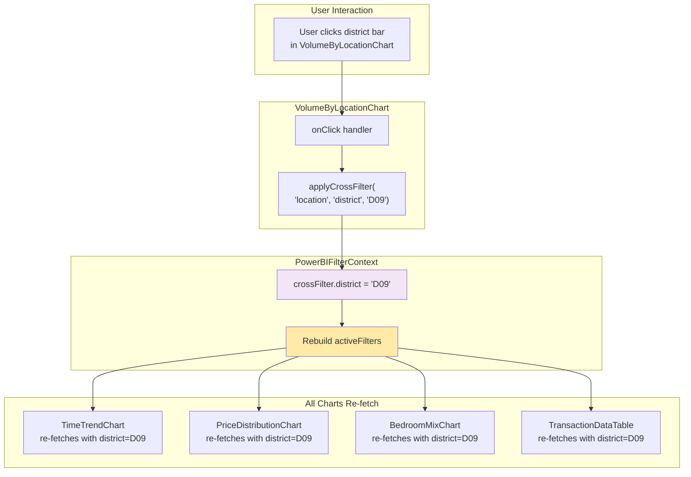
```mermaid
flowchart TD
    subgraph "User Interaction"
        Click["User clicks district bar<br/>in VolumeByLocationChart"]
    end

    subgraph "VolumeByLocationChart"
        Handler["onClick handler"]
        ApplyCross["applyCrossFilter(<br/>'location', 'district', 'D09')"]
    end

    subgraph "PowerBIFilterContext"
        CrossState["crossFilter.district = 'D09'"]
        Rebuild["Rebuild activeFilters"]
    end

    subgraph "All Charts Re-fetch"
        Time["TimeTrendChart<br/>re-fetches with district=D09"]
        Price["PriceDistributionChart<br/>re-fetches with district=D09"]
        Bedroom["BedroomMixChart<br/>re-fetches with district=D09"]
        Table["TransactionDataTable<br/>re-fetches with district=D09"]
    end

    Click --> Handler --> ApplyCross --> CrossState --> Rebuild
    Rebuild --> Time & Price & Bedroom & Table

    style CrossState fill:#f3e5f5
    style Rebuild fill:#ffeaa7
```

## Drill vs Cross-Filter Comparison

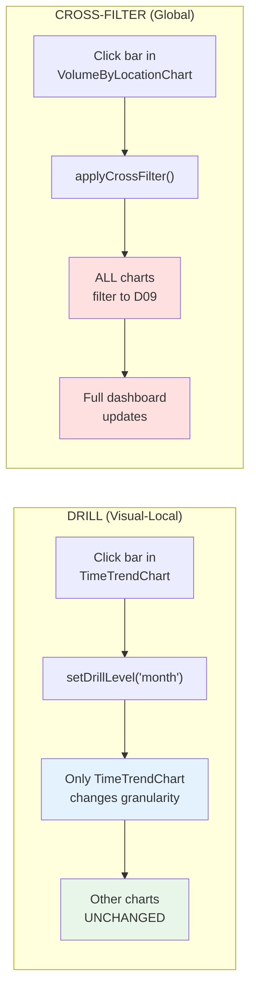
```mermaid
flowchart LR
    subgraph "DRILL (Visual-Local)"
        D1["Click bar in<br/>TimeTrendChart"]
        D2["setDrillLevel('month')"]
        D3["Only TimeTrendChart<br/>changes granularity"]
        D4["Other charts<br/>UNCHANGED"]
    end

    subgraph "CROSS-FILTER (Global)"
        C1["Click bar in<br/>VolumeByLocationChart"]
        C2["applyCrossFilter()"]
        C3["ALL charts<br/>filter to D09"]
        C4["Full dashboard<br/>updates"]
    end

    D1 --> D2 --> D3 --> D4
    C1 --> C2 --> C3 --> C4

    style D3 fill:#e3f2fd
    style D4 fill:#e8f5e9
    style C3 fill:#ffe0e0
    style C4 fill:#ffe0e0
```

## Fact Filter Flow (Price Bins → TransactionTable)

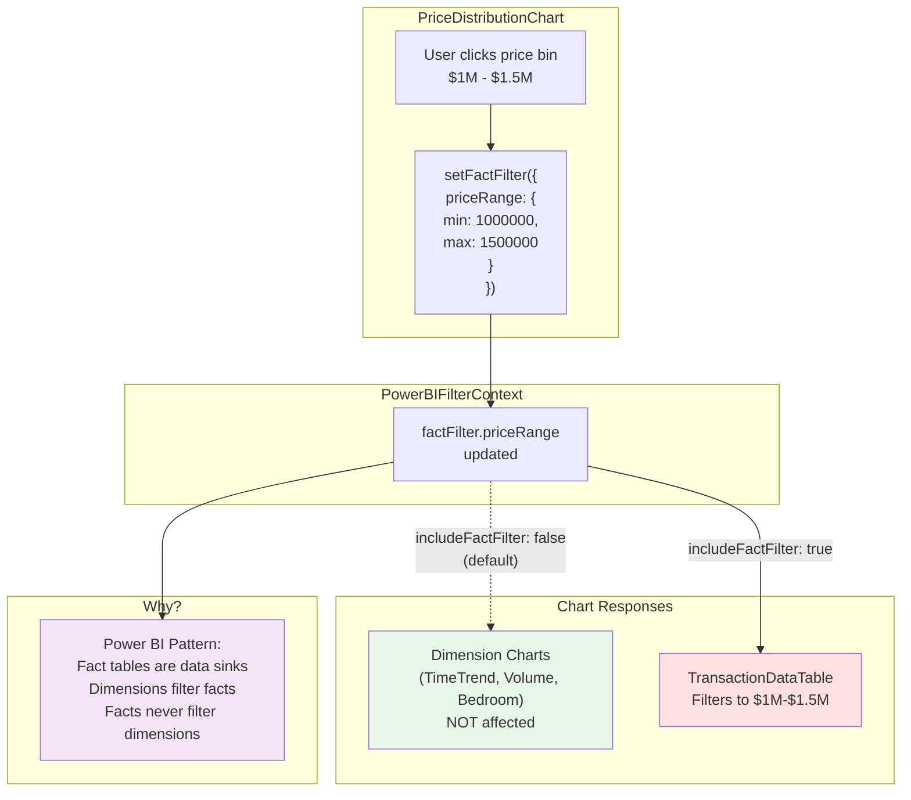
```mermaid
flowchart TD
    subgraph "PriceDistributionChart"
        Click["User clicks price bin<br/>$1M - $1.5M"]
        SetFact["setFactFilter({<br/>  priceRange: {<br/>    min: 1000000,<br/>    max: 1500000<br/>  }<br/>})"]
    end

    subgraph "PowerBIFilterContext"
        FactState["factFilter.priceRange<br/>updated"]
    end

    subgraph "Chart Responses"
        DimCharts["Dimension Charts<br/>(TimeTrend, Volume, Bedroom)<br/>NOT affected"]
        FactTable["TransactionDataTable<br/>Filters to $1M-$1.5M"]
    end

    subgraph "Why?"
        Reason["Power BI Pattern:<br/>Fact tables are data sinks<br/>Dimensions filter facts<br/>Facts never filter dimensions"]
    end

    Click --> SetFact --> FactState
    FactState -.->|"includeFactFilter: false<br/>(default)"| DimCharts
    FactState -->|"includeFactFilter: true"| FactTable
    FactState --> Reason

    style FactTable fill:#ffe0e0
    style DimCharts fill:#e8f5e9
    style Reason fill:#f3e5f5
```

## Time Highlight Flow

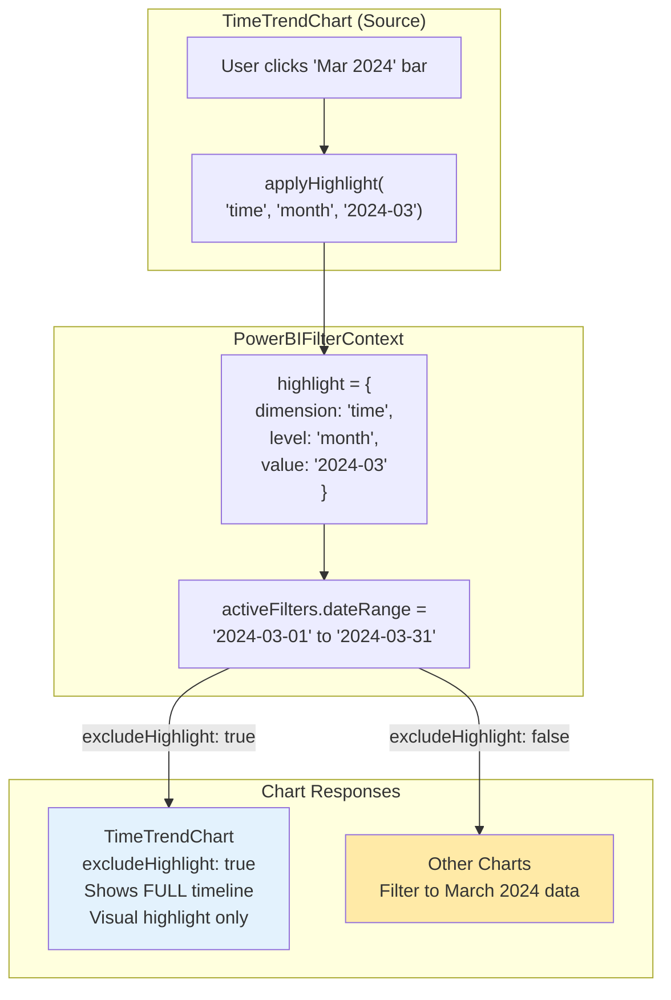
```mermaid
flowchart TD
    subgraph "TimeTrendChart (Source)"
        Click["User clicks 'Mar 2024' bar"]
        Apply["applyHighlight(<br/>'time', 'month', '2024-03')"]
    end

    subgraph "PowerBIFilterContext"
        HighState["highlight = {<br/>  dimension: 'time',<br/>  level: 'month',<br/>  value: '2024-03'<br/>}"]
        Active["activeFilters.dateRange =<br/>'2024-03-01' to '2024-03-31'"]
    end

    subgraph "Chart Responses"
        TimeChart["TimeTrendChart<br/>excludeHighlight: true<br/>Shows FULL timeline<br/>Visual highlight only"]
        OtherCharts["Other Charts<br/>Filter to March 2024 data"]
    end

    Click --> Apply --> HighState --> Active
    Active -->|"excludeHighlight: true"| TimeChart
    Active -->|"excludeHighlight: false"| OtherCharts

    style TimeChart fill:#e3f2fd
    style OtherCharts fill:#ffeaa7
```

## Full Request Lifecycle

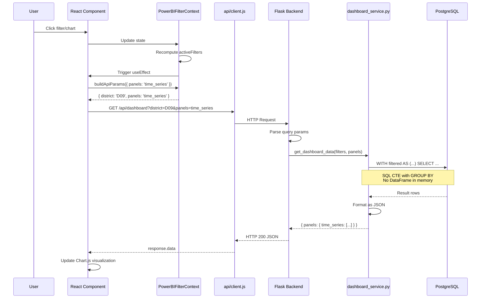
```mermaid
sequenceDiagram
    participant User
    participant React as React Component
    participant Context as PowerBIFilterContext
    participant Axios as api/client.js
    participant Flask as Flask Backend
    participant Service as dashboard_service.py
    participant DB as PostgreSQL

    User->>React: Click filter/chart
    React->>Context: Update state
    Context->>Context: Recompute activeFilters
    Context->>React: Trigger useEffect

    React->>Context: buildApiParams({ panels: 'time_series' })
    Context-->>React: { district: 'D09', panels: 'time_series' }

    React->>Axios: GET /api/dashboard?district=D09&panels=time_series
    Axios->>Flask: HTTP Request

    Flask->>Flask: Parse query params
    Flask->>Service: get_dashboard_data(filters, panels)

    Service->>DB: WITH filtered AS (...) SELECT ...
    Note over Service,DB: SQL CTE with GROUP BY<br/>No DataFrame in memory

    DB-->>Service: Result rows
    Service->>Service: Format as JSON
    Service-->>Flask: { panels: { time_series: [...] } }

    Flask-->>Axios: HTTP 200 JSON
    Axios-->>React: response.data

    React->>React: Update Chart.js visualization
```

## Project Drill-Through Flow

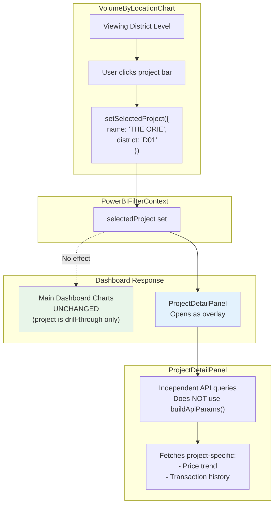
```mermaid
flowchart TD
    subgraph "VolumeByLocationChart"
        AtDistrict["Viewing District Level"]
        ClickProject["User clicks project bar"]
        SetProject["setSelectedProject({<br/>  name: 'THE ORIE',<br/>  district: 'D01'<br/>})"]
    end

    subgraph "PowerBIFilterContext"
        ProjectState["selectedProject set"]
    end

    subgraph "Dashboard Response"
        MainCharts["Main Dashboard Charts<br/>UNCHANGED<br/>(project is drill-through only)"]
        Panel["ProjectDetailPanel<br/>Opens as overlay"]
    end

    subgraph "ProjectDetailPanel"
        OwnQuery["Independent API queries<br/>Does NOT use buildApiParams()"]
        ProjectData["Fetches project-specific:<br/>- Price trend<br/>- Transaction history"]
    end

    AtDistrict --> ClickProject --> SetProject --> ProjectState
    ProjectState -.->|"No effect"| MainCharts
    ProjectState --> Panel --> OwnQuery --> ProjectData

    style MainCharts fill:#e8f5e9
    style Panel fill:#e3f2fd
```

---

# 6. Database Schema

## Entity Relationship Diagram

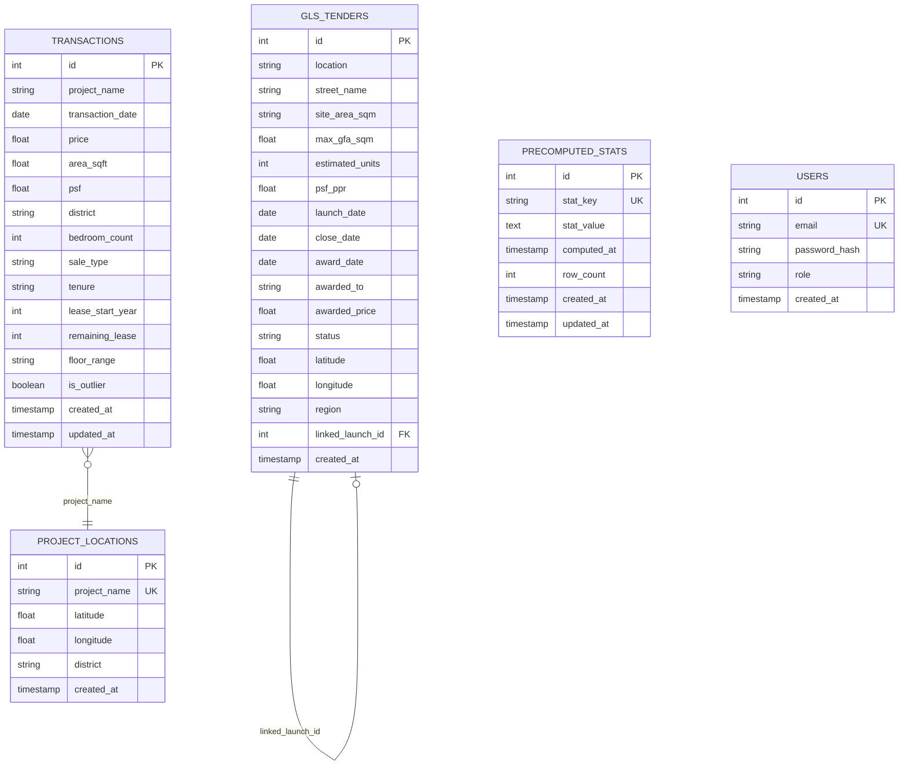
```mermaid
erDiagram
    TRANSACTIONS {
        int id PK
        string project_name
        date transaction_date
        float price
        float area_sqft
        float psf
        string district
        int bedroom_count
        string sale_type
        string tenure
        int lease_start_year
        int remaining_lease
        string floor_range
        boolean is_outlier
        timestamp created_at
        timestamp updated_at
    }

    GLS_TENDERS {
        int id PK
        string location
        string street_name
        string site_area_sqm
        float max_gfa_sqm
        int estimated_units
        float psf_ppr
        date launch_date
        date close_date
        date award_date
        string awarded_to
        float awarded_price
        string status
        float latitude
        float longitude
        string region
        int linked_launch_id FK
        timestamp created_at
    }

    PRECOMPUTED_STATS {
        int id PK
        string stat_key UK
        text stat_value
        timestamp computed_at
        int row_count
        timestamp created_at
        timestamp updated_at
    }

    USERS {
        int id PK
        string email UK
        string password_hash
        string role
        timestamp created_at
    }

    PROJECT_LOCATIONS {
        int id PK
        string project_name UK
        float latitude
        float longitude
        string district
        timestamp created_at
    }

    GLS_TENDERS ||--o| GLS_TENDERS : "linked_launch_id"
    TRANSACTIONS }o--|| PROJECT_LOCATIONS : "project_name"
```

## Table Details

### transactions

Primary table for condo transaction records.

| Column | Type | Index | Description |
|--------|------|-------|-------------|
| id | SERIAL | PK | Auto-increment ID |
| project_name | VARCHAR(255) | ✓ | Condo development name |
| transaction_date | DATE | ✓ | Sale contract date |
| price | NUMERIC | | Transaction price (SGD) |
| area_sqft | NUMERIC | | Unit size in sqft |
| psf | NUMERIC | | Price per square foot |
| district | VARCHAR(10) | ✓ | District code (D01-D28) |
| bedroom_count | INTEGER | ✓ | Number of bedrooms |
| sale_type | VARCHAR(20) | ✓ | 'New Sale' or 'Resale' |
| tenure | TEXT | | Original tenure string |
| lease_start_year | INTEGER | | Computed from tenure |
| remaining_lease | INTEGER | | Years remaining |
| floor_range | VARCHAR(20) | | Floor level range |
| is_outlier | BOOLEAN | ✓ | Soft-delete flag for outliers |

### precomputed_stats

Cached analytics to avoid expensive real-time aggregations.

| Column | Type | Description |
|--------|------|-------------|
| id | SERIAL | Auto-increment ID |
| stat_key | VARCHAR(100) | Unique stat identifier |
| stat_value | TEXT | JSON-serialized data |
| computed_at | TIMESTAMP | Last computation time |
| row_count | INTEGER | Record count at computation |

**Common stat_keys:**

| Key | Description |
|-----|-------------|
| `_metadata` | Dataset stats, outliers_excluded count |
| `total_volume_by_district` | Volume aggregations by district |
| `price_trends_all` | Price trends over time |
| `market_stats_all` | Percentile statistics |
| `market_stats_by_district` | Per-district percentiles |

### gls_tenders

Government Land Sales tender records.

| Column | Type | Description |
|--------|------|-------------|
| id | SERIAL | Auto-increment ID |
| location | VARCHAR(255) | Site location name |
| site_area_sqm | VARCHAR(50) | Site area in sqm |
| max_gfa_sqm | FLOAT | Maximum gross floor area |
| estimated_units | INTEGER | Estimated dwelling units |
| psf_ppr | FLOAT | Price per sqft per plot ratio |
| launch_date | DATE | Tender launch date |
| award_date | DATE | Award date (if awarded) |
| status | VARCHAR(20) | 'launched', 'awarded', 'closed' |
| latitude | FLOAT | Geocoded latitude |
| longitude | FLOAT | Geocoded longitude |
| region | VARCHAR(10) | CCR, RCR, OCR |
| linked_launch_id | INTEGER | FK to original launch record |

---

# 7. API Reference

## Transaction Endpoints

### GET /api/dashboard

Multi-panel dashboard data in single request.

```
GET /api/dashboard?panels=time_series,summary&district=D09&bedroom=2,3
```

| Param | Type | Description |
|-------|------|-------------|
| panels | string | Comma-separated: time_series, summary, volume_by_location, price_histogram, bedroom_mix |
| district | string | Comma-separated district codes (D01, D09, etc.) |
| bedroom | string | Comma-separated bedroom counts (1, 2, 3, 4, 5) |
| segment | string | Market segment: CCR, RCR, OCR |
| sale_type | string | 'New Sale' or 'Resale' |
| date_from | date | Start date (YYYY-MM-DD) |
| date_to | date | End date (YYYY-MM-DD) |
| time_grain | string | Aggregation level: year, quarter, month |

**Response:**
```json
{
  "panels": {
    "time_series": [
      { "period": "2024-01", "count": 150, "median_psf": 1850 }
    ],
    "summary": {
      "total_transactions": 1500,
      "median_psf": 1820,
      "total_value": 2500000000
    }
  }
}
```

### GET /api/aggregate

Flexible aggregation endpoint for custom queries.

```
GET /api/aggregate?group_by=district&metrics=count,median_psf
```

| Param | Type | Description |
|-------|------|-------------|
| group_by | string | Grouping: month, quarter, year, district, bedroom, sale_type, region |
| metrics | string | Metrics: count, median_psf, avg_psf, total_value |
| (+ all filter params from /api/dashboard) | | |

### GET /api/transactions/list

Paginated transaction list for fact table.

```
GET /api/transactions/list?page=1&per_page=50&district=D09
```

| Param | Type | Default | Description |
|-------|------|---------|-------------|
| page | int | 1 | Page number |
| per_page | int | 50 | Records per page (max 100) |
| sort_by | string | transaction_date | Sort column |
| sort_order | string | desc | Sort direction |

### GET /api/new-vs-resale

New Launch vs Resale comparison data.

```
GET /api/new-vs-resale?timeGrain=quarter&district=D09
```

| Param | Type | Description |
|-------|------|-------------|
| timeGrain | string | Visual-local drill level: year, quarter, month |
| (+ all global filter params) | | District, bedroom, segment, date range |

## GLS Endpoints

| Endpoint | Method | Description |
|----------|--------|-------------|
| `/api/gls/upcoming` | GET | Launched tenders (forward-looking) |
| `/api/gls/awarded` | GET | Awarded tenders (historical) |
| `/api/gls/all` | GET | All tenders with status labels |
| `/api/gls/supply-pipeline` | GET | Aggregate units by region |
| `/api/gls/price-floor` | GET | Aggregate PSF by region |
| `/api/gls/tender/:id` | GET | Single tender detail |
| `/api/gls/scrape` | POST | Manual scrape trigger |
| `/api/gls/cron-refresh` | POST | Cron job refresh |

## Utility Endpoints

| Endpoint | Method | Description |
|----------|--------|-------------|
| `/api/filter-options` | GET | Available filter values |
| `/api/metadata` | GET | Dataset statistics |
| `/api/health` | GET | Health check |

---

# 8. Deployment & Constraints

## Render Deployment Architecture

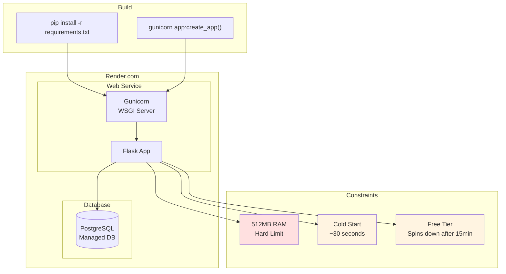
```mermaid
graph TB
    subgraph "Render.com"
        subgraph "Web Service"
            Gunicorn["Gunicorn<br/>WSGI Server"]
            Flask["Flask App"]
        end

        subgraph "Database"
            PG[("PostgreSQL<br/>Managed DB")]
        end
    end

    subgraph "Constraints"
        RAM["512MB RAM<br/>Hard Limit"]
        Cold["Cold Start<br/>~30 seconds"]
        Free["Free Tier<br/>Spins down after 15min"]
    end

    subgraph "Build"
        Install["pip install -r requirements.txt"]
        Start["gunicorn app:create_app()"]
    end

    Install --> Gunicorn
    Start --> Gunicorn
    Gunicorn --> Flask --> PG
    Flask --> RAM
    Flask --> Cold
    Flask --> Free

    style RAM fill:#ffe0e0
    style Cold fill:#fff4e1
    style Free fill:#fff4e1
```

## Memory Optimization Strategies

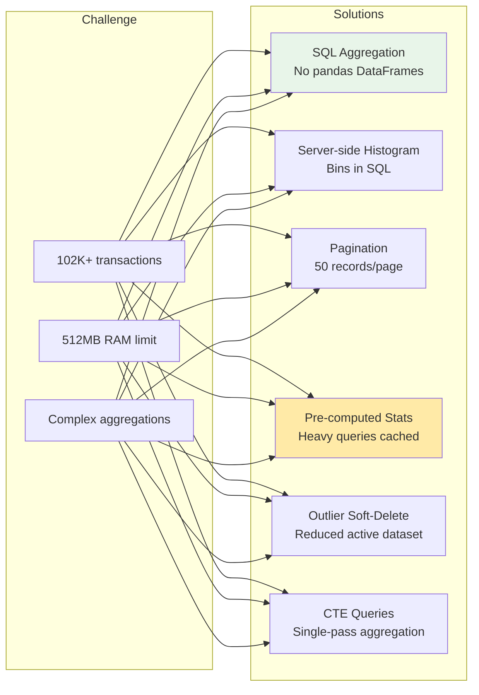
```mermaid
flowchart LR
    subgraph "Challenge"
        P1["102K+ transactions"]
        P2["512MB RAM limit"]
        P3["Complex aggregations"]
    end

    subgraph "Solutions"
        S1["SQL Aggregation<br/>No pandas DataFrames"]
        S2["Server-side Histogram<br/>Bins in SQL"]
        S3["Pagination<br/>50 records/page"]
        S4["Pre-computed Stats<br/>Heavy queries cached"]
        S5["Outlier Soft-Delete<br/>Reduced active dataset"]
        S6["CTE Queries<br/>Single-pass aggregation"]
    end

    P1 & P2 & P3 --> S1 & S2 & S3 & S4 & S5 & S6

    style S1 fill:#e8f5e9
    style S4 fill:#ffeaa7
```

## Startup Sequence

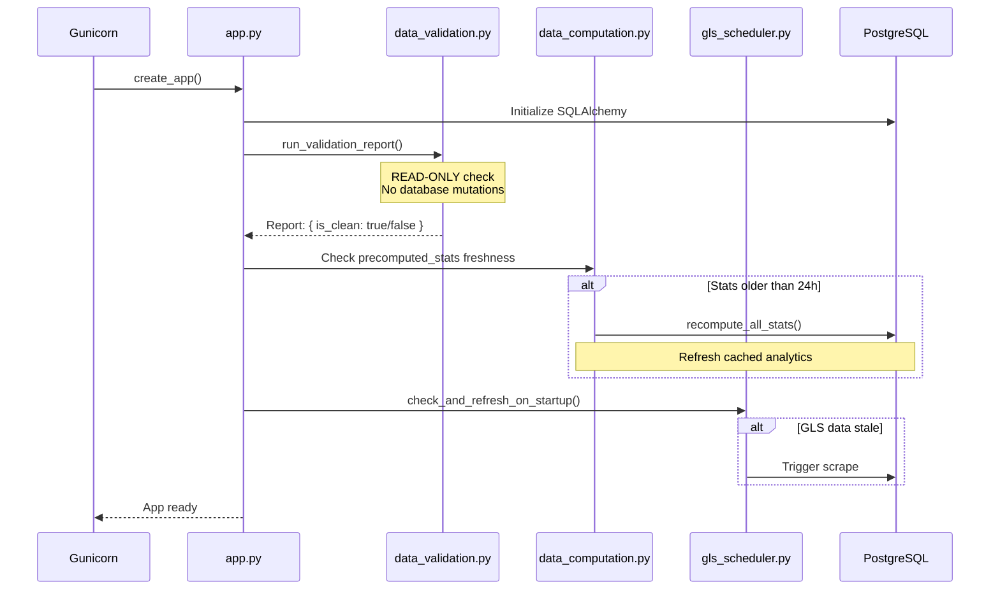
```mermaid
sequenceDiagram
    participant Gunicorn
    participant Flask as app.py
    participant Validation as data_validation.py
    participant Computation as data_computation.py
    participant GLS as gls_scheduler.py
    participant DB as PostgreSQL

    Gunicorn->>Flask: create_app()
    Flask->>DB: Initialize SQLAlchemy

    Flask->>Validation: run_validation_report()
    Note over Validation: READ-ONLY check<br/>No database mutations

    Validation-->>Flask: Report: { is_clean: true/false }

    Flask->>Computation: Check precomputed_stats freshness
    alt Stats older than 24h
        Computation->>DB: recompute_all_stats()
        Note over Computation,DB: Refresh cached analytics
    end

    Flask->>GLS: check_and_refresh_on_startup()
    alt GLS data stale
        GLS->>DB: Trigger scrape
    end

    Flask-->>Gunicorn: App ready
```

## Environment Variables

| Variable | Required | Description |
|----------|----------|-------------|
| DATABASE_URL | Yes | PostgreSQL connection string |
| SECRET_KEY | Yes | Flask session secret |
| JWT_SECRET_KEY | Yes | JWT signing key |
| ONEMAP_API_KEY | No | OneMap geocoding API key |
| FLASK_ENV | No | 'development' or 'production' |

## SQL Query Patterns (Memory-Safe)

```python
# GOOD: SQL aggregation (no memory spike)
result = db.session.execute(text("""
    WITH filtered AS (
        SELECT * FROM transactions
        WHERE district = :district
        AND is_outlier = false
    )
    SELECT
        DATE_TRUNC('month', transaction_date) as period,
        COUNT(*) as count,
        PERCENTILE_CONT(0.5) WITHIN GROUP (ORDER BY psf) as median_psf
    FROM filtered
    GROUP BY period
    ORDER BY period
"""), {'district': 'D09'}).fetchall()

# BAD: Loading all records into memory
df = pd.DataFrame([t.__dict__ for t in Transaction.query.all()])  # OOM risk!
```

---

## Quick Reference

### Data Flow Summary

```
CSV/API → upload.py → [validate, dedupe, mark outliers] → transactions
                                                              ↓
                                                   precomputed_stats (cached)
                                                              ↓
Frontend → PowerBIFilterContext → buildApiParams() → Flask API
                                                         ↓
                                             dashboard_service.py → SQL CTE
                                                         ↓
                                                  JSON Response → Chart.js
```

### Key Files by Function

| Function | File |
|----------|------|
| Filter state | `context/PowerBIFilterContext.jsx` |
| API params | `buildApiParams()` in context |
| Dashboard queries | `services/dashboard_service.py` |
| Data validation | `services/data_validation.py` |
| Pre-computed stats | `services/data_computation.py` |
| GLS scraping | `services/gls_scraper.py` |
| Transaction model | `models/transaction.py` |

### See Also

- [CLAUDE.md](./CLAUDE.md) - Project guide, Power BI patterns, implementation guides
