# State Machine Diagrams

This document contains state machine diagrams for key components in the Singapore Property Analyzer codebase.

---

## Frontend State Machines

### 1. Authentication Token State Machine (AuthContext)

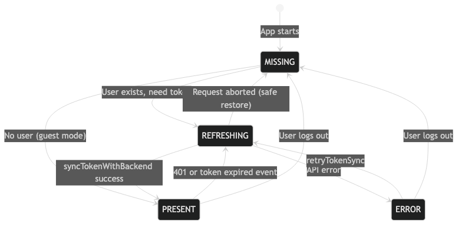

**States:**
| State | Description |
|-------|-------------|
| `MISSING` | No token stored, user may not be authenticated |
| `REFRESHING` | API call in flight to sync token with backend |
| `PRESENT` | Token is valid and ready for API calls |
| `ERROR` | Token sync failed, fallback to free tier |

**Key Transitions:**
- User login triggers `MISSING → REFRESHING → PRESENT`
- 401 responses trigger automatic token refresh
- Aborted requests safely restore previous state

---

### 2. Subscription Status State Machine (SubscriptionContext)

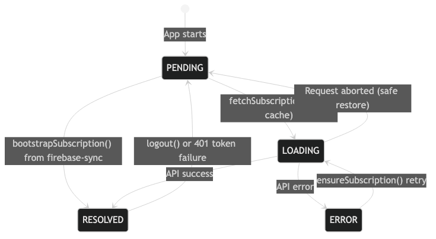

**Critical UI Rule:**
```jsx
if (isPending) return <Skeleton />;     // NEVER <Paywall />
if (isFreeResolved) return <Paywall />;
if (isPremiumResolved) return <Content />;
```

**Key Points:**
- `bootstrapSubscription()` from firebase-sync provides fastest path to RESOLVED
- Aborted requests restore to PENDING (not ERROR)
- 429 rate limits trigger cooldown + retry

---

### 3. App Boot Gate State Machine (AppReadyContext)

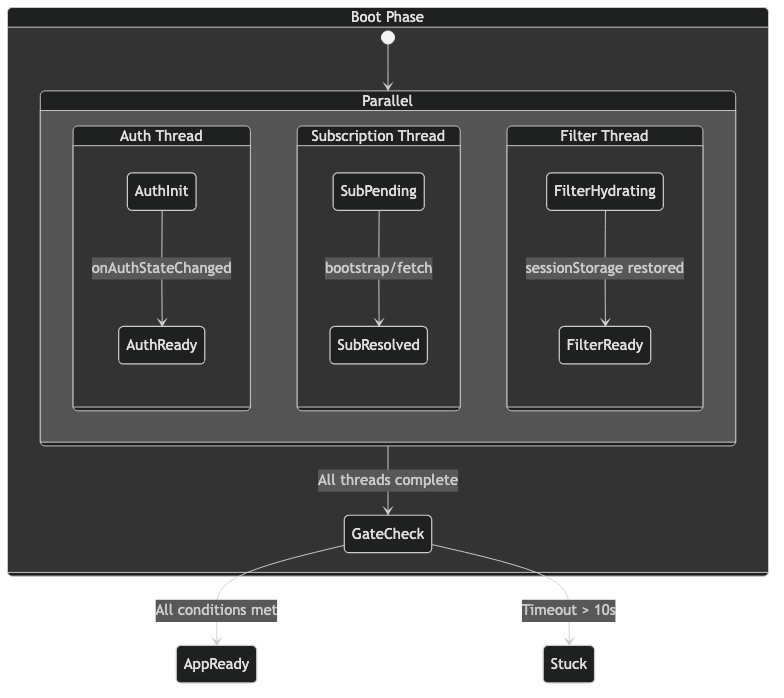

**Gate Logic:**
```javascript
appReady = authInitialized
       && isSubscriptionReady
       && (isAuthenticated === false || isTierKnown === true)
       && filtersReady
```

**Watchdog Timers:**
- 3s warning: Log slow boot
- 10s critical: Show `BootStuckBanner`

---

### 4. TanStack Query Status Machine (useAppQuery)

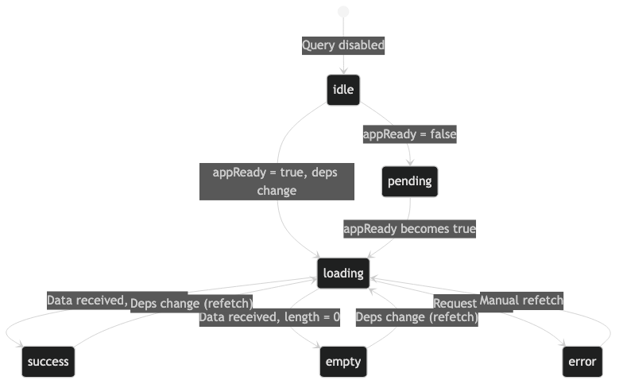

**Status Mapping:**
| TanStack Status | useAppQuery Status | UI Action |
|-----------------|-------------------|-----------|
| `pending` + !appReady | `pending` | Show skeleton |
| `pending` + appReady | `loading` | Show spinner |
| `success` + data.length > 0 | `success` | Render chart |
| `success` + data.length = 0 | `empty` | Show empty state |
| `error` | `error` | Show error state |

---

### 5. Drill-Down Navigation State Machine

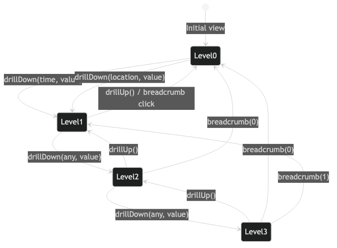

**Navigation Actions:**
- `drillDown(type, value)` - Navigate deeper
- `drillUp()` - Go back one level
- `breadcrumb(index)` - Jump to specific level

---

## Backend State Machines

### 6. API Contract Request Pipeline (12-Stage)

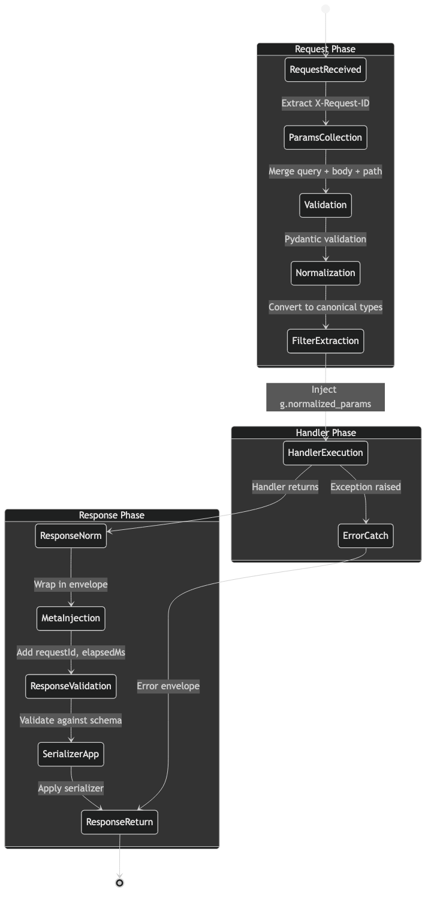

**Request Phase:**
1. Extract/generate X-Request-ID
2. Merge query + body + path params
3. Pydantic validation
4. Convert to canonical types
5. Inject `g.normalized_params`

**Response Phase:**
1. Wrap in envelope
2. Add requestId, elapsedMs
3. Validate against schema (STRICT/WARN mode)
4. Apply serializer

---

### 7. URA Sync Engine State Machine (8-Stage)

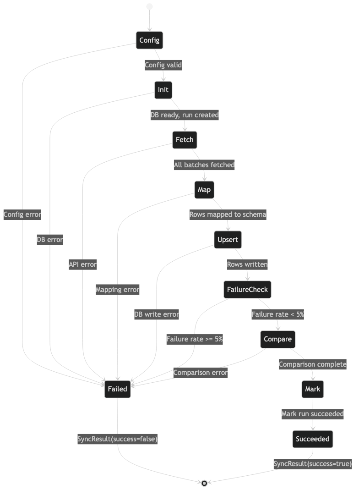

**SyncResult State:**
```python
@dataclass
class SyncResult:
    success: bool           # Final state
    run_id: str            # Identifies this run
    error_stage: str       # 'config' | 'init' | 'sync' | 'compare'
    stats: SyncStats       # inserted, updated, failed counts
```

**Failure Conditions:**
- Config validation error
- DB connection failure
- API fetch error
- Upsert failure rate >= 5%
- Comparison mismatch

---

### 8. Cache State Machine (TTLCache)

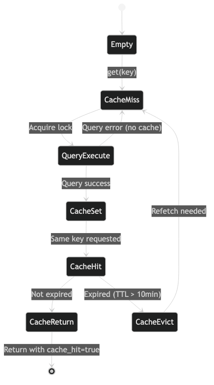

**Response Meta:**
```python
{
    "meta": {
        "cache_hit": true,      # Hit or miss
        "elapsedMs": 2,         # Fast if cached
        "requestId": "..."
    }
}
```

**TTL:** 10 minutes default

---

### 9. KPI Execution Pipeline

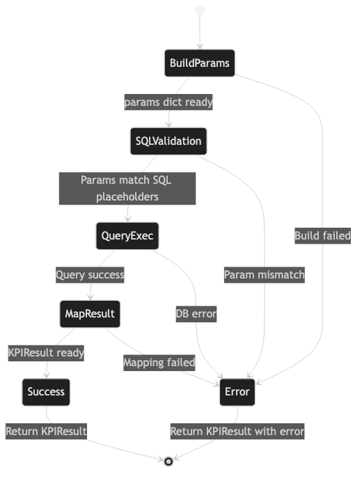

**Pipeline Stages:**
1. `build_params()` - Extract from filters
2. `validate_sql_params()` - Check placeholders match
3. `db.execute()` - Run query
4. `map_result()` - Transform to KPIResult

**Error Handling:** Returns `KPIResult(value=None, insight="Error...")` on failure

---

### 10. Schema Mode State Machine

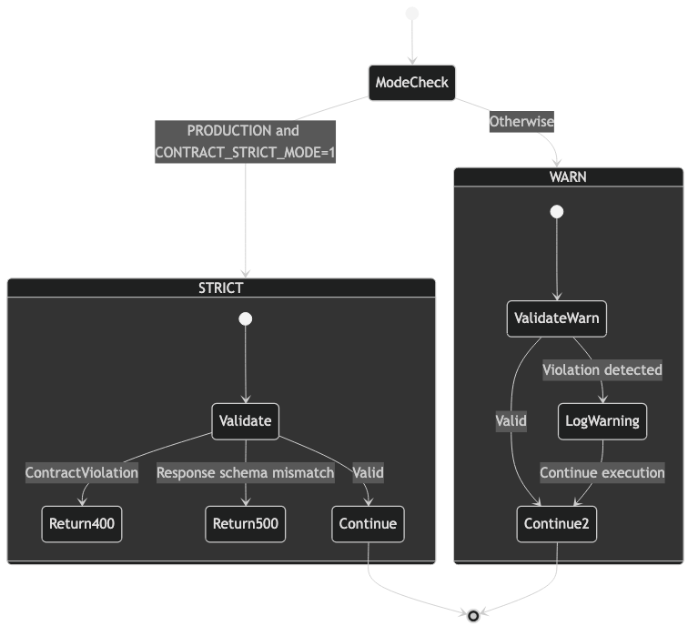

**Mode Determination:**
```python
if PRODUCTION and CONTRACT_STRICT_MODE == '1':
    mode = STRICT  # 400/500 on violations
else:
    mode = WARN    # Log only, continue
```

---

### 11. Risk Zone Classification

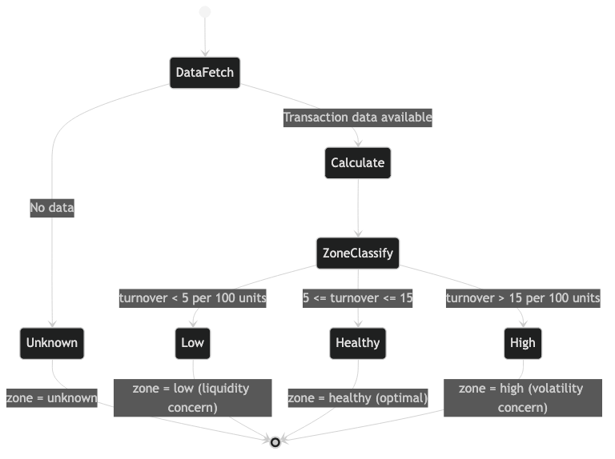

**Thresholds:**
| Turnover Rate | Zone | Interpretation |
|---------------|------|----------------|
| < 5 per 100 units | `low` | Liquidity concern |
| 5-15 per 100 units | `healthy` | Optimal |
| > 15 per 100 units | `high` | Volatility concern |

---

## Cross-Cutting Flows

### 12. Full Auth-to-Data Flow

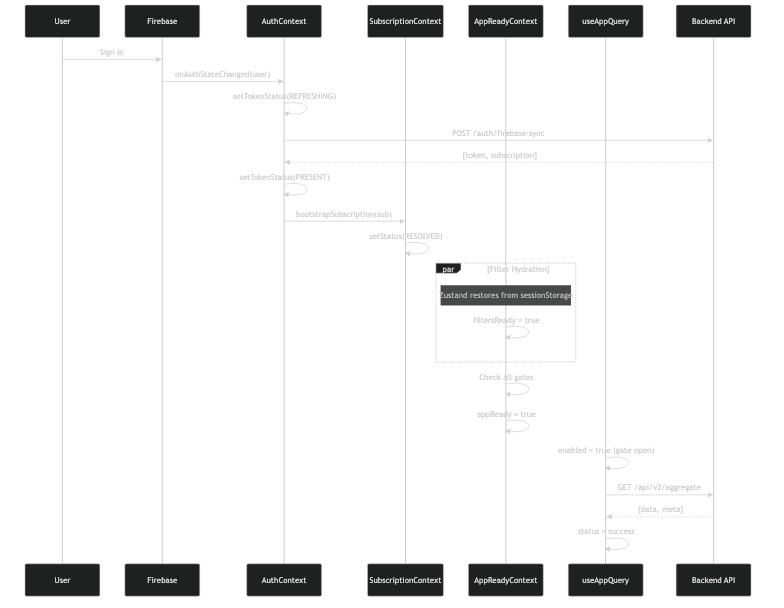

**Sequence:**
1. User signs in via Firebase
2. AuthContext syncs token with backend
3. Backend returns subscription info
4. SubscriptionContext bootstraps tier
5. Parallel: Filters hydrate from sessionStorage
6. AppReadyContext gates open
7. Charts begin fetching data

---

### 13. Filter Change to Chart Update Flow

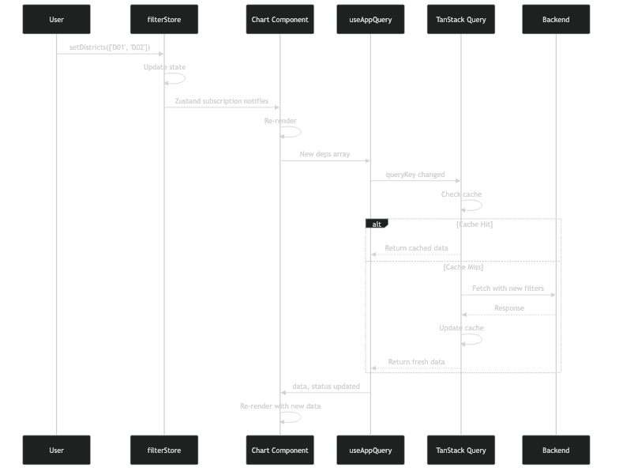

**Flow:**
1. User changes filter in UI
2. Zustand store updates
3. React components re-render
4. useAppQuery detects deps change
5. TanStack Query checks cache
6. Cache miss → API call
7. Chart re-renders with new data

---

## State Machine Summary Table

| Component | States | Persistence | File |
|-----------|--------|-------------|------|
| **TokenStatus** | MISSING, REFRESHING, PRESENT, ERROR | None | `AuthContext.jsx` |
| **SubscriptionStatus** | PENDING, LOADING, RESOLVED, ERROR | localStorage (cache) | `SubscriptionContext.jsx` |
| **AppReady** | Booting, Ready, Stuck | None (derived) | `AppReadyContext.jsx` |
| **useAppQuery** | idle, pending, loading, success, empty, error | TanStack cache | `useAppQuery.js` |
| **FilterStore** | ~40 actions | sessionStorage | `filterStore.js` |
| **API Contract** | 12 stages | Request scope | `api/contracts/wrapper.py` |
| **URA Sync** | 8 stages | Database (ura_sync_runs) | `services/ura_sync_engine.py` |
| **TTLCache** | Empty, Hit, Miss, Evict | In-memory (TTL) | `services/dashboard_service.py` |
| **SchemaMode** | STRICT, WARN | Environment | `api/contracts/registry.py` |
| **RiskZone** | low, healthy, high, unknown | Computed | `services/exit_queue_service.py` |

---

## Diagram Source Files

All diagram source files (`.mmd`) are in `docs/diagrams/` and can be edited and re-rendered using:

```bash
npx mmdc -i docs/diagrams/<name>.mmd -o docs/diagrams/<name>.png -b transparent -t dark
```
