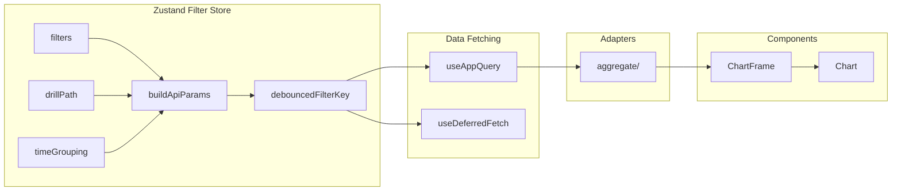

# System Architecture

## Table of Contents
- [Data Flow Overview](#data-flow-overview)
- [Backend Architecture](#backend-architecture)
- [Frontend Architecture](#frontend-architecture)
- [Database Design](#database-design)
- [Performance Architecture](#performance-architecture)
- [Page Routes](#page-routes)
- [File Organization](#file-organization)

---

## Data Flow Overview

### End-to-End Data Pipeline (ASCII)

```
┌────────────────────────────────────────────────────────────────────────────────┐
│                              DATA INGESTION                                     │
├────────────────────────────────────────────────────────────────────────────────┤
│                                                                                 │
│   URA REALIS CSV                GLS Tenders              Upcoming Launches      │
│        │                            │                           │               │
│        ▼                            ▼                           ▼               │
│   ┌──────────────────────────────────────────────────────────────────────────┐ │
│   │ ETL Pipeline (scripts/upload.py, services/etl/)                          │ │
│   │  1. Create staging table                                                 │ │
│   │  2. Load CSVs with column mapping                                        │ │
│   │  3. Deduplicate by composite key                                         │ │
│   │  4. Remove outliers (IQR-based)                                          │ │
│   │  5. Validate schema                                                      │ │
│   │  6. Atomic swap (staging → production)                                   │ │
│   │  7. Recompute precomputed_stats                                          │ │
│   └──────────────────────────────────────────────────────────────────────────┘ │
│        │                                                                        │
│        ▼                                                                        │
│   ┌──────────────────────────────────────────────────────────────────────────┐ │
│   │ PostgreSQL (Render)                                                      │ │
│   │  • transactions (~205K rows)      • project_locations                    │ │
│   │  • gls_tenders                    • upcoming_launches                    │ │
│   │  • precomputed_stats              • users, popular_schools               │ │
│   └──────────────────────────────────────────────────────────────────────────┘ │
│                                                                                 │
└────────────────────────────────────────────────────────────────────────────────┘

┌────────────────────────────────────────────────────────────────────────────────┐
│                              REQUEST FLOW                                       │
├────────────────────────────────────────────────────────────────────────────────┤
│                                                                                 │
│   React Frontend                                                                │
│   ┌──────────────────────────────────────────────────────────────────────────┐ │
│   │ PowerBIFilterContext → buildApiParams() → useAbortableQuery()            │ │
│   │      │                                                                   │ │
│   │      ▼                                                                   │ │
│   │ API Client (axios) ──────────────────────────────────────────────────▶   │ │
│   └──────────────────────────────────────────────────────────────────────────┘ │
│                                              │                                  │
│                                              ▼                                  │
│   ┌──────────────────────────────────────────────────────────────────────────┐ │
│   │ Flask Backend                                                            │ │
│   │  ┌────────────────────────────────────────────────────────────────────┐  │ │
│   │  │ Middleware: request_id → query_timing → error_envelope             │  │ │
│   │  └────────────────────────────────────────────────────────────────────┘  │ │
│   │                          │                                               │ │
│   │                          ▼                                               │ │
│   │  ┌────────────────────────────────────────────────────────────────────┐  │ │
│   │  │ @api_contract decorator                                            │  │ │
│   │  │  • Validate params (ParamSchema)                                   │  │ │
│   │  │  • Normalize (aliases, types, dates)                               │  │ │
│   │  │  • Validate service params (ServiceBoundarySchema)                 │  │ │
│   │  └────────────────────────────────────────────────────────────────────┘  │ │
│   │                          │                                               │ │
│   │                          ▼                                               │ │
│   │  ┌────────────────────────────────────────────────────────────────────┐  │ │
│   │  │ Route Handler → Service → SQL (with :param bindings)               │  │ │
│   │  └────────────────────────────────────────────────────────────────────┘  │ │
│   │                          │                                               │ │
│   │                          ▼                                               │ │
│   │  ┌────────────────────────────────────────────────────────────────────┐  │ │
│   │  │ Response: validate schema → inject meta → add headers              │  │ │
│   │  └────────────────────────────────────────────────────────────────────┘  │ │
│   └──────────────────────────────────────────────────────────────────────────┘ │
│                                              │                                  │
│                                              ▼                                  │
│   ┌──────────────────────────────────────────────────────────────────────────┐ │
│   │ Frontend Response Handling                                               │ │
│   │  Response → Adapter Transform → setState → Chart Render                  │ │
│   └──────────────────────────────────────────────────────────────────────────┘ │
│                                                                                 │
└────────────────────────────────────────────────────────────────────────────────┘
```

### System Flow (Mermaid)


---

## Backend Architecture

### Layer Diagram

```
┌─────────────────────────────────────────────────────────────────────────────────┐
│ MIDDLEWARE LAYER (api/middleware/)                                               │
│ ┌─────────────────┐  ┌─────────────────┐  ┌─────────────────────────────────┐   │
│ │ request_id.py   │→ │ query_timing.py │→ │ error_envelope.py               │   │
│ │ X-Request-ID    │  │ elapsedMs       │  │ Standardized error responses    │   │
│ └─────────────────┘  └─────────────────┘  └─────────────────────────────────┘   │
├─────────────────────────────────────────────────────────────────────────────────┤
│ API CONTRACT LAYER (api/contracts/)                                              │
│ ┌─────────────────────────────────────────────────────────────────────────────┐ │
│ │ wrapper.py: @api_contract("endpoint") decorator                             │ │
│ │  ├─ registry.py: Contract definitions (ParamSchema, ServiceBoundarySchema)  │ │
│ │  ├─ normalize.py: Param normalization (aliases, types, dates, districts)    │ │
│ │  ├─ validate.py: Schema validation logic                                    │ │
│ │  └─ schemas/: 17 endpoint-specific contracts                                │ │
│ │       aggregate.py, dashboard.py, kpi_summary.py, transactions.py, etc.     │ │
│ └─────────────────────────────────────────────────────────────────────────────┘ │
├─────────────────────────────────────────────────────────────────────────────────┤
│ ROUTE LAYER (routes/)                                                            │
│ ┌───────────────────────────────────────┐  ┌──────────────────────────────────┐ │
│ │ routes/analytics/ (12 modules)        │  │ Other Routes                     │ │
│ │  • aggregate.py   • dashboard.py      │  │  • auth.py (JWT, Firebase)       │ │
│ │  • filters.py     • charts.py         │  │  • gls.py                        │ │
│ │  • kpi.py         • transactions.py   │  │  • projects.py                   │ │
│ │  • precomputed.py • admin.py          │  │  • upcoming_launches.py          │ │
│ │  • supply.py      • insights.py       │  │  • deal_checker.py               │ │
│ └───────────────────────────────────────┘  └──────────────────────────────────┘ │
├─────────────────────────────────────────────────────────────────────────────────┤
│ SERVICE LAYER (services/ - 37 files)                                             │
│ ┌─────────────────────────────────────────────────────────────────────────────┐ │
│ │ Core Services                           │ Specialized Services              │ │
│ │  • dashboard_service.py (CTE-based)     │  • exit_queue_service.py          │ │
│ │  • classifier.py (domain logic)         │  • beads_chart_service.py         │ │
│ │  • data_loader.py                       │  • budget_analysis_service.py     │ │
│ │  • data_processor.py                    │  • gls_scheduler.py               │ │
│ │  • analytics_reader.py                  │  • etl/ (3 files)                 │ │
│ └─────────────────────────────────────────────────────────────────────────────┘ │
├─────────────────────────────────────────────────────────────────────────────────┤
│ DATA ACCESS LAYER                                                                │
│ ┌─────────────────────────────────────────┐  ┌──────────────────────────────┐   │
│ │ models/                                 │  │ db/sql.py                    │   │
│ │  • Transaction (core, 60KB+ index)      │  │  • OUTLIER_FILTER constant   │   │
│ │  • GLSTender                            │  │  • exclude_outliers(Model)   │   │
│ │  • UpcomingLaunch                       │  │  • validate_sql_params()     │   │
│ │  • ProjectLocation                      │  │  • get_outlier_filter_sql()  │   │
│ │  • PopularSchool, User                  │  │                              │   │
│ └─────────────────────────────────────────┘  └──────────────────────────────┘   │
├─────────────────────────────────────────────────────────────────────────────────┤
│ CONSTANTS & ENUMS                                                                │
│ ┌─────────────────────────────────────────┐  ┌──────────────────────────────┐   │
│ │ constants.py (SINGLE SOURCE OF TRUTH)   │  │ api/contracts/contract_schema.py      │   │
│ │  • District→Region mappings             │  │  • SaleType enum             │   │
│ │  • Sale types, Tenures                  │  │  • DB↔API field mappings     │   │
│ │  • CCR/RCR/OCR definitions              │  │  • Version management        │   │
│ └─────────────────────────────────────────┘  └──────────────────────────────┘   │
└─────────────────────────────────────────────────────────────────────────────────┘
```

### Request Processing Flow (Mermaid)


### Key Services

| Service | Purpose | Cache TTL |
|---------|---------|-----------|
| `dashboard_service.py` | Unified dashboard queries (CTE-based) | 10 min |
| `classifier.py` | Domain classification (bedrooms, segments) | - |
| `deal_checker.py` | Value analysis with multi-scope comparisons | - |
| `gls_scraper.py` | Government land sales data scraping | - |
| `data_loader.py` | CSV loading and transformation | - |
| `etl/*.py` | ETL pipeline orchestration | - |

---

## Frontend Architecture

### Provider Hierarchy

```
┌─────────────────────────────────────────────────────────────────────────────────┐
│ App.jsx                                                                          │
│ ┌─────────────────────────────────────────────────────────────────────────────┐ │
│ │ <QueryClientProvider>                     TanStack Query (caching, refetch) │ │
│ │  ┌───────────────────────────────────────────────────────────────────────┐  │ │
│ │  │ <SubscriptionProvider>                 Tier management (free/premium) │  │ │
│ │  │  ┌─────────────────────────────────────────────────────────────────┐  │  │ │
│ │  │  │ <AuthProvider>                      Firebase OAuth + JWT        │  │  │ │
│ │  │  │  ┌───────────────────────────────────────────────────────────┐  │  │  │ │
│ │  │  │  │ <DataProvider>                   Static data (districts)  │  │  │  │ │
│ │  │  │  │  ┌─────────────────────────────────────────────────────┐  │  │  │  │ │
│ │  │  │  │  │ <BrowserRouter>               React Router 6        │  │  │  │  │ │
│ │  │  │  │  │  ┌───────────────────────────────────────────────┐  │  │  │  │  │ │
│ │  │  │  │  │  │ <AppReadyProvider>         Boot gating        │  │  │  │  │  │ │
│ │  │  │  │  │  │  ┌─────────────────────────────────────────┐  │  │  │  │  │  │ │
│ │  │  │  │  │  │  │ <Routes>                                │  │  │  │  │  │  │ │
│ │  │  │  │  │  │  │  └─ <DashboardLayout>                  │  │  │  │  │  │  │ │
│ │  │  │  │  │  │  │      ├─ GlobalNavRail (64-256px)       │  │  │  │  │  │  │ │
│ │  │  │  │  │  │  │      └─ <Outlet />  ← Pages here       │  │  │  │  │  │  │ │
│ │  │  │  │  │  │  └─────────────────────────────────────────┘  │  │  │  │  │  │ │
│ │  │  │  │  │  └───────────────────────────────────────────────┘  │  │  │  │  │ │
│ │  │  │  │  └─────────────────────────────────────────────────────┘  │  │  │  │ │
│ │  │  │  └───────────────────────────────────────────────────────────┘  │  │  │ │
│ │  │  └─────────────────────────────────────────────────────────────────┘  │  │ │
│ │  └───────────────────────────────────────────────────────────────────────┘  │ │
│ └─────────────────────────────────────────────────────────────────────────────┘ │
│                                                                                  │
│ FILTER STATE: Zustand store (not in provider tree)                              │
│   • stores/filterStore.js - Page-namespaced, persisted to sessionStorage        │
│   • useZustandFilters() hook - Access from any component                        │
└─────────────────────────────────────────────────────────────────────────────────┘
```

### Key Architecture Change (January 2026)

**PowerBIFilterProvider removed.** Filter state now managed by Zustand store:

| Component | Before (Phase 2) | After (Phase 4) |
|-----------|------------------|-----------------|
| Filter State | `<PowerBIFilterProvider>` | Zustand `filterStore.js` |
| Filter Hook | `usePowerBIFilters()` | `useZustandFilters()` |
| Data Fetching | `useAbortableQuery()` | `useAppQuery()` |
| Query Library | Custom hooks | TanStack Query |

### Data Fetching Pipeline

```
┌────────────────────────────────────────────────────────────────────────────────┐
│ User Interaction (filter click, page navigation)                                │
└───────────────────────────────────┬────────────────────────────────────────────┘
                                    ▼
┌────────────────────────────────────────────────────────────────────────────────┐
│ Zustand Filter Store (stores/filterStore.js)                                    │
│  • filters (districts, bedroomTypes, timeFilter, saleType)                     │
│  • drillPath (location, time)                                                  │
│  • timeGrouping (year | quarter | month)                                       │
│  • buildApiParams() → merged filter + drill state                              │
│  • debouncedFilterKey (200ms debounce)                                         │
└───────────────────────────────────┬────────────────────────────────────────────┘
                                    ▼
┌────────────────────────────────────────────────────────────────────────────────┐
│ useAppQuery(queryFn, [deps], options)                                           │
│  TanStack Query wrapper with boot gating                                       │
│  1. Waits for appReady (auth + subscription + filters)                         │
│  2. Automatic abort on dependency change                                       │
│  3. Built-in caching and deduplication                                         │
│  4. Stale-while-revalidate pattern                                             │
│  5. Return { data, status, error, refetch }                                    │
└───────────────────────────────────┬────────────────────────────────────────────┘
                                    ▼
┌────────────────────────────────────────────────────────────────────────────────┐
│ API Client (axios)                                                              │
│  • JWT token interceptor                                                       │
│  • Request queue (max 8 concurrent)                                            │
│  • Timeout retry (cold start)                                                  │
│  • URL routing (dev: localhost:5000, prod: /api → Vercel proxy → Render)       │
└───────────────────────────────────┬────────────────────────────────────────────┘
                                    ▼
┌────────────────────────────────────────────────────────────────────────────────┐
│ Adapter Layer (adapters/aggregate/)                                             │
│  • transformTimeSeries()      • transformCompressionSeries()                   │
│  • transformDistribution()    • transformBeadsChart()                          │
│  • transformOscillator()      • transformNewVsResale()                         │
│  Charts NEVER access raw API data directly                                     │
└───────────────────────────────────┬────────────────────────────────────────────┘
                                    ▼
┌────────────────────────────────────────────────────────────────────────────────┐
│ Chart Component                                                                 │
│  status === 'pending' → <Skeleton />                                           │
│  status === 'error' → <ErrorState error={error} />                             │
│  !data?.length → <EmptyState />                                                │
│  else → <Chart data={data} />                                                  │
└────────────────────────────────────────────────────────────────────────────────┘
```

### Frontend State Flow (Mermaid)



---

## Database Design

### Primary Table: `transactions`

```sql
-- ~205K rows, partial indexes for outlier filtering
CREATE TABLE transactions (
    id SERIAL PRIMARY KEY,
    project_name VARCHAR(255),
    transaction_date DATE,
    price INTEGER,
    area_sqft NUMERIC(10,2),
    psf NUMERIC(10,2),
    district VARCHAR(10),
    bedroom_count INTEGER,
    property_type VARCHAR(50),
    sale_type VARCHAR(20),
    tenure VARCHAR(50),
    lease_start_year INTEGER,
    remaining_lease INTEGER,
    floor_level VARCHAR(20),
    floor_range VARCHAR(20),
    num_units INTEGER,
    nett_price INTEGER,
    type_of_area VARCHAR(20),
    market_segment VARCHAR(10),
    is_outlier BOOLEAN DEFAULT FALSE
);
```

### Key Indexes

```sql
-- Composite index for common filter patterns
CREATE INDEX idx_txn_active_composite
ON transactions(transaction_date, district, bedroom_count, sale_type)
INCLUDE (price, psf, area_sqft)
WHERE COALESCE(is_outlier, false) = false;

-- Price-based queries
CREATE INDEX idx_txn_price_active
ON transactions(price)
WHERE price > 0 AND COALESCE(is_outlier, false) = false;

-- Project-level queries
CREATE INDEX idx_txn_project_date
ON transactions(project_name, transaction_date)
WHERE COALESCE(is_outlier, false) = false;
```

### Supporting Tables

| Table | Rows | Purpose |
|-------|------|---------|
| `gls_tenders` | ~200 | Government land sales tenders |
| `upcoming_launches` | ~100 | Pre-launch project pipeline |
| `project_locations` | ~2K | Project centroids (lat/lng) |
| `precomputed_stats` | ~500 | Cached aggregations |
| `users` | ~1K | User accounts |
| `popular_schools` | ~50 | School proximity data |

---

## Performance Architecture

### Caching Strategy

| Layer | Implementation | TTL | Max Size |
|-------|---------------|-----|----------|
| Backend | In-memory dict + lock | 10 min | 1000 entries |
| Database | PostgreSQL buffer pool | Managed | - |
| Frontend | useAbortableQuery (implicit) | Per-mount | - |

### Performance Targets

| Metric | Target | Acceptable | Current |
|--------|--------|------------|---------|
| Dashboard (cached) | <50ms | <100ms | ~40ms |
| Dashboard (uncached) | <300ms | <500ms | ~250ms |
| Complex aggregation | <500ms | <1s | ~400ms |
| Memory usage | <400MB | <512MB | ~350MB |

### Optimization Decisions

1. **Sequential queries for remote DB** - Parallel execution worsens performance due to connection pool contention
2. **Partial indexes** - Pre-filter outliers at index level (`WHERE is_outlier = false`)
3. **CTE-based aggregation** - Complex queries use Common Table Expressions
4. **SQL-only aggregation** - No pandas DataFrames in memory
5. **Request queue limiting** - Frontend limits to 4 concurrent requests

---

## Page Routes

### Market Intelligence

| Nav Label | Page Component | Route | Data Scope |
|-----------|---------------|-------|------------|
| Market Overview | `MarketOverviewContent` | `/market-overview` | Resale ONLY |
| District Overview | `DistrictOverviewContent` | `/district-overview` | All |
| New Launch Market | `NewLaunchMarketContent` | `/new-launch-market` | New Sale + Resale |
| Supply & Inventory | `SupplyInventoryContent` | `/supply-inventory` | All |

### Project Tools

| Nav Label | Page Component | Route | Data Scope |
|-----------|---------------|-------|------------|
| Explore | `ExploreContent` | `/explore` | All |
| Value Check | `ValueCheckContent` | `/value-check` | All |
| Exit Risk | `ExitRiskContent` | `/exit-risk` | All |
| Methodology | `MethodologyContent` | `/methodology` | - |

### Legacy Redirects

| Old Route | Redirects To |
|-----------|--------------|
| `/market-core` | `/market-overview` |
| `/primary-market` | `/new-launch-market` |
| `/district-deep-dive` | `/district-overview` |
| `/project-deep-dive` | `/explore` |
| `/value-parity` | `/value-check` |
| `/supply-insights` | `/supply-inventory` |

---

## File Organization

```
sg-property-analyzer/
├── backend/
│   ├── app.py                    # Flask app factory, middleware setup
│   ├── config.py                 # Environment configuration
│   ├── constants.py              # SINGLE SOURCE OF TRUTH (districts, regions)
│   │
│   ├── api/
│   │   ├── contracts/            # API contract system
│   │   │   ├── registry.py       # Contract definitions
│   │   │   ├── wrapper.py        # @api_contract decorator
│   │   │   ├── normalize.py      # Param normalization
│   │   │   ├── validate.py       # Schema validation
│   │   │   ├── contract_schema.py # Enums, version, serialization
│   │   │   └── schemas/          # 17 endpoint contracts
│   │   │       ├── aggregate.py
│   │   │       ├── dashboard.py
│   │   │       └── ...
│   │   └── middleware/
│   │       ├── request_id.py     # X-Request-ID injection
│   │       ├── query_timing.py   # Performance monitoring
│   │       └── error_envelope.py # Standardized errors
│   │
│   ├── routes/
│   │   ├── analytics/            # 12 analytics modules
│   │   │   ├── aggregate.py      # /api/aggregate
│   │   │   ├── dashboard.py      # /api/dashboard
│   │   │   ├── filters.py        # /api/filters
│   │   │   └── ...
│   │   ├── auth.py               # Authentication
│   │   ├── gls.py                # GLS endpoints
│   │   ├── projects.py           # Project endpoints
│   │   └── upcoming_launches.py
│   │
│   ├── services/                 # 37 service files
│   │   ├── dashboard_service.py  # Core analytics
│   │   ├── classifier.py         # Domain logic
│   │   ├── etl/                  # ETL pipeline
│   │   │   ├── orchestrator.py
│   │   │   ├── loaders.py
│   │   │   └── validators.py
│   │   └── ...
│   │
│   ├── models/
│   │   ├── transaction.py        # Core Transaction model
│   │   ├── database.py           # SQLAlchemy setup
│   │   ├── gls_tender.py
│   │   └── ...
│   │
│   ├── db/
│   │   └── sql.py                # SQL helpers, outlier filter
│   │
│   ├── utils/
│   │   └── normalize.py          # Input boundary (to_int, to_date)
│   │
│   ├── tests/
│   │   ├── contracts/            # Contract validation tests
│   │   │   ├── test_contract_aggregate.py
│   │   │   └── test_frontend_backend_alignment.py
│   │   └── snapshots/            # Regression snapshots
│   │
│   └── migrations/               # Database migrations
│
├── frontend/
│   ├── src/
│   │   ├── App.jsx               # Routing, provider stack
│   │   │
│   │   ├── stores/               # Zustand state management (NEW)
│   │   │   ├── filterStore.js    # Filter state (replaces PowerBIFilterProvider)
│   │   │   └── index.js          # Central export
│   │   │
│   │   ├── lib/
│   │   │   └── queryClient.js    # TanStack Query configuration
│   │   │
│   │   ├── context/
│   │   │   ├── AuthContext.jsx
│   │   │   ├── SubscriptionContext.jsx
│   │   │   ├── DataContext.jsx
│   │   │   ├── AppReadyContext.jsx  # Boot gating
│   │   │   └── PowerBIFilter/       # Utilities only (Provider removed)
│   │   │       ├── constants.js
│   │   │       ├── hooks.js
│   │   │       ├── storage.js
│   │   │       └── utils.js
│   │   │
│   │   ├── components/
│   │   │   ├── layout/
│   │   │   │   ├── DashboardLayout.jsx
│   │   │   │   └── GlobalNavRail.jsx
│   │   │   ├── powerbi/          # 40+ chart components
│   │   │   ├── common/           # ChartFrame, ErrorState, etc.
│   │   │   ├── ui/               # Shared UI primitives
│   │   │   └── insights/         # Specialized visualizations
│   │   │
│   │   ├── adapters/
│   │   │   ├── aggregateAdapter.js
│   │   │   └── aggregate/        # 13 transform modules
│   │   │       ├── index.js
│   │   │       ├── timeSeries.js
│   │   │       └── ...
│   │   │
│   │   ├── hooks/
│   │   │   ├── useAppQuery.js    # TanStack Query wrapper (MAIN)
│   │   │   ├── useDeferredFetch.js
│   │   │   ├── useDebouncedFilterKey.js
│   │   │   └── index.js
│   │   │
│   │   ├── pages/                # Page components
│   │   │
│   │   ├── schemas/
│   │   │   └── apiContract/      # Frontend enums
│   │   │       ├── enums.js
│   │   │       ├── params.js
│   │   │       └── ...
│   │   │
│   │   ├── constants/
│   │   │   └── index.js          # Districts, regions
│   │   │
│   │   └── api/
│   │       └── client.js         # Axios client
│   │
│   ├── e2e/                      # Playwright E2E tests
│   │   ├── smoke.spec.js
│   │   ├── boot-hydration.spec.js
│   │   └── fixtures/
│   │       └── api-mocks.js
│   │
│   └── vite.config.js            # Build config, chunks
│
├── .github/
│   └── workflows/
│       ├── claude.yml            # Claude Code PR review (3-stage)
│       └── regression.yml        # CI/CD pipeline
│
├── scripts/
│   ├── upload.py                 # Data upload
│   ├── map_change_impact.py      # PR impact analysis
│   └── validate_e2e_mocks.py     # E2E mock validation
│
├── docs/                         # Documentation
└── rawdata/                      # CSV files
```

---

## Security Architecture

### Authentication Flow

```
1. User clicks "Sign in with Google"
2. Firebase popup → Google OAuth
3. Firebase returns ID token
4. Frontend sends token to /auth/firebase-sync
5. Backend validates token, creates/updates user
6. Backend returns JWT
7. Frontend stores JWT in localStorage
8. All subsequent requests include Authorization header
```

### Access Control

| Tier | Access Level |
|------|-------------|
| Free | Summary metrics, aggregated charts (premium data masked) |
| Premium | Full project details, transaction lists, export |
| Professional | All features + API access |

### Data Protection

- No raw transaction data in free tier (aggregation only)
- K-anonymity threshold: 10 minimum records
- Premium data masked via backend (never trust CSS blur)

---

## Deployment

### Production Stack

```
┌─────────────────────────────────────────────────────────────────────────────────┐
│ Vercel (Frontend)                                                               │
│  • Static files (dist/)                                                         │
│  • Proxy rewrites: /api/* → Render backend                                      │
│  • SPA routing: /* → /index.html                                               │
├─────────────────────────────────────────────────────────────────────────────────┤
│ Render (Backend)                                                                │
│  • Web Service: gunicorn app:app                                               │
│  • Memory: 512MB                                                               │
│  • PostgreSQL: Standard plan, 5 connections                                     │
└─────────────────────────────────────────────────────────────────────────────────┘
```

### Environment Variables

| Variable | Location | Description |
|----------|----------|-------------|
| `DATABASE_URL` | Render | PostgreSQL connection string |
| `FLASK_ENV` | Render | `production` |
| `VITE_API_URL` | Vercel | (optional, uses proxy) |
| `FIREBASE_*` | Both | Firebase auth credentials |

---

*Last updated: January 2026*
