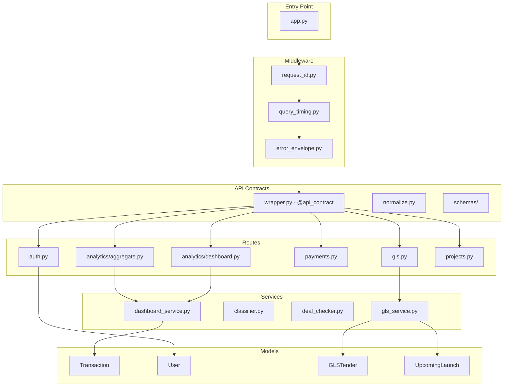
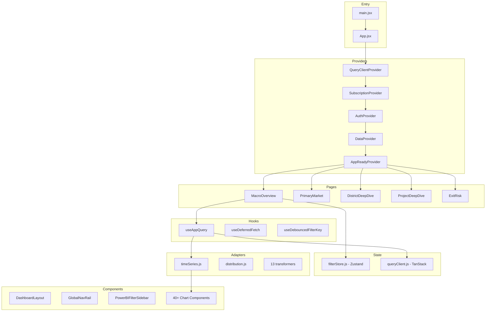
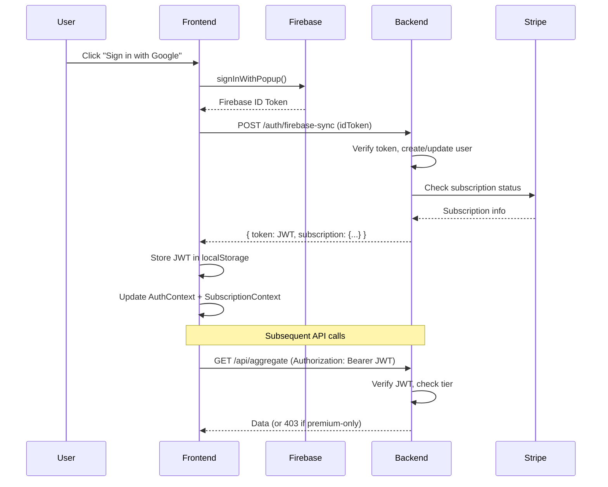
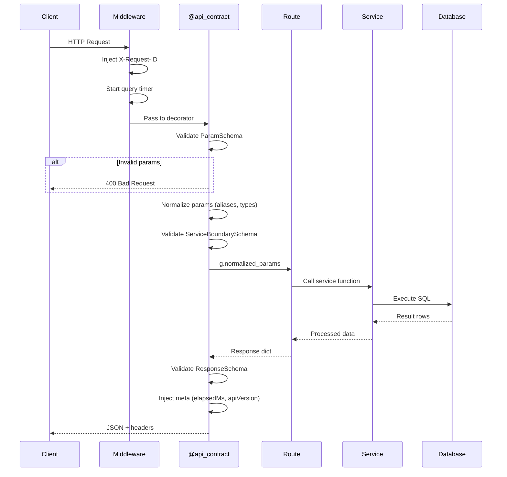

# SG Property Analyzer - System Overview

> **Purpose:** High-level architecture guide for engineers new to the codebase.
> **Read time:** 10 minutes
> **Last updated:** January 2026

---

## Table of Contents

1. [What is This System?](#1-what-is-this-system)
2. [System Architecture](#2-system-architecture)
3. [Component Breakdown](#3-component-breakdown)
4. [Data Flow](#4-data-flow)
5. [Runtime Interactions](#5-runtime-interactions)
6. [Dependency Graph](#6-dependency-graph)
7. [Key Invariants](#7-key-invariants)
8. [Common Failure Points](#8-common-failure-points)
9. [Glossary](#9-glossary)

---

## 1. What is This System?

**SG Property Analyzer** is a freemium SaaS platform for Singapore private residential real estate analytics.

### Core Capabilities

| Feature | Description |
|---------|-------------|
| **Transaction Analytics** | Visualize ~205K historical transactions with filters |
| **Price Trends** | PSF trends by district, region, bedroom type |
| **New Launch Tracking** | Monitor upcoming condo launches and pricing |
| **GLS Tenders** | Track government land sales (future supply) |
| **Deal Checker** | Compare a unit's price vs. nearby transactions |
| **Exit Risk** | Assess liquidity and holding period risks |

### User Tiers

| Tier | Access |
|------|--------|
| **Free** | Aggregated charts, masked project names |
| **Premium** | Full transaction details, exports, advanced filters |
| **Professional** | API access (planned) |

---

## 2. System Architecture

### High-Level Diagram

```
┌─────────────────────────────────────────────────────────────────────────────────────┐
│                              FRONTEND (Vercel)                                       │
│  ┌─────────────────────────────────────────────────────────────────────────────────┐│
│  │                           React 18 + Vite                                        ││
│  │  ┌──────────────────┐  ┌──────────────────┐  ┌──────────────────────────────┐  ││
│  │  │  Zustand Store   │  │  TanStack Query  │  │      React Router v6          │  ││
│  │  │  (Filter State)  │  │  (Server State)  │  │      (7 dashboard pages)      │  ││
│  │  └────────┬─────────┘  └────────┬─────────┘  └──────────────────────────────┘  ││
│  │           │                     │                                               ││
│  │           └──────────┬──────────┘                                               ││
│  │                      ▼                                                          ││
│  │  ┌──────────────────────────────────────────────────────────────────────────┐  ││
│  │  │                        Adapters (13 transformers)                         │  ││
│  │  │        transformTimeSeries() │ transformDistribution() │ etc.            │  ││
│  │  └──────────────────────────────────────────────────────────────────────────┘  ││
│  │                      │                                                          ││
│  │                      ▼                                                          ││
│  │  ┌──────────────────────────────────────────────────────────────────────────┐  ││
│  │  │                        API Client (Axios)                                 │  ││
│  │  │        JWT injection │ Request queue │ Cold-start retry                   │  ││
│  │  └──────────────────────────────────────────────────────────────────────────┘  ││
│  └─────────────────────────────────────────────────────────────────────────────────┘│
└─────────────────────────────────────────────────────────────────────────────────────┘
                                         │
                                         │ HTTPS
                                         ▼
┌─────────────────────────────────────────────────────────────────────────────────────┐
│                              BACKEND (Render)                                        │
│  ┌─────────────────────────────────────────────────────────────────────────────────┐│
│  │                           Flask + Gunicorn                                       ││
│  │  ┌──────────────────────────────────────────────────────────────────────────┐  ││
│  │  │                        Middleware Stack                                   │  ││
│  │  │        request_id │ query_timing │ error_envelope │ CORS                  │  ││
│  │  └──────────────────────────────────────────────────────────────────────────┘  ││
│  │                      │                                                          ││
│  │                      ▼                                                          ││
│  │  ┌──────────────────────────────────────────────────────────────────────────┐  ││
│  │  │                     @api_contract Decorator                               │  ││
│  │  │        Param validation │ Normalization │ Response envelope               │  ││
│  │  └──────────────────────────────────────────────────────────────────────────┘  ││
│  │                      │                                                          ││
│  │  ┌───────┬───────────┼───────────┬───────────┬───────────┐                     ││
│  │  ▼       ▼           ▼           ▼           ▼           ▼                     ││
│  │ Routes  Routes     Routes      Routes      Routes      Routes                   ││
│  │ /api    /auth      /payments   /gls        /projects   /supply                 ││
│  │                      │                                                          ││
│  │                      ▼                                                          ││
│  │  ┌──────────────────────────────────────────────────────────────────────────┐  ││
│  │  │                        Services (37 files)                                │  ││
│  │  │        dashboard_service │ classifier │ deal_checker │ cache              │  ││
│  │  └──────────────────────────────────────────────────────────────────────────┘  ││
│  │                      │                                                          ││
│  │                      ▼                                                          ││
│  │  ┌──────────────────────────────────────────────────────────────────────────┐  ││
│  │  │                      SQLAlchemy ORM                                       │  ││
│  │  └──────────────────────────────────────────────────────────────────────────┘  ││
│  └─────────────────────────────────────────────────────────────────────────────────┘│
└─────────────────────────────────────────────────────────────────────────────────────┘
                                         │
                                         ▼
┌─────────────────────────────────────────────────────────────────────────────────────┐
│                           POSTGRESQL (Render)                                        │
│  ┌─────────────────┐  ┌─────────────────┐  ┌─────────────────┐  ┌─────────────────┐│
│  │   transactions  │  │      users      │  │   gls_tenders   │  │upcoming_launches││
│  │    (~205K rows) │  │                 │  │                 │  │                 ││
│  └─────────────────┘  └─────────────────┘  └─────────────────┘  └─────────────────┘│
└─────────────────────────────────────────────────────────────────────────────────────┘
                                         │
                                         ▼
┌─────────────────────────────────────────────────────────────────────────────────────┐
│                           EXTERNAL SERVICES                                          │
│  ┌─────────────────┐  ┌─────────────────┐  ┌─────────────────┐                      │
│  │    Firebase     │  │     Stripe      │  │   OneMap API    │                      │
│  │  (Google OAuth) │  │  (Payments)     │  │  (Geocoding)    │                      │
│  └─────────────────┘  └─────────────────┘  └─────────────────┘                      │
└─────────────────────────────────────────────────────────────────────────────────────┘
```

### Tech Stack Summary

| Layer | Technology | Purpose |
|-------|------------|---------|
| **Frontend** | React 18, Vite, Tailwind CSS | SPA with lazy loading |
| **State** | Zustand, TanStack Query | Filter state, server cache |
| **Charts** | Chart.js | Data visualization |
| **Backend** | Flask, Gunicorn | REST API server |
| **ORM** | SQLAlchemy | Database abstraction |
| **Database** | PostgreSQL | Persistent storage |
| **Auth** | Firebase (OAuth), JWT | User authentication |
| **Payments** | Stripe | Subscription billing |
| **Hosting** | Vercel (FE), Render (BE, DB) | Cloud deployment |
| **CI/CD** | GitHub Actions | Automated testing, review |

---

## 3. Component Breakdown

### Backend Components



| Component | File | Responsibility |
|-----------|------|----------------|
| **App Factory** | `app.py` | Flask app creation, middleware, startup validation |
| **Request ID** | `middleware/request_id.py` | Inject X-Request-ID for debugging |
| **Query Timing** | `middleware/query_timing.py` | Track SQL execution time |
| **API Contract** | `contracts/wrapper.py` | Validate params, normalize, envelope response |
| **Aggregate Route** | `routes/analytics/aggregate.py` | THE main endpoint (flexible GROUP BY) |
| **Dashboard Service** | `services/dashboard_service.py` | SQL aggregation, CTEs, caching |
| **Classifier** | `services/classifier.py` | Bedroom classification logic |
| **Constants** | `constants.py` | Districts, regions (SSOT) |

### Frontend Components



| Component | File | Responsibility |
|-----------|------|----------------|
| **Filter Store** | `stores/filterStore.js` | All filter state (Zustand) |
| **Query Client** | `lib/queryClient.js` | TanStack Query configuration |
| **useAppQuery** | `hooks/useAppQuery.js` | Data fetching with boot gating |
| **Adapters** | `adapters/aggregate/` | Transform API → chart format |
| **DashboardLayout** | `components/layout/DashboardLayout.jsx` | Nav rail + content + filter sidebar |
| **Chart Components** | `components/powerbi/` | 40+ visualization components |

---

## 4. Data Flow

### Filter Change → Chart Update

```
┌────────────────────────────────────────────────────────────────────────────────────┐
│ 1. USER ACTION                                                                      │
│    User clicks "D09" in district filter                                            │
└────────────────────────────────────────────────────────────────────────────────────┘
                                         │
                                         ▼
┌────────────────────────────────────────────────────────────────────────────────────┐
│ 2. ZUSTAND STORE                                                                    │
│    filterStore.setDistricts(['D09'])                                               │
│    → Triggers re-render of all useZustandFilters() consumers                       │
│    → Persists to sessionStorage (page-namespaced)                                  │
└────────────────────────────────────────────────────────────────────────────────────┘
                                         │
                                         ▼
┌────────────────────────────────────────────────────────────────────────────────────┐
│ 3. DEBOUNCE                                                                         │
│    debouncedFilterKey changes after 200ms                                          │
│    → Prevents API spam during rapid filter changes                                 │
└────────────────────────────────────────────────────────────────────────────────────┘
                                         │
                                         ▼
┌────────────────────────────────────────────────────────────────────────────────────┐
│ 4. TANSTACK QUERY                                                                   │
│    useAppQuery detects dependency change                                           │
│    → Aborts previous in-flight request                                             │
│    → Checks cache (staleTime: 30s)                                                 │
│    → If stale/miss: fetches from API                                               │
└────────────────────────────────────────────────────────────────────────────────────┘
                                         │
                                         ▼
┌────────────────────────────────────────────────────────────────────────────────────┐
│ 5. API REQUEST                                                                      │
│    GET /api/aggregate?group_by=month&districts=D09&metrics=count,median_psf        │
│    Headers: Authorization: Bearer <jwt>, X-Request-ID: <uuid>                      │
└────────────────────────────────────────────────────────────────────────────────────┘
                                         │
                                         ▼
┌────────────────────────────────────────────────────────────────────────────────────┐
│ 6. BACKEND PROCESSING                                                               │
│    @api_contract validates + normalizes params                                     │
│    dashboard_service.get_aggregated_data() executes SQL                            │
│    Response: { data: [...], meta: { elapsedMs, apiVersion } }                      │
└────────────────────────────────────────────────────────────────────────────────────┘
                                         │
                                         ▼
┌────────────────────────────────────────────────────────────────────────────────────┐
│ 7. ADAPTER TRANSFORM                                                                │
│    transformTimeSeries(response.data, timeGrouping)                                │
│    → Normalizes dates, sorts, fills gaps                                           │
│    → Returns Chart.js-ready dataset                                                │
└────────────────────────────────────────────────────────────────────────────────────┘
                                         │
                                         ▼
┌────────────────────────────────────────────────────────────────────────────────────┐
│ 8. CHART RENDER                                                                     │
│    Chart component receives transformed data                                       │
│    → Chart.js renders updated visualization                                        │
└────────────────────────────────────────────────────────────────────────────────────┘
```

### Authentication Flow



---

## 5. Runtime Interactions

### Application Boot Sequence

```
┌─────────────────────────────────────────────────────────────────────────────────────┐
│                              FRONTEND BOOT                                           │
├─────────────────────────────────────────────────────────────────────────────────────┤
│  1. main.jsx renders <App />                                                        │
│  2. QueryClientProvider initializes TanStack Query                                  │
│  3. SubscriptionProvider sets status = 'pending'                                    │
│  4. AuthProvider fires Firebase onAuthStateChanged()                                │
│     └─ If user logged in: sync with backend, get subscription                      │
│     └─ If no user: initialized = true immediately                                  │
│  5. DataProvider fetches /api/filters (filter options)                              │
│  6. Zustand store hydrates from sessionStorage                                      │
│  7. AppReadyProvider checks: auth + subscription + filtersReady                     │
│     └─ If all true: appReady = true, useAppQuery enabled                           │
│     └─ If stuck > 5s: BootStuckBanner offers recovery                              │
│  8. Page components render, charts fetch data                                       │
└─────────────────────────────────────────────────────────────────────────────────────┘

┌─────────────────────────────────────────────────────────────────────────────────────┐
│                              BACKEND BOOT                                            │
├─────────────────────────────────────────────────────────────────────────────────────┤
│  1. Gunicorn spawns workers                                                         │
│  2. create_app() initializes Flask                                                  │
│  3. Database connection established                                                 │
│  4. Schema validation (HARD FAIL if missing tables)                                 │
│  5. Data integrity check (SOFT WARN if issues)                                      │
│  6. CSV file validation via data_guard.py                                           │
│  7. GLS freshness check (auto-refresh if stale)                                     │
│  8. Cache warming for common queries                                                │
│  9. Ready to accept requests                                                        │
└─────────────────────────────────────────────────────────────────────────────────────┘
```

### Request Processing



---

## 6. Dependency Graph

### Backend Module Dependencies

```
app.py
├── config.py (environment)
├── constants.py (SSOT for districts, regions)
├── api/
│   ├── contracts/
│   │   ├── wrapper.py (@api_contract)
│   │   ├── normalize.py (param normalization)
│   │   ├── contract_schema.py (enums)
│   │   └── schemas/ (17 endpoint schemas)
│   └── middleware/
│       ├── request_id.py
│       ├── query_timing.py
│       └── error_envelope.py
├── routes/
│   ├── analytics/ (12 modules)
│   │   └── aggregate.py → services/dashboard_service.py
│   ├── auth.py → models/user.py
│   ├── payments.py → Stripe SDK
│   └── gls.py → services/gls_service.py
├── services/ (37 files)
│   ├── dashboard_service.py → models/transaction.py
│   ├── classifier.py → constants.py
│   └── cache.py
└── models/
    ├── transaction.py
    ├── user.py
    ├── gls_tender.py
    └── upcoming_launch.py
```

### Frontend Module Dependencies

```
App.jsx
├── lib/queryClient.js (TanStack Query)
├── stores/filterStore.js (Zustand)
├── context/
│   ├── AuthContext.jsx → Firebase SDK
│   ├── SubscriptionContext.jsx
│   ├── DataContext.jsx → api/client.js
│   └── AppReadyContext.jsx
├── pages/ (7 dashboard pages)
│   └── MacroOverview.jsx
│       ├── hooks/useAppQuery.js → lib/queryClient.js
│       ├── stores/filterStore.js
│       ├── adapters/aggregate/ (13 transformers)
│       └── components/powerbi/ (40+ charts)
├── components/
│   ├── layout/DashboardLayout.jsx
│   │   ├── GlobalNavRail.jsx
│   │   └── PowerBIFilterSidebar.jsx
│   └── powerbi/ (chart components)
│       └── TimeTrendChart.jsx → adapters/timeSeries.js
└── api/
    └── client.js → Axios
```

### External Service Dependencies

| Service | Purpose | Failure Impact |
|---------|---------|----------------|
| **Firebase** | OAuth authentication | Login fails, app still usable as guest |
| **Stripe** | Subscription billing | New subscriptions fail, existing users unaffected |
| **Render DB** | Data storage | Complete outage |
| **OneMap API** | Geocoding | Project locations not updated |

---

## 7. Key Invariants

### Data Invariants (MUST always be true)

| Invariant | Enforcement | Violation Impact |
|-----------|-------------|------------------|
| Outliers excluded from analytics | `COALESCE(is_outlier, false) = false` in all queries | Skewed median PSF |
| Dates use exclusive upper bound | `date < :date_to_exclusive` | Off-by-one errors |
| SQL uses `:param` bindings only | Code review, CI checks | SQL injection risk |
| Frontend uses adapters | Charts never access raw API data | Type mismatches, crashes |
| Filter state is page-namespaced | sessionStorage key includes route | Cross-page filter bleed |

### Architectural Invariants

| Invariant | Enforcement | Violation Impact |
|-----------|-------------|------------------|
| Pages decide data scope | Components receive via props | Business logic scattered |
| Services contain SQL | Routes only parse params | Duplicate query logic |
| `@api_contract` on all endpoints | CI contract-guard job | Silent param drops |
| Enums from `contract_schema.py` | No hardcoded strings | Frontend/backend enum drift |
| No pandas in production | Code review | 512MB memory exceeded |

### Boot Invariants

| Invariant | Enforcement | Violation Impact |
|-----------|-------------|------------------|
| Schema must exist | `schema_check.py` hard fails | App won't start |
| Auth initialized before fetch | `AppReadyProvider` gates `useAppQuery` | Premature 401s |
| Filter store hydrated | `filtersReady` flag | Stale default filters |

---

## 8. Common Failure Points

### Frontend Failures

| Symptom | Likely Cause | Fix |
|---------|--------------|-----|
| "Updating..." stuck forever | Boot deadlock (auth/subscription pending) | Check `BootStuckBanner`, clear localStorage |
| Chart shows stale data | `debouncedFilterKey` missing dependency | Add missing filter to useAppQuery deps |
| 401 on page load | Token expired, refresh failed | Check `retryTokenSync()` in AuthContext |
| Blank chart | Adapter returns undefined | Check adapter null handling |
| "Loading chunk failed" | Network error during lazy load | `lazyWithRetry()` auto-reloads once |

### Backend Failures

| Symptom | Likely Cause | Fix |
|---------|--------------|-----|
| 500 TypeError in strptime | Date string passed instead of date object | Use `to_date()` at route boundary |
| 400 with unknown param | Frontend sends param backend doesn't know | Add to contract schema |
| Slow queries (>5s) | Missing index, no outlier filter | Check EXPLAIN, add COALESCE |
| 503 cold start timeout | Render spun down, cache cold | Cache warming on startup |
| Schema drift on deploy | Migration not run | `flask db upgrade` |

### Integration Failures

| Symptom | Likely Cause | Fix |
|---------|--------------|-----|
| Frontend 404 on endpoint | Route removed from backend | Run `check_route_contract.py` |
| Enum mismatch | Backend/frontend enum values differ | Sync `contract_schema.py` ↔ `enums.js` |
| Subscription stuck "loading" | Firebase sync failed | Check network, retry token sync |
| GLS data stale | Auto-refresh disabled or failed | Manual `/api/gls/trigger-refresh` |

---

## 9. Glossary

| Term | Definition |
|------|------------|
| **CCR** | Core Central Region (prime districts: D01, D02, D06, D09, D10, D11) |
| **RCR** | Rest of Central Region (city fringe districts) |
| **OCR** | Outside Central Region (suburban districts) |
| **PSF** | Price per square foot |
| **GLS** | Government Land Sales (land tender program) |
| **URA** | Urban Redevelopment Authority (data source) |
| **New Sale** | First-hand purchase from developer |
| **Resale** | Second-hand purchase from owner |
| **Outlier** | Transaction flagged as abnormal (excluded from analytics) |
| **Drill** | Navigate from aggregate to detail (region → district → project) |
| **Boot Gating** | Delay data fetching until auth/filters ready |
| **Adapter** | Transform API response to chart-ready format |
| **Contract** | API schema defining params, response shape, versioning |

---

## Quick Reference Links

- **[Architecture Details](architecture.md)** - Provider hierarchy, database design
- **[Backend Reference](backend.md)** - API contracts, SQL rules, caching
- **[Frontend Reference](frontend.md)** - Hooks, adapters, components
- **[REPO_MAP.md](../REPO_MAP.md)** - Navigation guide for developers

---

*This document provides a 10-minute overview. For implementation details, see the specific reference docs.*
