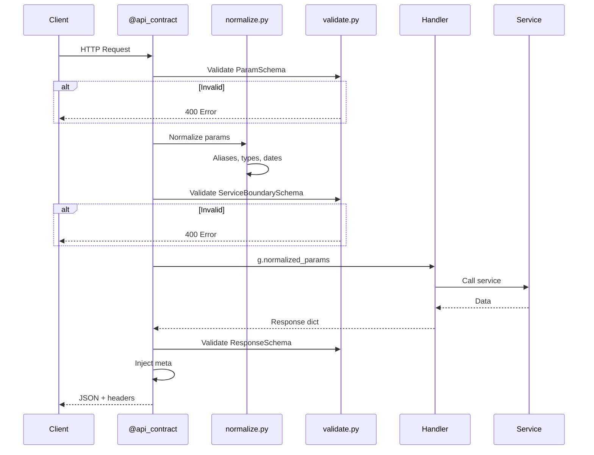

# Backend Reference

## Table of Contents
- [Architecture Layers](#architecture-layers)
- [API Contract System](#api-contract-system)
- [Input Boundary Normalization](#input-boundary-normalization)
- [SQL Best Practices](#sql-best-practices)
- [API Endpoints](#api-endpoints)
- [Services Reference](#services-reference)
- [Caching](#caching)
- [Error Handling](#error-handling)
- [Testing](#testing)

---

## Architecture Layers

### Layer Responsibilities

```
┌─────────────────────────────────────────────────────────────────────────────────┐
│ ROUTES (routes/)                                                                 │
│  • Thin HTTP handlers                                                           │
│  • Parse input using utils/normalize.py                                         │
│  • Call service functions                                                       │
│  • Return JSON responses                                                        │
│  • Decorated with @api_contract for validation                                  │
├─────────────────────────────────────────────────────────────────────────────────┤
│ SERVICES (services/)                                                             │
│  • Business logic                                                               │
│  • SQL query construction and execution                                         │
│  • Data transformation                                                          │
│  • Caching logic                                                                │
├─────────────────────────────────────────────────────────────────────────────────┤
│ DB LAYER (db/sql.py)                                                             │
│  • SQL validation helpers                                                       │
│  • Outlier filter constants                                                     │
│  • Parameter style enforcement                                                  │
└─────────────────────────────────────────────────────────────────────────────────┘
```

### Key Principle

**Routes parse, Services execute, DB enforces.**

```python
# ✅ CORRECT - Route parses, service executes
@app.route("/data")
def get_data():
    district = to_int(request.args.get("district"))  # Parse in route
    return service.get_data(district=district)        # Service executes

# ❌ WRONG - Parsing in service
def get_data(district):
    district = int(district) if district else None    # Don't parse here
```

---

## API Contract System

### Overview

The API contract system (`api/contracts/`) provides declarative validation and normalization for all endpoints.

### Components

```
api/contracts/
├── registry.py       # Contract definitions (ParamSchema, ServiceBoundarySchema, ResponseSchema)
├── wrapper.py        # @api_contract decorator
├── normalize.py      # Param normalization (aliases, types, dates, districts)
├── validate.py       # Schema validation logic
└── schemas/          # 17 endpoint-specific contracts
    ├── aggregate.py
    ├── dashboard.py
    ├── kpi_summary.py
    ├── transactions.py
    └── ...
```

### Request Processing Flow (ASCII)

```
Raw HTTP Request
        │
        ▼
┌───────────────────────────────────────────────────────────────────┐
│ Middleware Layer                                                   │
│  ┌─────────────┐    ┌─────────────┐    ┌─────────────────────┐   │
│  │ request_id  │ →  │ query_timing│ →  │ error_envelope      │   │
│  │ X-Request-ID│    │ elapsedMs   │    │ Standardized errors │   │
│  └─────────────┘    └─────────────┘    └─────────────────────┘   │
└───────────────────────────────────────────────────────────────────┘
        │
        ▼
┌───────────────────────────────────────────────────────────────────┐
│ @api_contract("endpoint") Decorator                               │
│                                                                   │
│  1. Collect params (query string + JSON body)                     │
│  2. Validate against ParamSchema                                  │
│       → Check required fields                                     │
│       → Check allowed values                                      │
│  3. Normalize params                                              │
│       → Resolve aliases (saleType → sale_type)                    │
│       → Type coercion (string "2,3" → [2, 3])                    │
│       → Singular→plural (district → districts[])                  │
│       → District normalization (9 → D09)                          │
│       → Date bounds (date_to → date_to_exclusive)                │
│  4. Validate against ServiceBoundarySchema                        │
│       → Check normalized values                                   │
│  5. Store in g.normalized_params                                  │
└───────────────────────────────────────────────────────────────────┘
        │
        ▼
┌───────────────────────────────────────────────────────────────────┐
│ Route Handler                                                     │
│  params = g.normalized_params  # Already validated + normalized   │
│  result = service.get_data(**params)                             │
│  return jsonify({"data": result})                                │
└───────────────────────────────────────────────────────────────────┘
        │
        ▼
┌───────────────────────────────────────────────────────────────────┐
│ Response Processing                                               │
│  1. Validate response against ResponseSchema                      │
│  2. Inject meta fields:                                           │
│       • requestId (from X-Request-ID)                            │
│       • elapsedMs (from query_timing)                            │
│       • apiVersion (from contract)                               │
│  3. Add headers:                                                  │
│       • X-Request-ID                                             │
│       • X-API-Contract-Version                                   │
└───────────────────────────────────────────────────────────────────┘
        │
        ▼
    JSON Response
```

### Contract Flow (Mermaid)



### Using @api_contract

```python
from api.contracts import api_contract
from flask import g, jsonify

@analytics_bp.route("/aggregate", methods=["GET"])
@api_contract("aggregate")  # Contract name must match schemas/aggregate.py
def aggregate():
    # Params already validated + normalized by decorator
    params = g.normalized_params

    # Call service with clean params
    result = dashboard_service.get_aggregated_data(
        districts=params.get('districts'),
        bedrooms=params.get('bedrooms'),
        date_from=params.get('date_from'),
        date_to_exclusive=params.get('date_to_exclusive'),
    )

    # Return data - decorator injects meta fields automatically
    return jsonify({"data": result})
```

### Contract Schema Definition

```python
# api/contracts/schemas/aggregate.py
from api.contracts.registry import register_contract

AGGREGATE_CONTRACT = {
    "name": "aggregate",
    "version": "v3",

    # What frontend sends
    "ParamSchema": {
        "group_by": {"type": "string", "required": True},
        "metrics": {"type": "string", "default": "count,median_psf"},
        "district": {"type": "string"},           # Singular allowed
        "districts": {"type": "array"},           # Plural preferred
        "bedroom": {"type": "int_or_array"},
        "date_from": {"type": "date"},
        "date_to": {"type": "date"},
        "sale_type": {"type": "string"},
    },

    # What services receive (after normalization)
    "ServiceBoundarySchema": {
        "group_by": {"type": "list", "required": True},
        "metrics": {"type": "list"},
        "districts": {"type": "list"},            # Always plural
        "bedrooms": {"type": "list"},             # Always plural
        "date_from": {"type": "date"},
        "date_to_exclusive": {"type": "date"},    # Always exclusive
        "sale_type": {"type": "string"},
    },

    # What client receives
    "ResponseSchema": {
        "data": {"type": "array", "required": True},
        "meta": {
            "type": "object",
            "properties": {
                "requestId": {"type": "string"},
                "elapsedMs": {"type": "number"},
                "apiVersion": {"type": "string"},
            }
        }
    }
}

register_contract(AGGREGATE_CONTRACT)
```

### Contract Modes

| Mode | Behavior | Use Case |
|------|----------|----------|
| `WARN` | Log violations, don't fail | Production (default) |
| `STRICT` | Fail on violations | Development, staging |

```python
# config.py
API_CONTRACT_MODE = os.getenv("API_CONTRACT_MODE", "WARN")
```

---

## Input Boundary Normalization

### Overview

All input parsing happens at the route boundary using `utils/normalize.py`. Services receive clean, validated data.

### Available Functions

| Function | Input | Output | Example |
|----------|-------|--------|---------|
| `to_int(value, default, field)` | `"42"` or `None` | `int` or `default` | `to_int("42")` → `42` |
| `to_float(value, default, field)` | `"3.14"` or `None` | `float` or `default` | `to_float("3.14")` → `3.14` |
| `to_date(value, default, field)` | `"2024-01-15"` | `date` or `default` | `to_date("2024-01-15")` → `date(2024, 1, 15)` |
| `to_bool(value, default, field)` | `"true"`, `"1"`, `"yes"` | `bool` | `to_bool("true")` → `True` |
| `to_list(value, item_type, field)` | `"2,3,4"` | `[2, 3, 4]` | `to_list("2,3", int)` → `[2, 3]` |
| `coerce_to_date(value)` | `date`, `datetime`, `str` | `date` | Legacy compat |

### Usage Pattern

```python
from utils.normalize import to_int, to_date, to_list, ValidationError, validation_error_response

@app.route("/data")
def get_data():
    try:
        # Parse at boundary
        limit = to_int(request.args.get("limit"), default=100, field="limit")
        date_from = to_date(request.args.get("date_from"), field="date_from")
        bedrooms = to_list(request.args.get("bedroom"), item_type=int, field="bedroom")
    except ValidationError as e:
        return validation_error_response(e)  # Returns 400 with field info

    # Service receives clean data
    return service.get_data(limit=limit, date_from=date_from, bedrooms=bedrooms)
```

### Error Response

```json
{
  "error": {
    "code": "INVALID_PARAMS",
    "message": "Invalid value for 'bedroom': expected integer",
    "field": "bedroom",
    "received": "abc",
    "requestId": "req_abc123"
  }
}
```

### Rule: Invalid Input → 400, Never 500

```python
# ✅ CORRECT - Boundary validation returns 400
try:
    bedroom = to_int(request.args.get("bedroom"), field="bedroom")
except ValidationError as e:
    return validation_error_response(e)  # 400

# ❌ WRONG - Unhandled exception causes 500
bedroom = int(request.args.get("bedroom"))  # ValueError → 500
```

---

## SQL Best Practices

### Parameter Style (MANDATORY)

**Use SQLAlchemy bind parameters (`:param`) only:**

```sql
-- ✅ CORRECT
WHERE sale_type = :sale_type
  AND transaction_date >= :date_from
  AND transaction_date < :date_to_exclusive
```

**Forbidden:**
```sql
%(sale_type)s                    -- ❌ psycopg2-specific
f"psf > {PSF_MIN}"               -- ❌ f-string interpolation
```

### Date Handling

**Pass Python `date` objects, never strings:**

```python
# ✅ CORRECT
params = {
    "date_from": date(2023, 1, 1),
    "date_to_exclusive": date(2024, 1, 1),
}

# ❌ WRONG
params = {
    "date_from": "2023-01-01",  # Never pass strings
}
```

### Date Bounds Convention

**Always use exclusive upper bound. Never mix `max_date` and `max_date_exclusive`.**

```sql
-- ✅ CORRECT: Exclusive upper bound
WHERE transaction_date >= :date_from
  AND transaction_date < :date_to_exclusive

-- For "last 12 months":
WHERE transaction_date >= :date_to_exclusive - INTERVAL '12 months'
  AND transaction_date < :date_to_exclusive

-- ❌ WRONG: Creates param confusion
AND transaction_date <= :date_to  -- Don't use alongside _exclusive
```

### Outlier Filtering

**Always use COALESCE (null-safe):**

```sql
-- ✅ CORRECT
WHERE COALESCE(is_outlier, false) = false

-- ❌ WRONG (not null-safe)
WHERE is_outlier = false OR is_outlier IS NULL
```

**Use helper from db/sql.py:**
```python
from db.sql import OUTLIER_FILTER, exclude_outliers

# In raw SQL
query = f"SELECT * FROM transactions WHERE {OUTLIER_FILTER}"

# In ORM
query = Transaction.query.filter(exclude_outliers(Transaction))
```

### Deterministic ORDER BY

**Required for window functions, cumulative sums, first/last row:**

```sql
-- ✅ CORRECT: Deterministic
ORDER BY transaction_date, id

-- ❌ WRONG: Non-deterministic (same date, random order)
ORDER BY transaction_date
```

**Safe to skip:** GROUP BY aggregations (no row order needed)

### Enum Normalization

**Use API contract methods:**

```python
from schemas.api_contract import SaleType

# Convert API value to DB value
sale_type_db = SaleType.to_db(SaleType.RESALE)  # → "Resale"

# Convert DB value to API value
sale_type_api = SaleType.to_api("Resale")  # → "resale"
```

**Never hardcode enum strings in business logic.**

---

## API Endpoints

### Core Analytics

| Endpoint | Method | Description | Auth |
|----------|--------|-------------|------|
| `/api/aggregate` | GET | Flexible aggregation with grouping | Optional |
| `/api/dashboard` | GET | Multi-panel dashboard data | Optional |
| `/api/kpi-summary-v2` | GET | Summary KPIs (registry-based) | Optional |
| `/api/filters` | GET | Filter options (districts, bedrooms) | Public |

### Projects

| Endpoint | Method | Description | Auth |
|----------|--------|-------------|------|
| `/api/projects/hot` | GET | Hot projects list | Optional |
| `/api/projects/<name>` | GET | Project details | Premium |
| `/api/projects/<name>/transactions` | GET | Project transactions | Premium |

### Market Data

| Endpoint | Method | Description | Auth |
|----------|--------|-------------|------|
| `/api/gls/all` | GET | All GLS tenders | Public |
| `/api/upcoming-launches/all` | GET | All upcoming launches | Public |
| `/api/deal-checker/multi-scope` | GET | Value analysis | Optional |
| `/api/supply/waterfall` | GET | Supply pipeline data | Optional |

### Admin/Debug

| Endpoint | Method | Description | Auth |
|----------|--------|-------------|------|
| `/api/health` | GET | Health check | Public |
| `/debug/data-status` | GET | Data loading status | Admin |
| `/admin/filter-outliers` | POST | Outlier management | Admin |

### Deprecated Endpoints (410 Gone)

| Endpoint | Replacement |
|----------|-------------|
| `/api/transactions/list` | `/api/aggregate` with pagination |
| `/api/kpi-summary` | `/api/kpi-summary-v2` |
| `/api/scatter-sample` | `/api/aggregate` |
| `/api/comparable_value_analysis` | `/api/deal-checker/multi-scope` |

---

## Services Reference

### Dashboard Service

```python
# services/dashboard_service.py

def get_dashboard_data(filters, panels, options=None):
    """
    Returns multi-panel dashboard data using CTEs for efficiency.

    Panels:
    - time_series: Transaction count + median PSF over time
    - volume_by_location: Count by region/district/project
    - price_histogram: Price distribution
    - bedroom_mix: Bedroom type distribution
    - sale_type_breakdown: New Sale vs Resale
    - summary: KPIs

    Cache: 10-minute TTL, 1000 max entries
    """
```

### Classifier Service

```python
# services/classifier.py

def classify_bedroom(area_sqft, sale_type, transaction_date):
    """
    3-tier bedroom classification based on area.

    Tier 1 (New ≥Jun'23): <580, <780, <1150, <1450, ≥1450 sqft
    Tier 2 (New <Jun'23): <600, <850, <1200, <1500, ≥1500 sqft
    Tier 3 (Resale):      <600, <950, <1350, <1650, ≥1650 sqft
    """

def get_market_segment(district):
    """
    Returns CCR, RCR, or OCR based on district.

    CCR: D01, D02, D06, D07, D09, D10, D11
    RCR: D03, D04, D05, D08, D12, D13, D14, D15, D20
    OCR: D16-D19, D21-D28
    """
```

### Deal Checker Service

```python
# services/deal_checker.py

def get_multi_scope_analysis(project, bedroom, area_sqft, price):
    """
    Value analysis comparing against:
    - Project history
    - District benchmark
    - Citywide benchmark

    Returns percentiles, z-scores, deal rating.
    """
```

---

## Caching

### Server-side Cache

```python
# dashboard_service.py
CACHE_TTL = 600  # 10 minutes
CACHE_MAX_SIZE = 1000

# Cache key includes normalized filters
cache_key = f"{filters_hash}:{panels_hash}:{options_hash}"
```

### Cache Behavior

| Scenario | Behavior |
|----------|----------|
| Cache hit | Return immediately (~5ms) |
| Cache miss | Execute query, store result |
| Cache full | Evict oldest entries (LRU) |
| TTL expired | Re-execute on next request |

### Cache Warming

On startup, pre-populates cache for:
- All data (no filters)
- By region (CCR, RCR, OCR)
- By bedroom type (2, 3, 4)
- Last 3 years of data

### Cache Invalidation

```bash
# After data upload
curl -X DELETE https://api.example.com/api/dashboard/cache
```

### Cache Stats

```python
from services.dashboard_service import get_cache_stats

stats = get_cache_stats()
# {
#   "size": 523,
#   "max_size": 1000,
#   "hit_rate": 0.87,
#   "ttl_seconds": 600
# }
```

---

## Error Handling

### Standard Error Envelope

```json
{
  "error": {
    "code": "INVALID_PARAM",
    "message": "Invalid value for 'district'",
    "field": "district",
    "received": "D99",
    "allowed": ["D01", "D02", "...", "D28"],
    "requestId": "req_abc123"
  }
}
```

### Error Codes

| Code | HTTP Status | Description |
|------|-------------|-------------|
| `INVALID_PARAM` | 400 | Invalid request parameter |
| `MISSING_PARAM` | 400 | Required parameter missing |
| `NOT_FOUND` | 404 | Resource not found |
| `GONE` | 410 | Endpoint deprecated |
| `UNAUTHORIZED` | 401 | Authentication required |
| `FORBIDDEN` | 403 | Insufficient permissions |
| `SERVER_ERROR` | 500 | Internal server error |

### Error Response Headers

```
X-Request-ID: req_abc123
X-API-Contract-Version: v3
```

### Debugging 500s

1. Check server logs for exception + traceback
2. Note endpoint, query params, selected filters
3. Look for `TypeError` in `strptime`/`int`/`float` → type mismatch

**Log pattern:**
```python
except Exception as e:
    logger.error(f"GET /api/dashboard: {e}")
    logger.error(f"Params: {[(k, repr(v), type(v).__name__) for k,v in filters.items()]}")
```

---

## Testing

### Required Tests

1. **Unit tests**: Pure computation functions (no DB)
2. **Integration tests**: API endpoint responses
3. **Contract tests**: v2/v3 response shapes
4. **Regression tests**: Snapshot comparisons

### Contract Response Validation

```python
def test_v2_response_has_no_snake_case():
    response = client.get('/api/aggregate?schema=v2&group_by=month')
    data = response.json()

    def check_no_snake_case(obj, path=""):
        if isinstance(obj, dict):
            for key in obj.keys():
                assert '_' not in key, f"Snake case at {path}.{key}"
                check_no_snake_case(obj[key], f"{path}.{key}")

    check_no_snake_case(data)
```

### SQL Checklist

Before any query:

- [ ] Uses `:param` style only (no `%(param)s`)
- [ ] Date params are Python `date` objects
- [ ] Enums use `api_contract.py` methods
- [ ] Outlier filter uses `COALESCE`
- [ ] Numeric values are parameterized
- [ ] SQL lives in service file, not route
- [ ] Uses exclusive upper bound for dates
- [ ] Deterministic ORDER BY for window functions

### Running Tests

```bash
cd backend

# Unit tests (no DB required)
pytest tests/unit/ -v

# Integration tests (requires DB)
pytest tests/integration/ -v

# Regression snapshot tests
pytest tests/test_regression_snapshots.py -v

# Update snapshots (after intentional changes)
pytest tests/test_regression_snapshots.py --update-snapshots
```

---

## API Contract Version

### Current Version: v3

```python
# schemas/api_contract.py
CURRENT_API_CONTRACT_VERSION = "v3"
SUPPORTED_API_CONTRACT_VERSIONS = {"v1", "v2", "v3"}
```

### Version Status

| Version | Status | Sunset | Notes |
|---------|--------|--------|-------|
| v1 | Deprecated | 2026-04-01 | snake_case fields |
| v2 | Supported | - | camelCase fields |
| v3 | Current | - | camelCase + version tracking |

### Response Format

```json
{
  "meta": {
    "apiVersion": "v3",
    "requestId": "req_abc123",
    "elapsedMs": 45,
    "timestamp": "2024-12-26T10:00:00Z"
  },
  "data": [...]
}
```

### Field Naming (v2/v3)

| v1 (deprecated) | v2/v3 (current) |
|-----------------|-----------------|
| `sale_type` | `saleType` |
| `median_psf` | `medianPsf` |
| `total_value` | `totalValue` |
| `project_name` | `projectName` |
| `bedroom_count` | `bedroomCount` |

---

*Last updated: December 2024*
