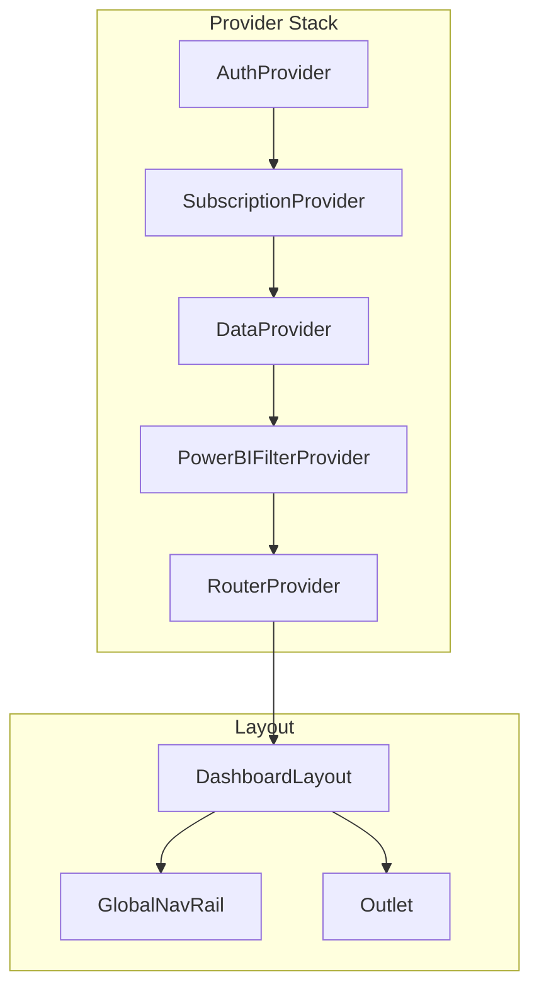

# Frontend Reference

## Table of Contents
- [Application Structure](#application-structure)
- [Page Routes](#page-routes)
- [State Management](#state-management)
- [Data Fetching](#data-fetching)
- [Adapter System](#adapter-system)
- [Component Architecture](#component-architecture)
- [API Contract (Frontend)](#api-contract-frontend)
- [Performance Patterns](#performance-patterns)
- [Checklists](#checklists)

---

## Application Structure

### Provider Hierarchy

```
┌─────────────────────────────────────────────────────────────────────────────────┐
│ main.jsx                                                                         │
│ ┌─────────────────────────────────────────────────────────────────────────────┐ │
│ │ <AuthProvider>                                                               │ │
│ │   • Firebase OAuth (Google)                                                 │ │
│ │   • JWT token management                                                    │ │
│ │   • Lazy-loads Firebase (only on sign-in)                                  │ │
│ │  ┌───────────────────────────────────────────────────────────────────────┐  │ │
│ │  │ <SubscriptionProvider>                                                 │  │ │
│ │  │   • Tier management (free/premium)                                    │  │ │
│ │  │   • Paywall logic                                                     │  │ │
│ │  │  ┌─────────────────────────────────────────────────────────────────┐  │  │ │
│ │  │  │ <DataProvider>                                                   │  │  │ │
│ │  │  │   • Static data: available districts, API metadata              │  │  │ │
│ │  │  │   • Fetched once at app init                                    │  │  │ │
│ │  │  │  ┌───────────────────────────────────────────────────────────┐  │  │  │ │
│ │  │  │  │ <PowerBIFilterProvider>                                    │  │  │  │ │
│ │  │  │  │   • All filter state (districts, bedrooms, dates)         │  │  │  │ │
│ │  │  │  │   • Drill state (location, time, project)                 │  │  │  │ │
│ │  │  │  │   • Session persistence (survives navigation)             │  │  │  │ │
│ │  │  │  │  ┌─────────────────────────────────────────────────────┐  │  │  │  │ │
│ │  │  │  │  │ <RouterProvider>                                     │  │  │  │  │ │
│ │  │  │  │  │   • React Router 6                                  │  │  │  │  │ │
│ │  │  │  │  │   • Lazy-loaded routes                              │  │  │  │  │ │
│ │  │  │  │  │  ┌───────────────────────────────────────────────┐  │  │  │  │  │ │
│ │  │  │  │  │  │ <DashboardLayout>                              │  │  │  │  │  │ │
│ │  │  │  │  │  │   ├─ GlobalNavRail (collapsible sidebar)      │  │  │  │  │  │ │
│ │  │  │  │  │  │   └─ <Outlet />  ← Pages render here          │  │  │  │  │  │ │
│ │  │  │  │  │  └───────────────────────────────────────────────┘  │  │  │  │  │ │
│ │  │  │  │  └─────────────────────────────────────────────────────┘  │  │  │  │ │
│ │  │  │  └───────────────────────────────────────────────────────────┘  │  │  │ │
│ │  │  └─────────────────────────────────────────────────────────────────┘  │  │ │
│ │  └───────────────────────────────────────────────────────────────────────┘  │ │
│ └─────────────────────────────────────────────────────────────────────────────┘ │
└─────────────────────────────────────────────────────────────────────────────────┘
```

### Provider Hierarchy (Mermaid)



### DashboardLayout Architecture

```
┌─────────────────────────────────────────────────────────────────────────────────┐
│ DashboardLayout                                                                  │
├─────────────────────────────────────────────────────────────────────────────────┤
│                                                                                  │
│   ┌───────────────┐  ┌───────────────────────────────────────────────────────┐  │
│   │ GlobalNavRail │  │ Main Content Area                                      │  │
│   │               │  │                                                        │  │
│   │ • 256px wide  │  │  ┌──────────────────────────────────────────────────┐ │  │
│   │   (expanded)  │  │  │ PowerBIFilterSidebar (control bar)               │ │  │
│   │ • 72px wide   │  │  │  • Date range picker                             │ │  │
│   │   (collapsed) │  │  │  • District/Region filters                       │ │  │
│   │               │  │  │  • Bedroom type filters                          │ │  │
│   │ Groups:       │  │  │  • Time grouping toggle (Y/Q/M)                  │ │  │
│   │ ─────────────│  │  └──────────────────────────────────────────────────┘ │  │
│   │ Market Intel  │  │                                                        │  │
│   │  • Overview   │  │  ┌──────────────────────────────────────────────────┐ │  │
│   │  • Districts  │  │  │ <Outlet /> (Page Content)                        │ │  │
│   │  • New Launch │  │  │                                                  │ │  │
│   │  • Supply     │  │  │  Charts, tables, KPIs...                        │ │  │
│   │               │  │  │                                                  │ │  │
│   │ Project Tools │  │  │                                                  │ │  │
│   │  • Explore    │  │  └──────────────────────────────────────────────────┘ │  │
│   │  • Value Chk  │  │                                                        │  │
│   │  • Exit Risk  │  │                                                        │  │
│   │               │  │                                                        │  │
│   └───────────────┘  └───────────────────────────────────────────────────────┘  │
│                                                                                  │
└─────────────────────────────────────────────────────────────────────────────────┘
```

---

## Page Routes

### Market Intelligence

| Nav Label | Page Component | Route | Data Scope |
|-----------|---------------|-------|------------|
| Market Overview | `MarketOverviewContent` | `/market-overview` | **Resale ONLY** |
| District Overview | `DistrictOverviewContent` | `/district-overview` | All |
| New Launch Market | `NewLaunchMarketContent` | `/new-launch-market` | New Sale + Resale |
| Supply & Inventory | `SupplyInventoryContent` | `/supply-inventory` | All |

### Project Tools

| Nav Label | Page Component | Route | Data Scope |
|-----------|---------------|-------|------------|
| Explore | `ExploreContent` | `/explore` | All |
| Value Check | `ValueCheckContent` | `/value-check` | All |
| Exit Risk | `ExitRiskContent` | `/exit-risk` | All |
| Methodology | `MethodologyContent` | `/methodology` | - |

### Public Routes

| Route | Component | Description |
|-------|-----------|-------------|
| `/` | `LandingPage` | Public landing |
| `/login` | `Login` | Authentication |
| `/pricing` | `Pricing` | Subscription plans |

### Legacy Redirects

```javascript
// App.jsx - Automatic redirects for backwards compatibility
{ path: '/market-core', redirect: '/market-overview' },
{ path: '/primary-market', redirect: '/new-launch-market' },
{ path: '/district-deep-dive', redirect: '/district-overview' },
{ path: '/project-deep-dive', redirect: '/explore' },
{ path: '/value-parity', redirect: '/value-check' },
{ path: '/supply-insights', redirect: '/supply-inventory' },
```

---

## State Management

### PowerBIFilterContext

All filter state lives in `context/PowerBIFilter/PowerBIFilterProvider.jsx`:

```javascript
const {
  // ═══════════════════════════════════════════════════════════════════════
  // FILTER STATE
  // ═══════════════════════════════════════════════════════════════════════
  filters: {
    districts,       // ['D09', 'D10', 'D11'] or []
    bedrooms,        // [2, 3, 4] or []
    saleTypes,       // ['New Sale', 'Resale'] or []
    tenures,         // ['Freehold', '99-year'] or []
    dateRange,       // { from: Date, to: Date }
  },

  // ═══════════════════════════════════════════════════════════════════════
  // DRILL STATE
  // ═══════════════════════════════════════════════════════════════════════
  drillPath: {
    location: null,  // 'CCR' | 'D09' | null
    time: null,      // '2024' | '2024Q3' | null
  },
  selectedProject,   // 'THE SAIL @ MARINA BAY' | null (drill-through)
  breadcrumbs,       // [{ label: 'All', level: 'root' }, { label: 'CCR', level: 'region' }]

  // ═══════════════════════════════════════════════════════════════════════
  // VIEW STATE
  // ═══════════════════════════════════════════════════════════════════════
  timeGrouping,      // 'year' | 'quarter' | 'month'
  filterOptions,     // { districts: [...], bedrooms: [...] } from API

  // ═══════════════════════════════════════════════════════════════════════
  // SETTERS
  // ═══════════════════════════════════════════════════════════════════════
  setDateRange,
  setDistricts,
  toggleDistrict,
  setBedroomTypes,
  toggleBedroom,
  setSaleTypes,
  setTimeGrouping,

  // ═══════════════════════════════════════════════════════════════════════
  // DRILL METHODS
  // ═══════════════════════════════════════════════════════════════════════
  drillIntoLocation,  // (region) or (district)
  drillIntoTime,      // (year) or (quarter)
  drillIntoProject,   // (projectName) - opens detail panel
  resetDrill,         // Clear drill state
  popBreadcrumb,      // Navigate back one level

  // ═══════════════════════════════════════════════════════════════════════
  // DERIVED
  // ═══════════════════════════════════════════════════════════════════════
  buildApiParams,     // (overrides, options) => merged params
  filterKey,          // Serialized filter state for cache keys
  debouncedFilterKey, // 200ms debounced version
  countActiveFilters, // Number of active filter selections

} = usePowerBIFilters();
```

### Filter Persistence

Filters persist to `sessionStorage`:
- Survives page navigation within tab
- Clears when browser tab closes
- Does NOT persist across sessions (by design)

```javascript
// Automatic persistence on filter change
useEffect(() => {
  sessionStorage.setItem('powerbi-filters', JSON.stringify(filters));
}, [filters]);

// Restore on mount
const initialFilters = JSON.parse(sessionStorage.getItem('powerbi-filters')) || defaults;
```

### buildApiParams Usage

```javascript
const { buildApiParams, debouncedFilterKey } = usePowerBIFilters();

// Basic usage - gets all current filters
const params = buildApiParams();

// With overrides - adds/overwrites specific params
const params = buildApiParams({
  group_by: 'quarter,sale_type',
  metrics: 'count,median_psf',
});

// With options
const params = buildApiParams(
  { group_by: 'month' },
  {
    excludeHighlight: true,  // Exclude highlighted project from filters
    excludeDrill: false,     // Include drill state (default)
  }
);
```

### Drill vs Cross-Filter

| Type | Scope | Behavior |
|------|-------|----------|
| **Sidebar Filter** | Global | Affects ALL charts |
| **Cross-Filter** | Global | Chart click affects other charts |
| **Drill** | Hierarchical | Navigates down (region→district→project) |
| **Drill-Through** | Local | Opens detail panel, doesn't affect global state |

```javascript
// Cross-filter: clicking chart updates sidebar
onChartClick={(item) => {
  toggleDistrict(item.district);  // Updates global filter
}}

// Drill: hierarchical navigation
onChartClick={(item) => {
  drillIntoLocation(item.region);  // Adds breadcrumb, zooms view
}}

// Drill-through: detail view
onChartClick={(item) => {
  drillIntoProject(item.projectName);  // Opens side panel
}}
```

---

## Data Fetching

### Data Flow Diagram

```
┌────────────────────────────────────────────────────────────────────────────────┐
│ User Interaction (filter click, page load)                                      │
└───────────────────────────────────┬────────────────────────────────────────────┘
                                    ▼
┌────────────────────────────────────────────────────────────────────────────────┐
│ PowerBIFilterContext                                                            │
│  ┌─────────────┐  ┌─────────────┐  ┌─────────────┐                             │
│  │ filters     │  │ drillPath   │  │ timeGrouping│                             │
│  │ (districts, │  │ (location,  │  │ (year/qtr/  │                             │
│  │  bedrooms)  │  │  time)      │  │  month)     │                             │
│  └──────┬──────┘  └──────┬──────┘  └──────┬──────┘                             │
│         └────────────────┴────────────────┘                                     │
│                          │                                                      │
│                   buildApiParams()                                              │
│                          │                                                      │
│                   debouncedFilterKey (200ms)                                    │
└──────────────────────────┬─────────────────────────────────────────────────────┘
                           ▼
┌────────────────────────────────────────────────────────────────────────────────┐
│ useAbortableQuery(fetcher, [debouncedFilterKey, timeGrouping])                  │
│                                                                                 │
│  1. Dependency change detected                                                 │
│  2. Abort previous request (AbortController.abort())                           │
│  3. Generate new requestId                                                     │
│  4. Start new request with signal                                              │
│  5. On response: check if stale (requestId mismatch)                           │
│  6. If fresh: update state                                                     │
│  7. Return { data, loading, error }                                            │
└──────────────────────────┬─────────────────────────────────────────────────────┘
                           ▼
┌────────────────────────────────────────────────────────────────────────────────┐
│ API Client (api/client.js)                                                      │
│  • Request queue (max 4 concurrent)                                            │
│  • JWT token injection                                                         │
│  • Timeout retry (cold start resilience)                                       │
│  • URL routing (dev: localhost:5000, prod: Vercel proxy)                       │
└──────────────────────────┬─────────────────────────────────────────────────────┘
                           ▼
┌────────────────────────────────────────────────────────────────────────────────┐
│ Backend Response                                                                │
│  { meta: { requestId, elapsedMs, apiVersion }, data: [...] }                   │
└──────────────────────────┬─────────────────────────────────────────────────────┘
                           ▼
┌────────────────────────────────────────────────────────────────────────────────┐
│ Adapter Transform                                                               │
│  transformTimeSeries(response.data, timeGrouping)                              │
│  → Normalized, sorted, typed data                                              │
└──────────────────────────┬─────────────────────────────────────────────────────┘
                           ▼
┌────────────────────────────────────────────────────────────────────────────────┐
│ Chart Component                                                                 │
│  <QueryState loading={loading} error={error} empty={!data?.length}>            │
│    <Chart data={data} />                                                       │
│  </QueryState>                                                                 │
└────────────────────────────────────────────────────────────────────────────────┘
```

### useAbortableQuery (Primary)

```javascript
import { useAbortableQuery } from '../hooks/useAbortableQuery';

function MyChart() {
  const { buildApiParams, debouncedFilterKey, timeGrouping } = usePowerBIFilters();

  const { data, loading, error } = useAbortableQuery(
    async (signal) => {
      const params = buildApiParams({ group_by: 'quarter' });
      const response = await apiClient.get('/api/aggregate', { params, signal });
      return transformTimeSeries(response.data.data, timeGrouping);  // Adapter!
    },
    [debouncedFilterKey, timeGrouping],  // Dependencies
    {
      initialData: [],
      keepPreviousData: true,  // Prevent loading flicker
      retries: 1,              // Auto-retry on network error
    }
  );

  if (loading) return <Skeleton />;
  if (error) return <ErrorState error={error} />;
  if (!data?.length) return <EmptyState />;
  return <Chart data={data} />;
}
```

### useDeferredFetch (Visibility-based)

For charts below the fold - only fetch when visible:

```javascript
import { useDeferredFetch } from '../hooks/useDeferredFetch';

function BelowFoldChart() {
  const { shouldFetch, containerRef } = useDeferredFetch({
    filterKey: debouncedFilterKey,
    priority: 'low',        // high | medium | low
    staggerDelay: 200,      // ms delay based on priority
  });

  const { data, loading } = useAbortableQuery(
    async (signal) => { /* ... */ },
    [debouncedFilterKey],
    { enabled: shouldFetch }  // Only fetch when visible
  );

  // CRITICAL: containerRef must be OUTSIDE QueryState
  return (
    <div ref={containerRef}>
      <QueryState loading={loading}>
        <Chart data={data} />
      </QueryState>
    </div>
  );
}
```

**Bug to avoid:**
```jsx
// ❌ BUG: ref inside QueryState (not rendered during loading)
<QueryState loading={loading}>
  <div ref={containerRef}>...</div>  // Never mounts when loading!
</QueryState>

// ✅ FIX: ref OUTSIDE QueryState
<div ref={containerRef}>
  <QueryState loading={loading}>...</QueryState>
</div>
```

### useStaleRequestGuard (Complex Cases)

For multiple sequential requests or custom loading:

```javascript
import { useStaleRequestGuard } from '../hooks/useStaleRequestGuard';

function ComplexChart() {
  const { startRequest, isStale, getSignal } = useStaleRequestGuard();
  const [data, setData] = useState(null);

  useEffect(() => {
    const requestId = startRequest();
    const signal = getSignal();

    Promise.all([fetchA({ signal }), fetchB({ signal })])
      .then(([a, b]) => {
        if (isStale(requestId)) return;  // Prevent stale update
        setData(combineData(a, b));
      })
      .catch(err => {
        if (err.name === 'AbortError') return;  // Ignore abort
        if (isStale(requestId)) return;
        setError(err);
      });
  }, [dependencies]);
}
```

### AbortError Handling

**AbortError must NEVER surface as an error to users:**

```javascript
.catch(err => {
  // Silently ignore abort errors
  if (err.name === 'AbortError' || err.name === 'CanceledError') {
    return;
  }
  setError(err);
});
```

---

## Adapter System

### Module Structure

```
adapters/
├── aggregateAdapter.js      # Main export (re-exports from aggregate/)
├── aggregate/
│   ├── index.js             # Central re-export
│   ├── validation.js        # Schema validation helpers
│   ├── sorting.js           # Period sorting utilities
│   ├── timeSeries.js        # transformTimeSeries()
│   ├── compression.js       # transformCompressionSeries()
│   ├── distribution.js      # transformDistributionSeries()
│   ├── chartTransforms.js   # transformNewVsResale(), transformDumbbell()
│   ├── beadsChart.js        # transformBeadsChartSeries()
│   ├── oscillator.js        # transformOscillatorSeries()
│   ├── transactions.js      # transformTransactionList()
│   ├── priceRange.js        # transformPriceRangeMatrix()
│   ├── districtComparison.js # transformDistrictComparison()
│   └── observability.js     # Debug logging helpers
└── supply/
    ├── index.js
    └── waterfallAdapter.js
```

### Rule: Charts Never Touch Raw API Data

**Forbidden:**
```javascript
// ❌ NEVER access raw API data
response.data.map(row => ...)
row.quarter ?? row.month
if (row.sale_type === 'New Sale')
```

**Required:**
```javascript
// ✅ ALWAYS use adapter
const transformed = transformTimeSeries(response.data.data, timeGrouping);
```

### Adapter Function Template

```javascript
// adapters/aggregate/timeSeries.js
import { getAggField, AggField, getPeriod, getPeriodGrain } from '../../schemas/apiContract';
import { sortByPeriod, hasValidPeriod } from './sorting';
import { logTransformResult } from './observability';

export function transformTimeSeries(rawData, expectedGrain = null) {
  // 1. Guard against invalid input
  if (!Array.isArray(rawData)) {
    if (process.env.NODE_ENV === 'development') {
      console.warn('[transformTimeSeries] Invalid input:', rawData);
    }
    return [];
  }

  // 2. Transform using contract helpers
  const result = rawData
    .filter(row => hasValidPeriod(row))
    .map(row => ({
      period: getPeriod(row, expectedGrain),
      periodGrain: getPeriodGrain(row) || expectedGrain,
      count: getAggField(row, AggField.COUNT),
      medianPsf: getAggField(row, AggField.MEDIAN_PSF),
      totalValue: getAggField(row, AggField.TOTAL_VALUE),
    }))
    .sort(sortByPeriod);

  // 3. Observability in dev
  logTransformResult('transformTimeSeries', rawData.length, result.length);

  return result;
}
```

### Common Transforms

| Function | Input | Output | Use Case |
|----------|-------|--------|----------|
| `transformTimeSeries` | Aggregate rows | `[{period, count, medianPsf}]` | Line/bar time charts |
| `transformCompressionSeries` | Aggregate rows | `[{period, compression, spread}]` | Compression analysis |
| `transformDistributionSeries` | Histogram data | `[{bin, count, percentage}]` | Price distribution |
| `transformNewVsResaleSeries` | Grouped data | `[{period, newSale, resale}]` | Comparison charts |
| `transformBeadsChartSeries` | Scatter data | `[{x, y, size, label}]` | Bubble charts |
| `transformOscillatorSeries` | Z-score data | `[{period, zScore, signal}]` | Momentum indicators |

---

## Component Architecture

### Chart Component Pattern

```javascript
// components/powerbi/TimeTrendChart.jsx
import { usePowerBIFilters } from '../../context/PowerBIFilterContext';
import { useAbortableQuery } from '../../hooks';
import { transformTimeSeries } from '../../adapters';
import { SaleType } from '../../schemas/apiContract';
import { QueryState, ChartSlot } from '../common';

export function TimeTrendChart({ saleType }) {
  // 1. Get filter context
  const { buildApiParams, debouncedFilterKey, timeGrouping } = usePowerBIFilters();

  // 2. Fetch with adapter transform
  const { data, loading, error } = useAbortableQuery(
    async (signal) => {
      const params = buildApiParams({
        group_by: 'quarter',
        metrics: 'count,median_psf',
        sale_type: saleType,  // Page passes this prop!
      });
      const response = await apiClient.get('/api/aggregate', { params, signal });
      return transformTimeSeries(response.data.data, timeGrouping);
    },
    [debouncedFilterKey, timeGrouping, saleType]
  );

  // 3. Render with QueryState wrapper
  return (
    <ChartSlot title="Transaction Trend">
      <QueryState loading={loading} error={error} empty={!data?.length}>
        <Line data={chartData(data)} options={chartOptions} />
      </QueryState>
    </ChartSlot>
  );
}
```

### QueryState Wrapper

All async data flows through `QueryState`:

```jsx
<QueryState
  loading={loading}
  error={error}
  empty={!data?.length}
  loadingComponent={<ChartSkeleton />}
  errorComponent={<ChartError />}
  emptyComponent={<EmptyState message="No data for selected filters" />}
>
  <Chart data={data} />
</QueryState>
```

### Page-Level Data Scope

**Pages decide business logic, charts receive it as props:**

```jsx
// pages/MarketOverview.jsx
import { SaleType } from '../schemas/apiContract';

export function MarketOverviewContent() {
  // PAGE decides: this page is resale-only
  const SALE_TYPE = SaleType.RESALE;

  return (
    <div>
      {/* All charts receive saleType as prop */}
      <TimeTrendChart saleType={SALE_TYPE} />
      <VolumeByLocationChart saleType={SALE_TYPE} />
      <PriceDistributionChart saleType={SALE_TYPE} />
    </div>
  );
}
```

**Charts never hardcode business logic:**
```jsx
// ✅ ALLOWED - conditional based on prop
if (saleType) params.sale_type = saleType;

// ❌ FORBIDDEN - chart decides
params.sale_type = SaleType.RESALE;
```

---

## API Contract (Frontend)

### Sources of Truth

```
schemas/apiContract/
├── enums.js              # SaleType, Tenure, FloorLevel, PropertyAgeBucket
├── transactionFields.js  # Transaction field constants
├── aggregateFields.js    # Aggregate metric field constants
├── dashboardFields.js    # Dashboard-specific normalization
├── params.js             # API parameter helpers
├── filterOptions.js      # Filter options normalization
├── version.js            # API contract versioning
└── index.js              # Central re-export
```

### Enum Usage

```javascript
import { SaleType, isSaleType, Tenure, isTenure } from '@/schemas/apiContract';

// ✅ Use enum constants
const saleType = SaleType.RESALE;  // 'resale'
const tenure = Tenure.FREEHOLD;     // 'freehold'

// ✅ Use type check helpers
if (isSaleType.newSale(row.saleType)) { ... }
if (isSaleType.resale(row.saleType)) { ... }
if (isTenure.freehold(row.tenure)) { ... }

// ❌ NEVER compare raw strings
if (row.saleType === 'New Sale') { ... }  // Wrong!
```

### Field Access Helpers

```javascript
import { getAggField, AggField, getPeriod } from '@/schemas/apiContract';

// Access aggregate fields (handles v2/v3 naming)
const count = getAggField(row, AggField.COUNT);
const medianPsf = getAggField(row, AggField.MEDIAN_PSF);
const totalValue = getAggField(row, AggField.TOTAL_VALUE);

// Access period (handles quarter/month/year)
const period = getPeriod(row);  // '2024Q3' or '2024-10' or '2024'
const grain = getPeriodGrain(row);  // 'quarter' | 'month' | 'year'
```

### Version Validation

```javascript
import { assertKnownVersion } from '@/schemas/apiContract';

// In adapter - validate API version
export function transformData(response) {
  assertKnownVersion(response.meta?.apiVersion);  // Throws if unknown
  // ... transform
}
```

---

## Performance Patterns

### Request Queue Limiting

API client limits concurrent requests:

```javascript
// api/client.js
const MAX_CONCURRENT_REQUESTS = 4;
```

### Debounced Filter Changes

200ms debounce prevents cascade of requests:

```javascript
const debouncedFilterKey = useDebouncedFilterKey(filterKey, 200);

useAbortableQuery(fetcher, [debouncedFilterKey]);  // Uses debounced version
```

### keepPreviousData

Prevents loading flicker during filter changes:

```javascript
const { data, loading } = useAbortableQuery(
  fetcher,
  [filterKey],
  { keepPreviousData: true }  // Shows old data while loading new
);
```

### Code Splitting

Pages and heavy components are lazy-loaded:

```javascript
// App.jsx
const MarketOverview = lazy(() =>
  retryImport(() => import('./pages/MarketOverview'))
);

// Chunk configuration (vite.config.js)
manualChunks: {
  'chart': ['chart.js', 'chartjs-*'],
  'map': ['maplibre-gl', 'react-map-gl'],
  'firebase': ['firebase/*'],
}
```

---

## Checklists

### Chart Migration Checklist

When adding or modifying charts:

**Data Fetching:**
- [ ] Uses `useAbortableQuery`
- [ ] Removed manual `useState` for data/loading/error
- [ ] Passes `signal` to API calls
- [ ] Uses `debouncedFilterKey` in dependencies

**Adapter Usage:**
- [ ] All transformation in adapter, not component
- [ ] Uses `getAggField()` for metrics
- [ ] Uses `getPeriod()` for time fields
- [ ] Uses `isSaleType.*()` for type checks

**QueryState:**
- [ ] Wrapped in `QueryState` or equivalent
- [ ] Handles loading, error, empty states
- [ ] `ref` is outside `QueryState` if using `useDeferredFetch`

**Query Key:**
- [ ] Includes ALL data-affecting state
- [ ] `timeGrouping` if view changes by Y/Q/M
- [ ] `saleType` if data scope varies
- [ ] `drillPath` if drill affects data

### Pre-PR Checklist

- [ ] Uses `useAbortableQuery` or `useStaleRequestGuard`
- [ ] AbortError handled silently
- [ ] Stale check before setState
- [ ] Empty data shows EmptyState
- [ ] No raw API data access in components
- [ ] Enums from `apiContract`, not string literals
- [ ] `keepPreviousData: true` to prevent flicker
- [ ] Chart handles Year/Quarter/Month switching

### Query Key Checklist

**Include in query key if it changes API response:**

| Include | Exclude |
|---------|---------|
| `filterKey` | `isExpanded` |
| `timeGrouping` | `tooltipPosition` |
| `saleType` | `chartAnimation` |
| `drillPath` | `scrollPosition` |
| `dateRange` | UI-only state |

---

## File Organization

```
frontend/src/
├── App.jsx                       # Routing, lazy loading
├── main.jsx                      # Provider stack
│
├── context/
│   ├── AuthContext.jsx           # Firebase auth
│   ├── SubscriptionContext.jsx   # Tier management
│   ├── DataContext.jsx           # Static data
│   └── PowerBIFilter/
│       ├── PowerBIFilterProvider.jsx  # Main filter context
│       ├── filterReducer.js           # State reducer
│       └── utils.js                   # Helper functions
│
├── components/
│   ├── layout/
│   │   ├── DashboardLayout.jsx   # Main layout wrapper
│   │   ├── GlobalNavRail.jsx     # Collapsible sidebar
│   │   └── UserProfileMenu.jsx   # Account dropdown
│   ├── powerbi/                  # 40+ chart components
│   │   ├── TimeTrendChart.jsx
│   │   ├── VolumeByLocationChart.jsx
│   │   ├── PowerBIFilterSidebar.jsx
│   │   └── ...
│   ├── common/
│   │   ├── QueryState.jsx        # Loading/error/empty wrapper
│   │   ├── ChartSlot.jsx         # Chart container
│   │   ├── ChartSkeleton.jsx     # Loading placeholder
│   │   └── ErrorState.jsx
│   ├── ui/                       # Shared primitives
│   └── insights/                 # Specialized visualizations
│
├── adapters/
│   ├── aggregateAdapter.js       # Main export
│   └── aggregate/                # 13 transform modules
│       ├── index.js
│       ├── timeSeries.js
│       └── ...
│
├── hooks/
│   ├── useAbortableQuery.js      # Primary data fetching
│   ├── useDeferredFetch.js       # Visibility-based fetching
│   ├── useStaleRequestGuard.js   # Stale request detection
│   └── useDebouncedFilterKey.js  # Filter debouncing
│
├── pages/
│   ├── MarketOverview.jsx
│   ├── DistrictOverview.jsx
│   ├── NewLaunchMarket.jsx
│   └── ...
│
├── schemas/
│   └── apiContract/
│       ├── enums.js              # SaleType, Tenure, etc.
│       ├── aggregateFields.js    # AggField constants
│       └── index.js              # Central export
│
├── constants/
│   └── index.js                  # Districts, regions, colors
│
└── api/
    └── client.js                 # Axios instance
```

---

*Last updated: December 2024*
