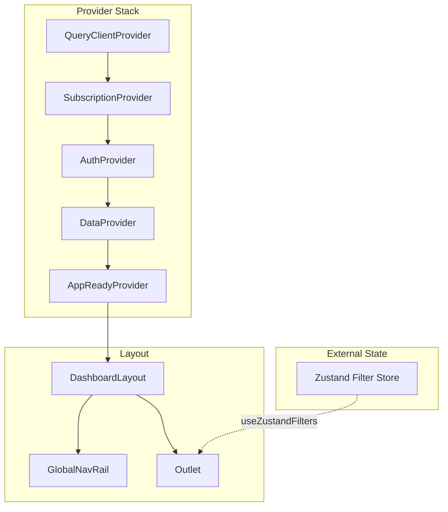

# Frontend Reference

## Table of Contents
- [Application Structure](#application-structure)
- [Page Routes](#page-routes)
- [State Management](#state-management)
- [Data Fetching](#data-fetching)
- [Adapter System](#adapter-system)
- [Component Architecture](#component-architecture)
- [API Contract (Frontend)](#api-contract-frontend)
- [Performance Patterns](#performance-patterns)
- [Checklists](#checklists)

---

## Application Structure

### Provider Hierarchy

```
┌─────────────────────────────────────────────────────────────────────────────────┐
│ App.jsx                                                                          │
│ ┌─────────────────────────────────────────────────────────────────────────────┐ │
│ │ <QueryClientProvider>                     TanStack Query (caching, refetch) │ │
│ │  ┌───────────────────────────────────────────────────────────────────────┐  │ │
│ │  │ <SubscriptionProvider>                 Tier management (free/premium) │  │ │
│ │  │  ┌─────────────────────────────────────────────────────────────────┐  │  │ │
│ │  │  │ <AuthProvider>                      Firebase OAuth + JWT        │  │  │ │
│ │  │  │  ┌───────────────────────────────────────────────────────────┐  │  │  │ │
│ │  │  │  │ <DataProvider>                   Static data (districts)  │  │  │  │ │
│ │  │  │  │  ┌─────────────────────────────────────────────────────┐  │  │  │  │ │
│ │  │  │  │  │ <BrowserRouter>               React Router 6        │  │  │  │  │ │
│ │  │  │  │  │  ┌───────────────────────────────────────────────┐  │  │  │  │  │ │
│ │  │  │  │  │  │ <AppReadyProvider>         Boot gating        │  │  │  │  │  │ │
│ │  │  │  │  │  │   • Waits for auth + subscription + filters   │  │  │  │  │  │ │
│ │  │  │  │  │  │   • Gates data fetching until ready           │  │  │  │  │  │ │
│ │  │  │  │  │  │  ┌─────────────────────────────────────────┐  │  │  │  │  │  │ │
│ │  │  │  │  │  │  │ <Routes>                                │  │  │  │  │  │  │ │
│ │  │  │  │  │  │  │  └─ <DashboardLayout>                  │  │  │  │  │  │  │ │
│ │  │  │  │  │  │  │      ├─ GlobalNavRail (64-256px)       │  │  │  │  │  │  │ │
│ │  │  │  │  │  │  │      └─ <Outlet />  ← Pages here       │  │  │  │  │  │  │ │
│ │  │  │  │  │  │  └─────────────────────────────────────────┘  │  │  │  │  │  │ │
│ │  │  │  │  │  └───────────────────────────────────────────────┘  │  │  │  │  │ │
│ │  │  │  │  └─────────────────────────────────────────────────────┘  │  │  │  │ │
│ │  │  │  └───────────────────────────────────────────────────────────┘  │  │  │ │
│ │  │  └─────────────────────────────────────────────────────────────────┘  │  │ │
│ │  └───────────────────────────────────────────────────────────────────────┘  │ │
│ └─────────────────────────────────────────────────────────────────────────────┘ │
│                                                                                  │
│ FILTER STATE: Zustand store (not in provider tree)                              │
│   • stores/filterStore.js - Page-namespaced, persisted to sessionStorage        │
│   • useZustandFilters() hook - Access from any component                        │
└─────────────────────────────────────────────────────────────────────────────────┘
```

### Provider Hierarchy (Mermaid)



### Key Architecture Change (January 2026)

**PowerBIFilterProvider has been removed.** Filter state is now managed by Zustand:

| Before (Phase 2) | After (Phase 4) |
|------------------|-----------------|
| `<PowerBIFilterProvider>` in tree | Zustand store (external) |
| `usePowerBIFilters()` hook | `useZustandFilters()` hook |
| Context re-renders on any change | Selector-based updates |
| 600+ lines of context code | ~200 lines of store code |

### DashboardLayout Architecture

```
┌─────────────────────────────────────────────────────────────────────────────────┐
│ DashboardLayout                                                                  │
├─────────────────────────────────────────────────────────────────────────────────┤
│                                                                                  │
│   ┌───────────────┐  ┌───────────────────────────────────────────────────────┐  │
│   │ GlobalNavRail │  │ Main Content Area                                      │  │
│   │               │  │                                                        │  │
│   │ • 256px wide  │  │  ┌──────────────────────────────────────────────────┐ │  │
│   │   (expanded)  │  │  │ PowerBIFilterSidebar (control bar)               │ │  │
│   │ • 72px wide   │  │  │  • Date range picker                             │ │  │
│   │   (collapsed) │  │  │  • District/Region filters                       │ │  │
│   │               │  │  │  • Bedroom type filters                          │ │  │
│   │ Groups:       │  │  │  • Time grouping toggle (Y/Q/M)                  │ │  │
│   │ ─────────────│  │  └──────────────────────────────────────────────────┘ │  │
│   │ Market Intel  │  │                                                        │  │
│   │  • Overview   │  │  ┌──────────────────────────────────────────────────┐ │  │
│   │  • Districts  │  │  │ <Outlet /> (Page Content)                        │ │  │
│   │  • New Launch │  │  │                                                  │ │  │
│   │  • Supply     │  │  │  Charts, tables, KPIs...                        │ │  │
│   │               │  │  │                                                  │ │  │
│   │ Project Tools │  │  │                                                  │ │  │
│   │  • Explore    │  │  └──────────────────────────────────────────────────┘ │  │
│   │  • Value Chk  │  │                                                        │  │
│   │  • Exit Risk  │  │                                                        │  │
│   │               │  │                                                        │  │
│   └───────────────┘  └───────────────────────────────────────────────────────┘  │
│                                                                                  │
└─────────────────────────────────────────────────────────────────────────────────┘
```

---

## Page Routes

### Market Intelligence

| Nav Label | Page Component | Route | Data Scope |
|-----------|---------------|-------|------------|
| Market Overview | `MacroOverviewContent` | `/market-overview` | **Resale ONLY** |
| District Overview | `DistrictDeepDiveContent` | `/district-overview` | All |
| New Launch Market | `PrimaryMarketContent` | `/new-launch-market` | New Sale + Resale |
| Supply & Inventory | `SupplyInsightsContent` | `/supply-inventory` | All |

### Project Tools

| Nav Label | Page Component | Route | Data Scope |
|-----------|---------------|-------|------------|
| Explore | `ProjectDeepDiveContent` | `/explore` | All |
| Value Check | `ValueParityPanel` | `/value-check` | All |
| Exit Risk | `ExitRiskContent` | `/exit-risk` | All |
| Methodology | `MethodologyContent` | `/methodology` | - |

### Public Routes

| Route | Component | Description |
|-------|-----------|-------------|
| `/` | `LandingPage` | Public landing |
| `/login` | `Login` | Authentication |
| `/pricing` | `Pricing` | Subscription plans |

### Legacy Redirects

```javascript
// App.jsx - Automatic redirects for backwards compatibility
{ path: '/market-core', redirect: '/market-overview' },
{ path: '/primary-market', redirect: '/new-launch-market' },
{ path: '/district-deep-dive', redirect: '/district-overview' },
{ path: '/project-deep-dive', redirect: '/explore' },
{ path: '/value-parity', redirect: '/value-check' },
{ path: '/supply-insights', redirect: '/supply-inventory' },
```

---

## State Management

### Zustand Filter Store (Current)

All filter state lives in `stores/filterStore.js`. Access via `useZustandFilters()`:

```javascript
import { useZustandFilters } from '../stores';

const {
  // ═══════════════════════════════════════════════════════════════════════
  // FILTER STATE
  // ═══════════════════════════════════════════════════════════════════════
  filters: {
    timeFilter,      // { type: 'preset', value: 'Y1' } or { type: 'custom', start, end }
    districts,       // ['D09', 'D10', 'D11'] or []
    bedroomTypes,    // [2, 3, 4] or []
    segments,        // ['CCR', 'RCR', 'OCR'] or []
    saleType,        // 'New Sale' | 'Resale' | null
    tenure,          // 'Freehold' | '99-year' | null
    psfRange,        // { min: number|null, max: number|null }
    sizeRange,       // { min: number|null, max: number|null }
    propertyAge,     // { min: number|null, max: number|null }
    project,         // 'THE SAIL @ MARINA BAY' | null
  },

  // ═══════════════════════════════════════════════════════════════════════
  // DRILL STATE (resets on route change)
  // ═══════════════════════════════════════════════════════════════════════
  drillPath: {
    location: 'all', // 'all' | 'region' | 'district' | 'project'
    time: 'year',    // 'year' | 'quarter' | 'month'
  },
  selectedProject,   // { name: string|null, district: string|null }
  breadcrumbs: {
    location: [],    // [{ value: 'CCR', label: 'CCR' }, ...]
    time: [],        // [{ value: '2024', label: '2024' }, ...]
  },

  // ═══════════════════════════════════════════════════════════════════════
  // VIEW STATE
  // ═══════════════════════════════════════════════════════════════════════
  timeGrouping,      // 'year' | 'quarter' | 'month'
  filterOptions,     // { districts: [...], bedrooms: [...] } from DataContext
  filtersReady,      // boolean - hydration complete

  // ═══════════════════════════════════════════════════════════════════════
  // DERIVED STATE
  // ═══════════════════════════════════════════════════════════════════════
  activeFilters,     // Merged filters + drill state
  activeFilterCount, // Number of active filter selections
  filterKey,         // Serialized filter state for cache keys
  debouncedFilterKey, // 200ms debounced version

  // ═══════════════════════════════════════════════════════════════════════
  // ACTIONS - TIME FILTER
  // ═══════════════════════════════════════════════════════════════════════
  setTimeFilter,     // (timeFilter) - unified format
  setTimePreset,     // (value) - preset mode ('Y1', 'Y3', etc.)
  setTimeRange,      // (start, end) - custom range mode
  setDateRange,      // (start, end) - legacy alias
  setDatePreset,     // (preset) - legacy alias

  // ═══════════════════════════════════════════════════════════════════════
  // ACTIONS - DIMENSIONS
  // ═══════════════════════════════════════════════════════════════════════
  setDistricts,
  toggleDistrict,
  setBedroomTypes,
  toggleBedroomType,
  setSegments,
  toggleSegment,
  setSaleType,
  setTenure,
  setProject,

  // ═══════════════════════════════════════════════════════════════════════
  // ACTIONS - DRILL NAVIGATION
  // ═══════════════════════════════════════════════════════════════════════
  drillDown,         // (type, value, label) - navigate deeper
  drillUp,           // (type) - navigate up one level
  navigateToBreadcrumb, // (type, index) - jump to breadcrumb

  // ═══════════════════════════════════════════════════════════════════════
  // ACTIONS - PROJECT SELECTION
  // ═══════════════════════════════════════════════════════════════════════
  setSelectedProject,   // (name, district) - opens detail panel
  clearSelectedProject, // () - closes detail panel

  // ═══════════════════════════════════════════════════════════════════════
  // HELPER FUNCTIONS
  // ═══════════════════════════════════════════════════════════════════════
  buildApiParams,    // (overrides, options) => merged params for API calls

} = useZustandFilters();
```

### Alternative Hooks (Performance Optimization)

```javascript
// State only (for read-heavy components)
import { useZustandFilterState } from '../stores';
const { filters, activeFilters, filterKey } = useZustandFilterState();

// Actions only (stable, never causes re-renders)
import { useZustandFilterActions } from '../stores';
const { setTimePreset, setDistricts } = useZustandFilterActions();

// Direct store access with selector (most performant)
import { useFilterStoreSelector } from '../stores';
const districts = useFilterStoreSelector(state => state.filters.districts);
```

### Filter Persistence

Filters persist to `sessionStorage`:
- Survives page navigation within tab
- Clears when browser tab closes
- Does NOT persist across sessions (by design)

```javascript
// Automatic persistence on filter change
useEffect(() => {
  sessionStorage.setItem('powerbi-filters', JSON.stringify(filters));
}, [filters]);

// Restore on mount
const initialFilters = JSON.parse(sessionStorage.getItem('powerbi-filters')) || defaults;
```

### buildApiParams Usage

```javascript
const { buildApiParams, debouncedFilterKey } = useZustandFilters();

// Basic usage - gets all current filters
const params = buildApiParams();

// With overrides - adds/overwrites specific params
const params = buildApiParams({
  group_by: 'quarter,sale_type',
  metrics: 'count,median_psf',
});

// With options
const params = buildApiParams(
  { group_by: 'month' },
  {
    excludeHighlight: true,  // Exclude highlighted project from filters
    excludeDrill: false,     // Include drill state (default)
  }
);
```

### Drill vs Cross-Filter

| Type | Scope | Behavior |
|------|-------|----------|
| **Sidebar Filter** | Global | Affects ALL charts |
| **Cross-Filter** | Global | Chart click affects other charts |
| **Drill** | Hierarchical | Navigates down (region→district→project) |
| **Drill-Through** | Local | Opens detail panel, doesn't affect global state |

```javascript
// Cross-filter: clicking chart updates sidebar
onChartClick={(item) => {
  toggleDistrict(item.district);  // Updates global filter
}}

// Drill: hierarchical navigation
onChartClick={(item) => {
  drillIntoLocation(item.region);  // Adds breadcrumb, zooms view
}}

// Drill-through: detail view
onChartClick={(item) => {
  drillIntoProject(item.projectName);  // Opens side panel
}}
```

---

## Data Fetching

### Data Flow Diagram

```
┌────────────────────────────────────────────────────────────────────────────────┐
│ User Interaction (filter click, page load)                                      │
└───────────────────────────────────┬────────────────────────────────────────────┘
                                    ▼
┌────────────────────────────────────────────────────────────────────────────────┐
│ Zustand Filter Store (stores/filterStore.js)                                    │
│  ┌─────────────┐  ┌─────────────┐  ┌─────────────┐                             │
│  │ filters     │  │ drillPath   │  │ timeGrouping│                             │
│  │ (districts, │  │ (location,  │  │ (year/qtr/  │                             │
│  │  bedrooms)  │  │  time)      │  │  month)     │                             │
│  └──────┬──────┘  └──────┬──────┘  └──────┬──────┘                             │
│         └────────────────┴────────────────┘                                     │
│                          │                                                      │
│                   buildApiParams()                                              │
│                          │                                                      │
│                   debouncedFilterKey (200ms)                                    │
└──────────────────────────┬─────────────────────────────────────────────────────┘
                           ▼
┌────────────────────────────────────────────────────────────────────────────────┐
│ useAppQuery(queryFn, [deps], options)                                           │
│  TanStack Query wrapper with boot gating                                       │
│                                                                                 │
│  Features:                                                                      │
│  • Waits for appReady (auth + subscription + filters) before fetching          │
│  • Automatic abort on dependency change (via TanStack Query)                   │
│  • Built-in caching and deduplication                                          │
│  • Stale-while-revalidate pattern                                              │
│  • Auto-retry on network errors                                                │
│  • DevTools integration for debugging                                          │
│                                                                                 │
│  Returns: { data, status, error, refetch, isFetching, isRefetching }           │
└──────────────────────────┬─────────────────────────────────────────────────────┘
                           ▼
┌────────────────────────────────────────────────────────────────────────────────┐
│ API Client (api/client.js)                                                      │
│  • Request queue (max 8 concurrent)                                            │
│  • JWT token injection                                                         │
│  • Timeout retry (cold start resilience)                                       │
│  • URL routing (dev: localhost:5000, prod: Vercel proxy)                       │
└──────────────────────────┬─────────────────────────────────────────────────────┘
                           ▼
┌────────────────────────────────────────────────────────────────────────────────┐
│ Backend Response                                                                │
│  { meta: { requestId, elapsedMs, apiVersion }, data: [...] }                   │
└──────────────────────────┬─────────────────────────────────────────────────────┘
                           ▼
┌────────────────────────────────────────────────────────────────────────────────┐
│ Adapter Transform                                                               │
│  transformTimeSeries(response.data, timeGrouping)                              │
│  → Normalized, sorted, typed data                                              │
└──────────────────────────┬─────────────────────────────────────────────────────┘
                           ▼
┌────────────────────────────────────────────────────────────────────────────────┐
│ Chart Component                                                                 │
│  status === 'pending' → <Skeleton />                                           │
│  status === 'error' → <ErrorState error={error} />                             │
│  !data?.length → <EmptyState />                                                │
│  else → <Chart data={data} />                                                  │
└────────────────────────────────────────────────────────────────────────────────┘
```

### useAppQuery (Primary - TanStack Query Wrapper)

**This is the ONLY data fetching hook.** All legacy hooks have been removed.

```javascript
import { useAppQuery } from '../hooks';
import { useZustandFilters } from '../stores';
import { getAggregate } from '../api/analytics';
import { transformTimeSeries } from '../adapters';

function MyChart() {
  const { buildApiParams, debouncedFilterKey, timeGrouping } = useZustandFilters();

  const { data, status, error, isFetching } = useAppQuery(
    async (signal) => {
      const params = buildApiParams({ group_by: 'quarter' });
      const response = await getAggregate(params, { signal });
      return transformTimeSeries(response.data, timeGrouping);  // Always use adapter!
    },
    [debouncedFilterKey, timeGrouping],  // Dependencies → query key
    {
      chartName: 'MyChart',      // For dev timing instrumentation
      keepPreviousData: true,    // Show old data while fetching new
      staleTime: 30000,          // 30s cache freshness (default)
    }
  );

  if (status === 'pending') return <Skeleton />;
  if (status === 'error') return <ErrorState error={error} />;
  if (!data?.length) return <EmptyState />;
  return <Chart data={data} />;
}
```

### useAppQuery Options

| Option | Type | Default | Description |
|--------|------|---------|-------------|
| `chartName` | string | - | Name for dev timing instrumentation |
| `enabled` | boolean | `true` | ANDed with `appReady` |
| `keepPreviousData` | boolean | `false` | Show stale data while fetching |
| `staleTime` | number | `30000` | Cache freshness in ms |
| `initialData` | any | - | Initial data before first fetch |

### useAppQuery Return Values

| Value | Type | Description |
|-------|------|-------------|
| `status` | string | `'pending'` \| `'error'` \| `'success'` \| `'refreshing'` |
| `data` | any | Query result (or `initialData` if pending) |
| `error` | Error | Error object if query failed |
| `refetch` | function | Manually trigger refetch |
| `isFetching` | boolean | True when fetching (including background) |
| `isRefetching` | boolean | True when refetching with existing data |
| `hasData` | boolean | True if data has content |
| `isBootPending` | boolean | True if waiting for app boot |

### Migration from Legacy Hooks

Legacy hooks have been **deleted**. Here's the migration path:

```javascript
// ❌ REMOVED - Do not use
import { useAbortableQuery } from '../hooks/useAbortableQuery';
import { useGatedAbortableQuery } from '../hooks/useGatedAbortableQuery';
import { useStaleRequestGuard } from '../hooks/useStaleRequestGuard';
import { useQuery } from '../hooks/useQuery';

// ✅ CURRENT - Use this
import { useAppQuery } from '../hooks';
```

| Legacy Hook | Replacement | Notes |
|-------------|-------------|-------|
| `useAbortableQuery` | `useAppQuery` | Same arguments |
| `useGatedAbortableQuery` | `useAppQuery` | Boot gating is built-in |
| `useStaleRequestGuard` | `useAppQuery` | TanStack handles stale detection |
| `useQuery` (custom) | `useAppQuery` | TanStack provides caching |

### Visibility-based Fetching

For charts below the fold - still use `useDeferredFetch`:

```javascript
import { useDeferredFetch } from '../hooks/useDeferredFetch';

function BelowFoldChart() {
  const { shouldFetch, containerRef } = useDeferredFetch({
    filterKey: debouncedFilterKey,
    priority: 'low',
    staggerDelay: 200,
  });

  const { data, status } = useAppQuery(
    async (signal) => { /* ... */ },
    [debouncedFilterKey],
    { enabled: shouldFetch }  // Only fetch when visible
  );

  // CRITICAL: containerRef must be OUTSIDE status checks
  return (
    <div ref={containerRef}>
      {status === 'pending' ? <Skeleton /> : <Chart data={data} />}
    </div>
  );
}
```

### TanStack Query DevTools

In development, TanStack Query DevTools are available (bottom-left button):

- View all cached queries
- Inspect query state and data
- Manually invalidate/refetch queries
- Debug stale times and cache behavior

---

## Adapter System

### Module Structure

```
adapters/
├── aggregateAdapter.js      # Main export (re-exports from aggregate/)
├── aggregate/
│   ├── index.js             # Central re-export
│   ├── validation.js        # Schema validation helpers
│   ├── sorting.js           # Period sorting utilities
│   ├── timeSeries.js        # transformTimeSeries()
│   ├── compression.js       # transformCompressionSeries()
│   ├── distribution.js      # transformDistributionSeries()
│   ├── chartTransforms.js   # transformNewVsResale(), transformDumbbell()
│   ├── beadsChart.js        # transformBeadsChartSeries()
│   ├── oscillator.js        # transformOscillatorSeries()
│   ├── transactions.js      # transformTransactionList()
│   ├── priceRange.js        # transformPriceRangeMatrix()
│   ├── districtComparison.js # transformDistrictComparison()
│   └── observability.js     # Debug logging helpers
└── supply/
    ├── index.js
    └── waterfallAdapter.js
```

### Rule: Charts Never Touch Raw API Data

**Forbidden:**
```javascript
// ❌ NEVER access raw API data
response.data.map(row => ...)
row.quarter ?? row.month
if (row.sale_type === 'New Sale')
```

**Required:**
```javascript
// ✅ ALWAYS use adapter
const transformed = transformTimeSeries(response.data.data, timeGrouping);
```

### Adapter Function Template

```javascript
// adapters/aggregate/timeSeries.js
import { getAggField, AggField, getPeriod, getPeriodGrain } from '../../schemas/apiContract';
import { sortByPeriod, hasValidPeriod } from './sorting';
import { logTransformResult } from './observability';

export function transformTimeSeries(rawData, expectedGrain = null) {
  // 1. Guard against invalid input
  if (!Array.isArray(rawData)) {
    if (process.env.NODE_ENV === 'development') {
      console.warn('[transformTimeSeries] Invalid input:', rawData);
    }
    return [];
  }

  // 2. Transform using contract helpers
  const result = rawData
    .filter(row => hasValidPeriod(row))
    .map(row => ({
      period: getPeriod(row, expectedGrain),
      periodGrain: getPeriodGrain(row) || expectedGrain,
      count: getAggField(row, AggField.COUNT),
      medianPsf: getAggField(row, AggField.MEDIAN_PSF),
      totalValue: getAggField(row, AggField.TOTAL_VALUE),
    }))
    .sort(sortByPeriod);

  // 3. Observability in dev
  logTransformResult('transformTimeSeries', rawData.length, result.length);

  return result;
}
```

### Common Transforms

| Function | Input | Output | Use Case |
|----------|-------|--------|----------|
| `transformTimeSeries` | Aggregate rows | `[{period, count, medianPsf}]` | Line/bar time charts |
| `transformCompressionSeries` | Aggregate rows | `[{period, compression, spread}]` | Compression analysis |
| `transformDistributionSeries` | Histogram data | `[{bin, count, percentage}]` | Price distribution |
| `transformNewVsResaleSeries` | Grouped data | `[{period, newSale, resale}]` | Comparison charts |
| `transformBeadsChartSeries` | Scatter data | `[{x, y, size, label}]` | Bubble charts |
| `transformOscillatorSeries` | Z-score data | `[{period, zScore, signal}]` | Momentum indicators |

---

## Component Architecture

### Chart Component Pattern

```javascript
// components/powerbi/TimeTrendChart.jsx
import { useZustandFilters } from '../../stores';
import { useAppQuery } from '../../hooks';
import { getAggregate } from '../../api/analytics';
import { transformTimeSeries } from '../../adapters';
import { ChartFrame } from '../common';

export function TimeTrendChart({ saleType }) {
  // 1. Get filter state from Zustand
  const { buildApiParams, debouncedFilterKey, timeGrouping } = useZustandFilters();

  // 2. Fetch with TanStack Query wrapper
  const { data, status, error } = useAppQuery(
    async (signal) => {
      const params = buildApiParams({
        group_by: 'quarter',
        metrics: 'count,median_psf',
        ...(saleType && { sale_type: saleType }),  // Page passes this prop!
      });
      const response = await getAggregate(params, { signal });
      return transformTimeSeries(response.data, timeGrouping);
    },
    [debouncedFilterKey, timeGrouping, saleType],
    { chartName: 'TimeTrendChart', keepPreviousData: true }
  );

  // 3. Render with ChartFrame (handles status states)
  return (
    <ChartFrame
      title="Transaction Trend"
      status={status}
      error={error}
      isEmpty={!data?.length}
    >
      <Line data={chartData(data)} options={chartOptions} />
    </ChartFrame>
  );
}
```

### QueryState Wrapper

All async data flows through `QueryState`:

```jsx
<QueryState
  loading={loading}
  error={error}
  empty={!data?.length}
  loadingComponent={<ChartSkeleton />}
  errorComponent={<ChartError />}
  emptyComponent={<EmptyState message="No data for selected filters" />}
>
  <Chart data={data} />
</QueryState>
```

### Page-Level Data Scope

**Pages decide business logic, charts receive it as props:**

```jsx
// pages/MarketOverview.jsx
import { SaleType } from '../schemas/apiContract';

export function MarketOverviewContent() {
  // PAGE decides: this page is resale-only
  const SALE_TYPE = SaleType.RESALE;

  return (
    <div>
      {/* All charts receive saleType as prop */}
      <TimeTrendChart saleType={SALE_TYPE} />
      <VolumeByLocationChart saleType={SALE_TYPE} />
      <PriceDistributionChart saleType={SALE_TYPE} />
    </div>
  );
}
```

**Charts never hardcode business logic:**
```jsx
// ✅ ALLOWED - conditional based on prop
if (saleType) params.sale_type = saleType;

// ❌ FORBIDDEN - chart decides
params.sale_type = SaleType.RESALE;
```

---

## API Contract (Frontend)

### Sources of Truth

```
schemas/apiContract/
├── enums.js              # SaleType, Tenure, FloorLevel, PropertyAgeBucket
├── transactionFields.js  # Transaction field constants
├── aggregateFields.js    # Aggregate metric field constants
├── dashboardFields.js    # Dashboard-specific normalization
├── params.js             # API parameter helpers
├── filterOptions.js      # Filter options normalization
├── version.js            # API contract versioning
└── index.js              # Central re-export
```

### Enum Usage

```javascript
import { SaleType, isSaleType, Tenure, isTenure } from '@/schemas/apiContract';

// ✅ Use enum constants
const saleType = SaleType.RESALE;  // 'resale'
const tenure = Tenure.FREEHOLD;     // 'freehold'

// ✅ Use type check helpers
if (isSaleType.newSale(row.saleType)) { ... }
if (isSaleType.resale(row.saleType)) { ... }
if (isTenure.freehold(row.tenure)) { ... }

// ❌ NEVER compare raw strings
if (row.saleType === 'New Sale') { ... }  // Wrong!
```

### Field Access Helpers

```javascript
import { getAggField, AggField, getPeriod } from '@/schemas/apiContract';

// Access aggregate fields (handles v2/v3 naming)
const count = getAggField(row, AggField.COUNT);
const medianPsf = getAggField(row, AggField.MEDIAN_PSF);
const totalValue = getAggField(row, AggField.TOTAL_VALUE);

// Access period (handles quarter/month/year)
const period = getPeriod(row);  // '2024Q3' or '2024-10' or '2024'
const grain = getPeriodGrain(row);  // 'quarter' | 'month' | 'year'
```

### Version Validation

```javascript
import { assertKnownVersion } from '@/schemas/apiContract';

// In adapter - validate API version
export function transformData(response) {
  assertKnownVersion(response.meta?.apiVersion);  // Throws if unknown
  // ... transform
}
```

---

## Performance Patterns

### Request Queue Limiting

API client limits concurrent requests to balance UX responsiveness with backend memory constraints (512MB):

```javascript
// api/client.js
const MAX_CONCURRENT_REQUESTS = 8;  // Tuned from 4 to reduce "loads in waves" perception
```

High-priority requests (e.g., KPIs) bypass the queue entirely.

### Debounced Filter Changes

200ms debounce prevents cascade of requests:

```javascript
const debouncedFilterKey = useDebouncedFilterKey(filterKey, 200);

useAbortableQuery(fetcher, [debouncedFilterKey]);  // Uses debounced version
```

### keepPreviousData

Prevents loading flicker during filter changes:

```javascript
const { data, loading } = useAbortableQuery(
  fetcher,
  [filterKey],
  { keepPreviousData: true }  // Shows old data while loading new
);
```

### Code Splitting

Pages and heavy components are lazy-loaded:

```javascript
// App.jsx
const MarketOverview = lazy(() =>
  retryImport(() => import('./pages/MarketOverview'))
);

// Chunk configuration (vite.config.js)
manualChunks: {
  'chart': ['chart.js', 'chartjs-*'],
  'map': ['maplibre-gl', 'react-map-gl'],
  'firebase': ['firebase/*'],
}
```

---

## Checklists

### Chart Migration Checklist

When adding or modifying charts:

**Data Fetching:**
- [ ] Uses `useAppQuery` (the ONLY data fetching hook)
- [ ] Removed manual `useState` for data/loading/error
- [ ] Passes `signal` to API calls
- [ ] Uses `debouncedFilterKey` in dependencies

**State Access:**
- [ ] Uses `useZustandFilters()` for filter state (not `usePowerBIFilters`)
- [ ] Imports from `../stores` not `../context/PowerBIFilter`

**Adapter Usage:**
- [ ] All transformation in adapter, not component
- [ ] Uses `getAggField()` for metrics
- [ ] Uses `getPeriod()` for time fields
- [ ] Uses `isSaleType.*()` for type checks

**ChartFrame/Status:**
- [ ] Uses `ChartFrame` with `status` prop
- [ ] Handles pending, error, empty states
- [ ] `ref` is outside status checks if using `useDeferredFetch`

**Query Key (deps array):**
- [ ] Includes ALL data-affecting state
- [ ] `debouncedFilterKey` for filter changes
- [ ] `timeGrouping` if view changes by Y/Q/M
- [ ] `saleType` if data scope varies

### Pre-PR Checklist

- [ ] Uses `useAppQuery` (not legacy hooks)
- [ ] Uses `useZustandFilters` (not `usePowerBIFilters`)
- [ ] Empty data shows EmptyState
- [ ] No raw API data access in components
- [ ] Enums from `apiContract`, not string literals
- [ ] `keepPreviousData: true` to prevent flicker
- [ ] Chart handles Year/Quarter/Month switching
- [ ] TanStack Query DevTools shows expected caching

### Query Key Checklist

**Include in query key if it changes API response:**

| Include | Exclude |
|---------|---------|
| `filterKey` | `isExpanded` |
| `timeGrouping` | `tooltipPosition` |
| `saleType` | `chartAnimation` |
| `drillPath` | `scrollPosition` |
| `dateRange` | UI-only state |

---

## File Organization

```
frontend/src/
├── App.jsx                       # Routing, lazy loading, provider stack
├── main.jsx                      # React root
│
├── stores/                       # Zustand state management (NEW)
│   ├── filterStore.js            # Filter state (replaces PowerBIFilterProvider)
│   └── index.js                  # Central export
│
├── lib/
│   └── queryClient.js            # TanStack Query client configuration
│
├── context/
│   ├── AuthContext.jsx           # Firebase auth
│   ├── SubscriptionContext.jsx   # Tier management
│   ├── DataContext.jsx           # Static data (filter options)
│   ├── AppReadyContext.jsx       # Boot gating (auth + sub + filters ready)
│   ├── DebugContext.jsx          # Dev tools
│   ├── ChartTimingContext.jsx    # Performance instrumentation (dev)
│   └── PowerBIFilter/            # Utilities only (Provider removed)
│       ├── constants.js          # INITIAL_FILTERS, TIME_LEVELS, etc.
│       ├── hooks.js              # useFilterOptions, useDebouncedFilterKey
│       ├── storage.js            # Page-namespaced persistence
│       ├── utils.js              # deriveActiveFilters, buildApiParamsFromState
│       └── index.js              # Re-exports utilities
│
├── components/
│   ├── layout/
│   │   ├── DashboardLayout.jsx   # Main layout wrapper
│   │   ├── GlobalNavRail.jsx     # Collapsible sidebar (64-256px)
│   │   └── UserProfileMenu.jsx   # Account dropdown
│   ├── powerbi/                  # 40+ chart components
│   │   ├── TimeTrendChart.jsx
│   │   ├── PriceDistributionChart.jsx
│   │   ├── PowerBIFilterSidebar.jsx
│   │   └── ...
│   ├── common/
│   │   ├── ChartFrame.jsx        # Chart container with status handling
│   │   ├── ChartSkeleton.jsx     # Loading placeholder
│   │   ├── ErrorState.jsx        # Error display
│   │   └── BootStuckBanner.jsx   # Recovery UI for stuck boot
│   ├── ui/                       # Shared primitives
│   └── insights/                 # Specialized visualizations (maps, etc.)
│
├── adapters/
│   ├── aggregateAdapter.js       # Main export
│   └── aggregate/                # 13 transform modules
│       ├── index.js
│       ├── timeSeries.js
│       ├── compression.js
│       └── ...
│
├── hooks/
│   ├── useAppQuery.js            # TanStack Query wrapper (MAIN HOOK)
│   ├── useDeferredFetch.js       # Visibility-based fetching
│   ├── useDebouncedFilterKey.js  # Filter debouncing
│   ├── useChartHeight.js         # Responsive chart heights
│   ├── useChartTiming.js         # Performance timing (dev)
│   ├── useChartLoadingState.js   # Loading state aggregation
│   ├── useDebugOverlay.js        # Debug overlay toggle
│   └── index.js                  # Central export
│
├── pages/
│   ├── MacroOverview.jsx         # /market-overview
│   ├── DistrictDeepDive.jsx      # /district-overview
│   ├── PrimaryMarket.jsx         # /new-launch-market
│   ├── SupplyInsights.jsx        # /supply-inventory
│   ├── ProjectDeepDive.jsx       # /explore
│   ├── ExitRisk.jsx              # /exit-risk
│   └── Methodology.jsx           # /methodology
│
├── schemas/
│   └── apiContract/
│       ├── enums.js              # SaleType, Tenure, etc.
│       ├── aggregateFields.js    # AggField constants
│       └── index.js              # Central export
│
├── constants/
│   └── index.js                  # Districts, regions, colors
│
├── api/
│   ├── client.js                 # Axios instance with interceptors
│   └── analytics.js              # API functions (getAggregate, etc.)
│
└── e2e/                          # Playwright E2E tests
    ├── smoke.spec.js             # Basic functionality tests
    ├── boot-hydration.spec.js    # Boot sequence tests
    └── fixtures/
        └── api-mocks.js          # API mock handlers
```

---

*Last updated: January 2026*
